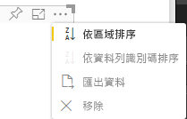

# <a name="sorting-options-for-power-bi-visuals"></a>Power BI 視覺效果的排序選項

此文章討論 *sorting* 選項如何指定 Power BI 視覺效果的預設排序行為。 

排序功能需要下列其中一個參數。

## <a name="default-sorting"></a>預設排序

`default` 選項是最簡單的形式。 它允許排序 'DataMappings' 區段中顯示的資料。 此選項可排序由使用者對應的資料，並可指定排序方向。

```json
    "sorting": {
        "default": {   }
    }
```



## <a name="implicit-sorting"></a>隱含排序

隱含排序是指使用陣列參數 `clauses` 進行排序，該參數會描述每個資料角色的排序方式。 `implicit` 表示視覺效果的使用者無法變更排序次序。 Power BI 不會在視覺效果的功能表中顯示排序選項。 不過，Power BI 會根據指定的設定來排序資料。

`clauses` 參數可以包含數個具有下列兩個參數的物件：

- `role`：決定用於排序的 `DataMapping`
- `direction`：決定排序方向 (1 = 遞增，2 = 遞減)

```json
    "sorting": {
        "implicit": {
            "clauses": [
                {
                    "role": "category",
                    "direction": 1
                },
                {
                    "role": "measure",
                    "direction": 2
                }
            ]
        }
    }
```

## <a name="custom-sorting"></a>自訂排序

自訂排序表示排序是由開發人員在視覺效果的程式碼中管理。
