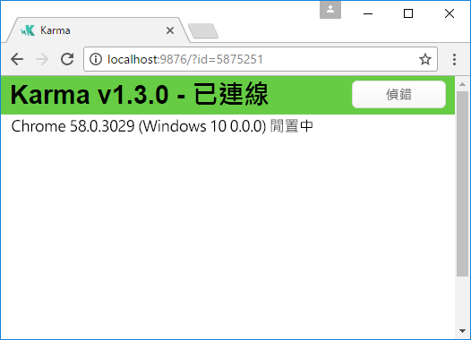
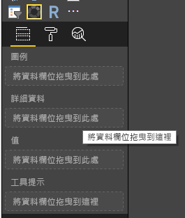
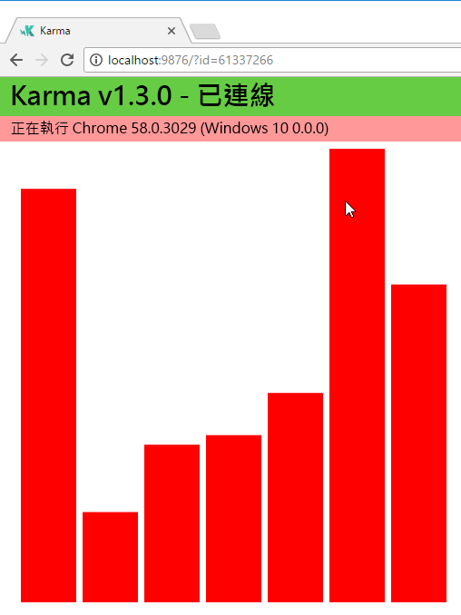
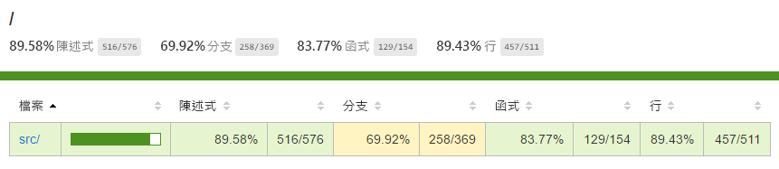

# <a name="tutorial-add-unit-tests-for-power-bi-visual-projects"></a>教學課程：新增 Power BI 視覺效果專案的單元測試

此文章說明為 Power BI 視覺效果撰寫單元測試的基本概念，包括如何：

* 設定 Karma JavaScript 測試執行器測試架構 (Jasmine)。
* 使用 powerbi-visuals-utils-testutils 套件。
* 使用模擬和假功能集協助簡化 Power BI 視覺效果的單元測試。

## <a name="prerequisites"></a>先決條件

* 已安裝 Power BI 視覺效果專案
* 已設定 Node.js 環境

## <a name="install-and-configure-the-karma-javascript-test-runner-and-jasmine"></a>安裝和設定 Karma JavaScript 測試執行器和 Jasmine

將必要的程式庫新增至 *package.json* 檔案的 `devDependencies` 區段中：

```json
"@babel/polyfill": "^7.2.5",
"@types/d3": "5.5.0",
"@types/jasmine": "2.5.37",
"@types/jasmine-jquery": "1.5.28",
"@types/jquery": "2.0.41",
"@types/karma": "3.0.0",
"@types/lodash-es": "4.17.1",
"coveralls": "3.0.2",
"istanbul-instrumenter-loader": "^3.0.1",
"jasmine": "2.5.2",
"jasmine-core": "2.5.2",
"jasmine-jquery": "2.1.1",
"jquery": "3.1.1",
"karma": "3.1.1",
"karma-chrome-launcher": "2.2.0",
"karma-coverage": "1.1.2",
"karma-coverage-istanbul-reporter": "^2.0.4",
"karma-jasmine": "2.0.1",
"karma-junit-reporter": "^1.2.0",
"karma-sourcemap-loader": "^0.3.7",
"karma-typescript": "^3.0.13",
"karma-typescript-preprocessor": "0.4.0",
"karma-webpack": "3.0.5",
"puppeteer": "1.17.0",
"style-loader": "0.23.1",
"ts-loader": "5.3.0",
"ts-node": "7.0.1",
"tslint": "^5.12.0",
"webpack": "4.26.0"
```

若要深入了解套件，請參閱說明。

在 `package.json` 位置儲存 *package.json* 檔案，然後執行下列命令：

```cmd
npm install
```

套件管理員會安裝所有新增至 *package.json* 的新套件。

若要執行單元測試，請設定測試執行器和 `webpack` 設定。

下列程式碼是 *test.webpack.config.js* 檔案的範例：

```typescript
const path = require('path');
const webpack = require("webpack");

module.exports = {
    devtool: 'source-map',
    mode: 'development',
    optimization : {
        concatenateModules: false,
        minimize: false
    },
    module: {
        rules: [
            {
                test: /\.tsx?$/,
                use: 'ts-loader',
                exclude: /node_modules/
            },
            {
                test: /\.json$/,
                loader: 'json-loader'
            },
            {
                test: /\.tsx?$/i,
                enforce: 'post',
                include: /(src)/,
                exclude: /(node_modules|resources\/js\/vendor)/,
                loader: 'istanbul-instrumenter-loader',
                options: { esModules: true }
            },
            {
                test: /\.less$/,
                use: [
                    {
                        loader: 'style-loader'
                    },
                    {
                        loader: 'css-loader'
                    },
                    {
                        loader: 'less-loader',
                        options: {
                            paths: [path.resolve(__dirname, 'node_modules')]
                        }
                    }
                ]
            }
        ]
    },
    externals: {
        "powerbi-visuals-api": '{}'
    },
    resolve: {
        extensions: ['.tsx', '.ts', '.js', '.css']
    },
    output: {
        path: path.resolve(__dirname, ".tmp/test")
    },
    plugins: [
        new webpack.ProvidePlugin({
            'powerbi-visuals-api': null
        })
    ]
};
```

下列程式碼是 *karma.conf.ts* 檔案的範例：

```typescript
"use strict";

const webpackConfig = require("./test.webpack.config.js");
const tsconfig = require("./test.tsconfig.json");
const path = require("path");

const testRecursivePath = "test/visualTest.ts";
const srcOriginalRecursivePath = "src/**/*.ts";
const coverageFolder = "coverage";

process.env.CHROME_BIN = require("puppeteer").executablePath();

import { Config, ConfigOptions } from "karma";

module.exports = (config: Config) => {
    config.set(<ConfigOptions>{
        mode: "development",
        browserNoActivityTimeout: 100000,
        browsers: ["ChromeHeadless"], // or Chrome to use locally installed Chrome browser
        colors: true,
        frameworks: ["jasmine"],
        reporters: [
            "progress",
            "junit",
            "coverage-istanbul"
        ],
        junitReporter: {
            outputDir: path.join(__dirname, coverageFolder),
            outputFile: "TESTS-report.xml",
            useBrowserName: false
        },
        singleRun: true,
        plugins: [
            "karma-coverage",
            "karma-typescript",
            "karma-webpack",
            "karma-jasmine",
            "karma-sourcemap-loader",
            "karma-chrome-launcher",
            "karma-junit-reporter",
            "karma-coverage-istanbul-reporter"
        ],
        files: [
            "node_modules/jquery/dist/jquery.min.js",
            "node_modules/jasmine-jquery/lib/jasmine-jquery.js",
            {
                pattern: './capabilities.json',
                watched: false,
                served: true,
                included: false
            },
            testRecursivePath,
            {
                pattern: srcOriginalRecursivePath,
                included: false,
                served: true
            }
        ],
        preprocessors: {
            [testRecursivePath]: ["webpack", "coverage"]
        },
        typescriptPreprocessor: {
            options: tsconfig.compilerOptions
        },
        coverageIstanbulReporter: {
            reports: ["html", "lcovonly", "text-summary", "cobertura"],
            dir: path.join(__dirname, coverageFolder),
            'report-config': {
                html: {
                    subdir: 'html-report'
                }
            },
            combineBrowserReports: true,
            fixWebpackSourcePaths: true,
            verbose: false
        },
        coverageReporter: {
            dir: path.join(__dirname, coverageFolder),
            reporters: [
                // reporters not supporting the `file` property
                { type: 'html', subdir: 'html-report' },
                { type: 'lcov', subdir: 'lcov' },
                // reporters supporting the `file` property, use `subdir` to directly
                // output them in the `dir` directory
                { type: 'cobertura', subdir: '.', file: 'cobertura-coverage.xml' },
                { type: 'lcovonly', subdir: '.', file: 'report-lcovonly.txt' },
                { type: 'text-summary', subdir: '.', file: 'text-summary.txt' },
            ]
        },
        mime: {
            "text/x-typescript": ["ts", "tsx"]
        },
        webpack: webpackConfig,
        webpackMiddleware: {
            stats: "errors-only"
        }
    });
};
```

如有需要，您可以修改此設定。

*karma.conf.js* 中的程式碼包含下列變數：

* `recursivePathToTests`：尋找測試程式碼

* `srcRecursivePath`：在編譯之後，尋找輸出 JavaScript 程式碼

* `srcCssRecursivePath`：尋找編譯 LESS 檔案 (含樣式) 後的輸出 CSS

* `srcOriginalRecursivePath`：尋找視覺效果的原始程式碼

* `coverageFolder`：決定要建立涵蓋範圍報表的位置

設定檔包含下列屬性：

* `singleRun: true`：測試是在持續整合 (CI) 系統上執行，或是執行一次。 您可以將設定變更為 *false*，來對測試進行偵錯。 Karma 會讓瀏覽器保持執行狀態，讓您可以使用主控台進行偵錯。

* `files: [...]`：在此陣列中，您可以指定要載入瀏覽器的檔案。 通常包括原始程式檔、測試案例、程式庫 (Jasmine、測試公用程式)。 您可以視需要將其他檔案新增至清單。

* `preprocessors`：在本節中，您會設定在執行單元測試之前執行的動作。 系統會將 TypeScript 先行編譯為 JavaScript 並準備來源對應檔，再產生程式碼涵蓋範圍報表。 當您在對測試進行偵錯時，可以停用 `coverage`。 涵蓋範圍會產生其他程式碼來檢查測試涵蓋範圍中的程式碼，這會使得對測試進行偵錯變得複雜。

如需所有 Karma 設定的說明，請移至 [Karma 設定檔](https://karma-runner.github.io/1.0/config/configuration-file.html)頁面。

為了方便使用，您可以將測試命令新增至 `scripts`：

```json
{
    "scripts": {
        "pbiviz": "pbiviz",
        "start": "pbiviz start",
        "typings":"node node_modules/typings/dist/bin.js i",
        "lint": "tslint -r \"node_modules/tslint-microsoft-contrib\"  \"+(src|test)/**/*.ts\"",
        "pretest": "pbiviz package --resources --no-minify --no-pbiviz --no-plugin",
        "test": "karma start"
    }
    ...
}
```

您已準備好開始撰寫單元測試。

## <a name="check-the-dom-element-of-the-visual"></a>檢查視覺效果的 DOM 元素

若要測試視覺效果，我們必須建立視覺效果的執行個體。

### <a name="create-a-visual-instance-builder"></a>建立視覺效果執行個體產生器

使用下列程式碼，將 *visualBuilder.ts* 檔案新增至 [test]  資料夾：

```typescript
import {
    VisualBuilderBase
} from "powerbi-visuals-utils-testutils";

import {
    BarChart as VisualClass
} from "../src/visual";

import  powerbi from "powerbi-visuals-api";
import VisualConstructorOptions = powerbi.extensibility.visual.VisualConstructorOptions;

export class BarChartBuilder extends VisualBuilderBase<VisualClass> {
    constructor(width: number, height: number) {
        super(width, height);
    }

    protected build(options: VisualConstructorOptions) {
        return new VisualClass(options);
    }

    public get mainElement() {
        return this.element.children("svg.barChart");
    }
}
```

其中的 `build` 方法會建立視覺效果執行個體。 `mainElement` 是 get 方法，會傳回視覺效果中的「根」文件物件模型 (DOM) 元素執行個體。 getter 是選擇性的，但可讓您更輕鬆地撰寫單元測試。

您現在已經有視覺效果執行個體的組建。 接下來將撰寫測試案例。 測試案例會檢查顯示視覺效果時所建立的 SVG 元素。

### <a name="create-a-typescript-file-to-write-test-cases"></a>建立 TypeScript 檔案以撰寫測試案例

使用下列程式碼，新增測試案例的 *visualTest.ts* 檔案：

```typescript
import powerbi from "powerbi-visuals-api";

import { BarChartBuilder } from "./VisualBuilder";

import {
    BarChart as VisualClass
} from "../src/visual";

import VisualBuilder = powerbi.extensibility.visual.test.BarChartBuilder;

describe("BarChart", () => {
    let visualBuilder: VisualBuilder;
    let dataView: DataView;

    beforeEach(() => {
        visualBuilder = new VisualBuilder(500, 500);
    });

    it("root DOM element is created", () => {
        expect(visualBuilder.mainElement).toBeInDOM();
    });
});
```

呼叫數個方法：

* [`describe`](https://jasmine.github.io/api/2.6/global.html#describe)：描述測試案例。 在 Jasmine 架構的內容中，它通常描述套件或規格群組。

* `beforeEach`：在每次呼叫 `it` 方法之前，都會呼叫此方法，這定義於 [`describe`](https://jasmine.github.io/api/2.6/global.html#beforeEach) 方法中。

* [`it`](https://jasmine.github.io/api/2.6/global.html#it)：定義單一規格。`it` 方法應該包含一或多個 `expectations`。

* [`expect`](https://jasmine.github.io/api/2.6/global.html#expect)：建立規格的預期。如果所有預期皆通過且未發生任何失敗，則規格即為成功。

* `toBeInDOM`：其中一個「比對器」  方法。 如需比對器的詳細資訊，請參閱 [Jasmine 命名空間：比對器](https://jasmine.github.io/api/2.6/matchers.html) \(英文\)。

如需 Jasmine 的詳細資訊，請參閱 [Jasmine 架構文件](https://jasmine.github.io/)頁面 \(英文\)。

### <a name="launch-unit-tests"></a>啟動單元測試

此測試會檢查是否已建立視覺效果的根 SVG 元素。 若要執行單元測試，請在命令列工具中輸入此命令：

```cmd
npm run test
```

`karma.js` 會在 Chrome 瀏覽器中執行測試案例。



> [!NOTE]
> 您必須在本機安裝 Google Chrome。

在命令列視窗中，您會取得下列輸出：

```cmd
> karma start

23 05 2017 12:24:26.842:WARN [watcher]: Pattern "E:/WORKSPACE/PowerBI/PowerBI-visuals-sampleBarChart/data/*.csv" does not match any file.
23 05 2017 12:24:30.836:WARN [karma]: No captured browser, open http://localhost:9876/
23 05 2017 12:24:30.849:INFO [karma]: Karma v1.3.0 server started at http://localhost:9876/
23 05 2017 12:24:30.850:INFO [launcher]: Launching browser Chrome with unlimited concurrency
23 05 2017 12:24:31.059:INFO [launcher]: Starting browser Chrome
23 05 2017 12:24:33.160:INFO [Chrome 58.0.3029 (Windows 10 0.0.0)]: Connected on socket /#2meR6hjXFmsE_fjiAAAA with id 5875251
Chrome 58.0.3029 (Windows 10 0.0.0): Executed 1 of 1 SUCCESS (0.194 secs / 0.011 secs)

=============================== Coverage summary ===============================
Statements   : 27.43% ( 65/237 )
Branches     : 19.84% ( 25/126 )
Functions    : 43.86% ( 25/57 )
Lines        : 20.85% ( 44/211 )
================================================================================
```

### <a name="how-to-add-static-data-for-unit-tests"></a>如何新增單元測試的靜態資料

使用下列程式碼，在 [test]  資料夾中建立 *visualData.ts* 檔案：

```typescript
import powerbi from "powerbi-visuals-api";
import DataView = powerbi.DataView;

import {
    testDataViewBuilder,
    getRandomNumbers
} from "powerbi-visuals-utils-testutils";

export class SampleBarChartDataBuilder extends TestDataViewBuilder {
    public static CategoryColumn: string = "category";
    public static MeasureColumn: string = "measure";

    public constructor() {
        super();
        ...
    }

    public getDataView(columnNames?: string[]): DataView {
        let dateView: any = this.createCategoricalDataViewBuilder([
            ...
        ],
        [
            ...
        ], columnNames).build();

        // there's client side computed maxValue
        let maxLocal = 0;
        this.valuesMeasure.forEach((item) => {
                if (item > maxLocal) {
                    maxLocal = item;
                }
        });
        (<any>dataView).categorical.values[0].maxLocal = maxLocal;
    }
}
```

`SampleBarChartDataBuilder` 類別會擴充 `TestDataViewBuilder` 並實作抽象方法 `getDataView`。

當您將資料放入資料欄位值區時，Power BI 會產生以您資料為基礎的類別目錄 `dataview` 物件。



在單元測試中，您沒有 Power BI 核心函式可將資料重現。 但您必須將靜態資料對應至類別目錄 `dataview`。 `TestDataViewBuilder` 類別可協助您對應它。

如需資料檢視對應的詳細資訊，請參閱 [DataViewMappings](https://github.com/Microsoft/PowerBI-visuals/blob/master/Capabilities/DataViewMappings.md) \(英文\)。

在 `getDataView` 方法中，使用您的資料呼叫 `createCategoricalDataViewBuilder` 方法。

在 `sampleBarChart` 視覺效果的 [capabilities.json](https://github.com/Microsoft/PowerBI-visuals-sampleBarChart/blob/master/capabilities.json#L2) 檔案中，我們有 dataRoles 和 dataViewMapping 物件：

```json
"dataRoles": [
    {
        "displayName": "Category Data",
        "name": "category",
        "kind": "Grouping"
    },
    {
        "displayName": "Measure Data",
        "name": "measure",
        "kind": "Measure"
    }
],
"dataViewMappings": [
    {
        "conditions": [
            {
                "category": {
                    "max": 1
                },
                "measure": {
                    "max": 1
                }
            }
        ],
        "categorical": {
            "categories": {
                "for": {
                    "in": "category"
                }
            },
            "values": {
                "select": [
                    {
                        "bind": {
                            "to": "measure"
                        }
                    }
                ]
            }
        }
    }
],
```

若要產生相同的對應，您必須將下列參數設定為 `createCategoricalDataViewBuilder` 方法：

```typescript
([
    {
        source: {
            displayName: "Category",
            queryName: SampleBarChartData.ColumnCategory,
            type: ValueType.fromDescriptor({ text: true }),
            roles: {
                Category: true
            },
        },
        values: this.valuesCategory
    }
],
[
    {
        source: {
            displayName: "Measure",
            isMeasure: true,
            queryName: SampleBarChartData.MeasureColumn,
            type: ValueType.fromDescriptor({ numeric: true }),
            roles: {
                Measure: true
            },
        },
        values: this.valuesMeasure
    },
], columnNames)
```

其中 `this.valuesCategory` 是類別陣列：

```ts
public valuesCategory: string[] = ["Monday", "Tuesday", "Wednesday", "Thursday", "Friday", "Saturday", "Sunday"];
```

而 `this.valuesMeasure` 是每個類別的量值陣列：

```ts
public valuesMeasure: number[] = [742731.43, 162066.43, 283085.78, 300263.49, 376074.57, 814724.34, 570921.34];
```

現在，您可以在單元測試中使用 `SampleBarChartDataBuilder` 類別。

`ValueType` 類別是定義於 powerbi-visuals-utils-testutils 套件中。 而 `createCategoricalDataViewBuilder` 方法需要 `lodash` 程式庫。

將這些套件新增至相依性。

在 `package.json` 的 `devDependencies` 區段中

```json
"lodash-es": "4.17.1",
"powerbi-visuals-utils-testutils": "2.2.0"
```

呼叫

```cmd
npm install
```

以安裝 `lodash-es` 程式庫。

現在，您可以再次執行單元測試。 您必須取得下列輸出：

```cmd
> karma start

23 05 2017 16:19:54.318:WARN [watcher]: Pattern "E:/WORKSPACE/PowerBI/PowerBI-visuals-sampleBarChart/data/*.csv" does not match any file.
23 05 2017 16:19:58.333:WARN [karma]: No captured browser, open http://localhost:9876/
23 05 2017 16:19:58.346:INFO [karma]: Karma v1.3.0 server started at http://localhost:9876/
23 05 2017 16:19:58.346:INFO [launcher]: Launching browser Chrome with unlimited concurrency
23 05 2017 16:19:58.394:INFO [launcher]: Starting browser Chrome
23 05 2017 16:19:59.873:INFO [Chrome 58.0.3029 (Windows 10 0.0.0)]: Connected on socket /#NcNTAGH9hWfGMCuEAAAA with id 3551106
Chrome 58.0.3029 (Windows 10 0.0.0): Executed 1 of 1 SUCCESS (1.266 secs / 1.052 secs)

=============================== Coverage summary ===============================
Statements   : 56.72% ( 135/238 )
Branches     : 32.54% ( 41/126 )
Functions    : 66.67% ( 38/57 )
Lines        : 52.83% ( 112/212 )
================================================================================
```

您的視覺效果會在 Chrome 瀏覽器中開啟，如下所示：



摘要顯示涵蓋範圍已增加。 若要深入了解目前的程式碼涵蓋範圍，開啟 `coverage\index.html`。



或查看 `src` 資料夾的範圍：

![[src] 資料夾的涵蓋範圍](./media/code-coverage-src-folder.png)

在檔案範圍內，您可以檢視原始程式碼。 如果特定程式碼在單元測試中未執行，`Coverage` 公用程式會用紅色醒目提示該列。


> [!IMPORTANT]
> 程式碼涵蓋範圍並不表示您有很好的視覺效果功能涵蓋範圍。 一個簡單單元測試提供 `src\visual.ts` 中超過百分之 96 的涵蓋範圍。

## <a name="next-steps"></a>後續步驟

當您的視覺效果就緒時，您可以提交它以供發佈。 如需詳細資訊，請參閱[在 AppSource 上發佈自訂視覺效果](../office-store.md)。
