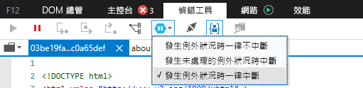
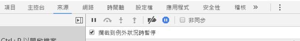

# <a name="how-to-debug-power-bi-visuals"></a>如何針對 Power BI 視覺效果進行偵錯

此頁面會顯示在建置視覺效果時的一些偵錯祕訣。 其中包含基本步驟，並顯示了標準前端應用程式與 Power BI 視覺效果的偵錯之間的差異。
閱讀本文後，您將能夠使用中斷點、記錄例外狀況，以及在 Chrome 與 Edge 中攔截例外狀況，以對 Power BI 視覺效果進行偵錯。

## <a name="using-breakpoints"></a>使用中斷點

由於每次更新視覺效果時都會完全重新載入視覺效果的 JavaScript，因此重新整理偵錯視覺效果時，所新增的任何中斷點都會遺失。 因應措施是在程式碼中使用 `debugger` 陳述式。 建議您在程式碼中使用 `debugger` 時，關閉自動重新載入。

```typescript
public update(options: VisualUpdateOptions) {
    console.log('Visual update', options);
    debugger;
    this.target.innerHTML = `<p>Update count: <em>${(this.updateCount</em></p>`;
}
```


## <a name="showing-exceptions"></a>顯示例外狀況

當使用視覺效果時，您會注意到所有錯誤都是由 Power BI 服務「取用」。 這是 Power BI 中一個刻意設計的功能，可防止不正常的視覺效果導致整個應用程式變得不穩定。

因應措施是加入程式碼來攔截及記錄您的例外狀況，或將偵錯工具設定為在攔截到例外狀況時中斷。


## <a name="log-exceptions"></a>記錄例外狀況

若要記錄 Power BI 視覺效果中的例外狀況，請將下列程式碼新增至您的視覺效果，以定義例外狀況記錄裝飾項目。

```typescript
export function logExceptions(): MethodDecorator {
    return function (target: Object, propertyKey: string, descriptor: TypedPropertyDescriptor<any>): TypedPropertyDescriptor<any> {
        return {
            value: function () {
                try {
                    return descriptor.value.apply(this, arguments);
                } catch (e) {
                    console.error(e);
                    throw e;
                }
            }
        }
    }
}
```
然後，您可以在任何函式上使用此裝飾項目來查看錯誤記錄。

```typescript
@logExceptions()
public update(options: VisualUpdateOptions) {
```

## <a name="break-on-exceptions"></a>發生例外狀況時中斷

您也可以將瀏覽器設定為在攔截到例外狀況時中斷。 這將會在發生錯誤時停止程式碼執行，並可讓您從該處進行偵錯。

### <a name="edge"></a>Edge

1. 開啟開發人員工具 (F12)。
2. 移至 [偵錯工具]  索引標籤。
3. 按一下**發生例外狀況時中斷**圖示 (具有暫停符號的六邊形)。
4. 選取 [發生任何例外狀況時中斷]  。



## <a name="chrome"></a>Chrome

1. 開啟開發人員工具 (F12)。
2. 移至 [Sources]  \(來源\) 索引標籤。
3. 按一下**發生例外狀況時中斷**圖示 (具有暫停符號的停止符號)。
4. 選取 [Pause On Caught Exceptions]  \(攔截到例外狀況時暫停\) 核取方塊。



## <a name="next-steps"></a>後續步驟
* [針對 Power BI 視覺效果進行疑難排解](power-bi-custom-visuals-troubleshoot.md)
* 如需詳細資訊與問題的解答，請前往 [Power BI 視覺效果常見問題集](power-bi-custom-visuals-faq.md#organizational-power-bi-visuals)
