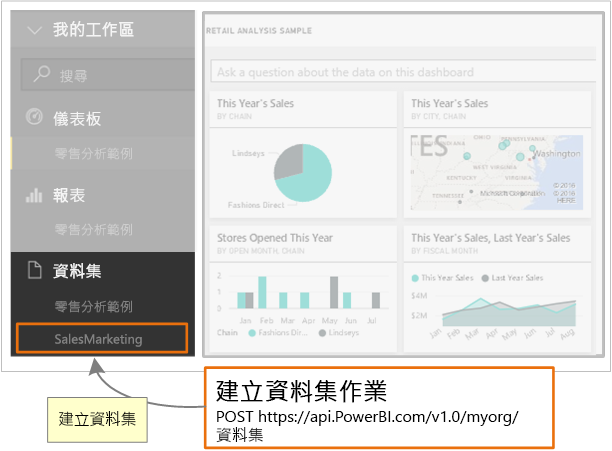

# <a name="step-3-create-a-dataset-in-power-bi"></a>步驟 3：在 Power BI 中建立資料集
本文屬於[將資料推送至資料集](walkthrough-push-data.md)逐步解說的一部分。

在將資料推送至資料集的**步驟 2** [取得驗證存取權杖](walkthrough-push-data-get-token.md)中，您取得了向 **Azure AD** 驗證的權杖。 在此步驟中，您會使用權杖來呼叫 [PostDataset](https://docs.microsoft.com/rest/api/power-bi/pushdatasets) 作業。

若要呼叫 REST 資源，您可使用用以定位資源的 URL，以及將 JavaScript 物件標記法 (JSON) 字串 (其中描述資料集) 傳送到 Power BI 服務資源。 REST 資源會識別您想要使用的 Power BI 服務之部分。 若要將資料推送至資料集，則目標資源是**資料集**。 識別資料集的 URL 是 https://api.PowerBI.com/v1.0/myorg/datasets。 如果您要推送資料群組中的，url 是 https://api.PowerBI.com/v1.0/myorg/groups/{group_id}/datasets。

若要驗證 Power BI REST 作業，您可將在[取得驗證存取權杖](walkthrough-push-data-get-token.md)中取得的權杖加入要求標頭：

當您呼叫 [PostDataset](https://docs.microsoft.com/rest/api/power-bi/pushdatasets) 作業時，會建立新的資料集。 



以下是在 Power BI 中建立資料集的方法。

## <a name="create-a-dataset-in-power-bi"></a>在 Power BI 中建立資料集
> [!NOTE]
> 開始使用之前，請確定您已經執行過[將資料推送至資料集](walkthrough-push-data.md)逐步解說中的先前步驟。
> 
> 

1. 在[步驟 2 - 取得驗證存取權杖](walkthrough-push-data-get-token.md)所建立的主控台應用程式專案中，將 **using System.Net;** 和 **using System.IO;** 加入 Program.cs。
2. 在 Program.cs 中，加入下列程式碼。
3. 執行主控台應用程式，然後登入您的 Power BI 帳戶。 您應該會在主控台視窗中看到 **建立的資料列** 。 此外，您可以登入 Power BI，以查看新的資料集。

**將資料推送至資料集的範例**

將此程式碼加入 Program.cs 中。

* 在 static void Main(string[] args) 中：
  
    ```csharp
    static void Main(string[] args)
    {
        //Get an authentication access token
        token = GetToken();
  
        //Create a dataset in Power BI
        CreateDataset();
    }
    ```
* 加入 CreateDataset() 方法：
  
    ```csharp
    #region Create a dataset in Power BI
    private static void CreateDataset()
    {
        //TODO: Add using System.Net and using System.IO
  
        string powerBIDatasetsApiUrl = "https://api.powerbi.com/v1.0/myorg/datasets";
        //POST web request to create a dataset.
        //To create a Dataset in a group, use the Groups uri: https://api.PowerBI.com/v1.0/myorg/groups/{group_id}/datasets
        HttpWebRequest request = System.Net.WebRequest.Create(powerBIDatasetsApiUrl) as System.Net.HttpWebRequest;
        request.KeepAlive = true;
        request.Method = "POST";
        request.ContentLength = 0;
        request.ContentType = "application/json";
  
        //Add token to the request header
        request.Headers.Add("Authorization", String.Format("Bearer {0}", token));
  
        //Create dataset JSON for POST request
        string datasetJson = "{\"name\": \"SalesMarketing\", \"tables\": " +
            "[{\"name\": \"Product\", \"columns\": " +
            "[{ \"name\": \"ProductID\", \"dataType\": \"Int64\"}, " +
            "{ \"name\": \"Name\", \"dataType\": \"string\"}, " +
            "{ \"name\": \"Category\", \"dataType\": \"string\"}," +
            "{ \"name\": \"IsCompete\", \"dataType\": \"bool\"}," +
            "{ \"name\": \"ManufacturedOn\", \"dataType\": \"DateTime\"}" +
            "]}]}";
  
        //POST web request
        byte[] byteArray = System.Text.Encoding.UTF8.GetBytes(datasetJson);
        request.ContentLength = byteArray.Length;
  
        //Write JSON byte[] into a Stream
        using (Stream writer = request.GetRequestStream())
        {
            writer.Write(byteArray, 0, byteArray.Length);
  
            var response = (HttpWebResponse)request.GetResponse();
  
            Console.WriteLine(string.Format("Dataset {0}", response.StatusCode.ToString()));
  
            Console.ReadLine();
        }
    }
    #endregion
    ```

下一個步驟將為您示範如何[取得資料集，以將資料列加入 Power BI 資料表](walkthrough-push-data-get-datasets.md)。

以下是[完整程式碼清單](#code)。

<a name="code"/>

## <a name="complete-code-listing"></a>完整程式碼清單

```csharp
using System;
using Microsoft.IdentityModel.Clients.ActiveDirectory;
using System.Net;
using System.IO;

namespace walkthrough_push_data
{
    class Program
    {
        private static string token = string.Empty;

        static void Main(string[] args)
        {

            //Get an authentication access token
            token = GetToken();

            //Create a dataset in Power BI
            CreateDataset();

        }

        #region Get an authentication access token
        private static string GetToken()
        {
            // TODO: Install-Package Microsoft.IdentityModel.Clients.ActiveDirectory -Version 2.21.301221612
            // and add using Microsoft.IdentityModel.Clients.ActiveDirectory

            //The client id that Azure AD created when you registered your client app.
            string clientID = "{Client_ID}";

            //RedirectUri you used when you register your app.
            //For a client app, a redirect uri gives Azure AD more details on the application that it will authenticate.
            // You can use this redirect uri for your client app
            string redirectUri = "https://login.live.com/oauth20_desktop.srf";

            //Resource Uri for Power BI API
            string resourceUri = "https://analysis.windows.net/powerbi/api";

            //OAuth2 authority Uri
            string authorityUri = "https://login.microsoftonline.com/common/";

            //Get access token:
            // To call a Power BI REST operation, create an instance of AuthenticationContext and call AcquireToken
            // AuthenticationContext is part of the Active Directory Authentication Library NuGet package
            // To install the Active Directory Authentication Library NuGet package in Visual Studio,
            //  run "Install-Package Microsoft.IdentityModel.Clients.ActiveDirectory" from the nuget Package Manager Console.

            // AcquireToken will acquire an Azure access token
            // Call AcquireToken to get an Azure token from Azure Active Directory token issuance endpoint
            AuthenticationContext authContext = new AuthenticationContext(authorityUri);
            string token = authContext.AcquireToken(resourceUri, clientID, new Uri(redirectUri)).AccessToken;

            Console.WriteLine(token);
            Console.ReadLine();

            return token;
        }

        #endregion


        #region Create a dataset in Power BI
        private static void CreateDataset()
        {
            //TODO: Add using System.Net and using System.IO

            string powerBIDatasetsApiUrl = "https://api.powerbi.com/v1.0/myorg/datasets";
            //POST web request to create a dataset.
            //To create a Dataset in a group, use the Groups uri: https://api.PowerBI.com/v1.0/myorg/groups/{group_id}/datasets
            HttpWebRequest request = System.Net.WebRequest.Create(powerBIDatasetsApiUrl) as System.Net.HttpWebRequest;
            request.KeepAlive = true;
            request.Method = "POST";
            request.ContentLength = 0;
            request.ContentType = "application/json";

            //Add token to the request header
            request.Headers.Add("Authorization", String.Format("Bearer {0}", token));

            //Create dataset JSON for POST request
            string datasetJson = "{\"name\": \"SalesMarketing\", \"tables\": " +
                "[{\"name\": \"Product\", \"columns\": " +
                "[{ \"name\": \"ProductID\", \"dataType\": \"Int64\"}, " +
                "{ \"name\": \"Name\", \"dataType\": \"string\"}, " +
                "{ \"name\": \"Category\", \"dataType\": \"string\"}," +
                "{ \"name\": \"IsCompete\", \"dataType\": \"bool\"}," +
                "{ \"name\": \"ManufacturedOn\", \"dataType\": \"DateTime\"}" +
                "]}]}";

            //POST web request
            byte[] byteArray = System.Text.Encoding.UTF8.GetBytes(datasetJson);
            request.ContentLength = byteArray.Length;

            //Write JSON byte[] into a Stream
            using (Stream writer = request.GetRequestStream())
            {
                writer.Write(byteArray, 0, byteArray.Length);

                var response = (HttpWebResponse)request.GetResponse();

                Console.WriteLine(string.Format("Dataset {0}", response.StatusCode.ToString()));

                Console.ReadLine();
            }
        }
        #endregion
    }
}
```

[下一步 >](walkthrough-push-data-get-datasets.md)

## <a name="next-steps"></a>後續步驟
[取得資料集，以便將資料列新增至 Power BI 資料表](walkthrough-push-data-get-datasets.md)  
[取得驗證存取權杖](walkthrough-push-data-get-token.md)  
[PostDataset](https://docs.microsoft.com/rest/api/power-bi/pushdatasets/datasets_postdataset)  
[PostDatasetInGroup](https://docs.microsoft.com/rest/api/power-bi/pushdatasets/datasets_postdatasetingroup)  
[將資料推送至 Power BI 儀表板](walkthrough-push-data.md)  
[Power BI REST API 概觀](overview-of-power-bi-rest-api.md)  
[Power BI REST API 參考](https://docs.microsoft.com/rest/api/power-bi/)  

有其他問題嗎？ [試試 Power BI 社群](http://community.powerbi.com/)

