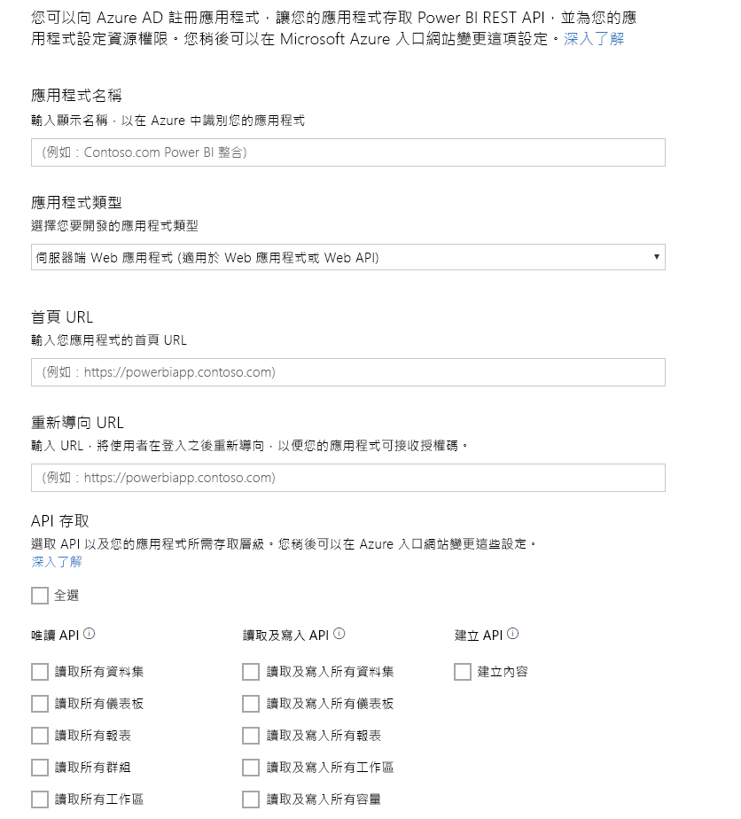

# 步驟 1：使用 Azure AD 註冊應用程式
本文屬於[將資料推送至資料集](walkthrough-push-data.md)逐步解說的一部分。

將資料推送至 Power BI 資料集的第一個步驟，是在 Azure AD 中註冊您的應用程式。 您必須先執行此作業，以便取得 **用戶端識別碼** ，在 Azure AD 中識別您的應用程式。 若無 **用戶端識別碼**，Azure AD 便無法驗證您的應用程式。

> **注意**︰註冊 Power BI 的 Web 應用程式之前，您必須先[註冊 Power BI](create-an-azure-active-directory-tenant.md)。
> 
> 

以下是在 Azure AD 中註冊應用程式的步驟。

## 在 Azure AD 中註冊應用程式
1. 請前往 dev.powerbi.com/apps。
2. 按一下 [使用現有的帳戶登入] ，然後登入 Power BI 帳戶。
3. 輸入 **應用程式名稱** ，例如「推送資料應用程式範例」。
4. 在 [應用程式類型] 選擇 [原生應用程式] 。
5. 輸入 **Redirect URL**，例如 **https://login.live.com/oauth20_desktop.srf**。 在 **原生用戶端應用程式**中，重新導向 URI 會提供 **Azure AD** 驗證之特定應用程式的詳細資訊。 用戶端應用程式的標準 URI 是https://login.live.com/oauth20_desktop.srf。
6. 在 [選擇要存取的 API] 選擇 [讀取和寫入所有資料集] 。 關於所有 Power BI 應用程式權限，請參閱 [Power BI 權限](power-bi-permissions.md)。
7. 按一下 [註冊應用程式] ，然後儲存產生的 **用戶端識別碼** 。 **用戶端識別碼** 可識別 Azure AD 中的應用程式。

以下是 **為 Power BI 註冊應用程式** 頁面的外觀：

下一步將為您示範如何[取得驗證存取權杖](walkthrough-push-data-get-token.md)。

[下一步 >](walkthrough-push-data-get-token.md)

## 後續步驟
[註冊 Power BI](create-an-azure-active-directory-tenant.md)  
[取得驗證存取權杖](walkthrough-push-data-get-token.md)  
[逐步解說：將資料推送至資料集](walkthrough-push-data.md)  
[註冊應用程式](register-app.md)  
[Power BI REST API 概觀](overview-of-power-bi-rest-api.md)  

有其他問題嗎？ [嘗試在 Power BI 社群提問](http://community.powerbi.com/)

