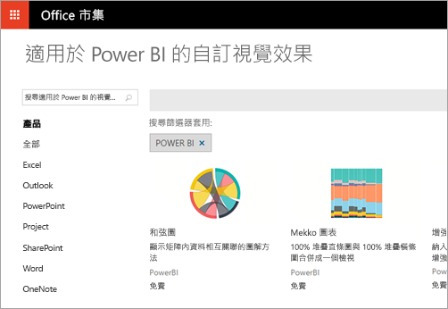
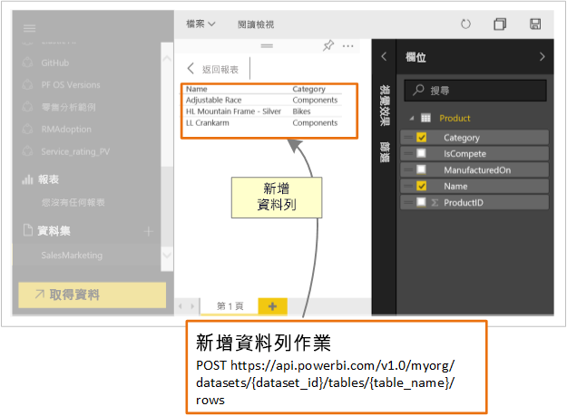

# 開發人員可如何利用 Power BI？

開發人員有各種不同選項可嘗試將 Power BI 內容包含在應用程式中。 身為開發人員的您可以使用這些選項，包括**使用 Power BI 進行內嵌**、**自訂視覺效果**，以及**將資料推送至 Power BI**。

## 內嵌 Power BI 內容

Power BI 服務 (SaaS) 和 Azure 中的 Power BI Embedded 服務 (PaaS) 都有 API 可供內嵌您的儀表板和報表。 此功能意謂著在內嵌內容時，您可以存取最新的 Power BI 功能，例如儀表板、閘道及應用程式工作區。

您可以完成[內嵌安裝工具](https://aka.ms/embedsetup)以快速開始使用並下載應用程式範例。

選擇最適合您的方案：

* [對客戶進行內嵌](embedding.md#embedding-for-your-customers)，可讓您將儀表板和報告內嵌至沒有 Power BI 帳戶的使用者。 執行[對客戶進行內嵌](https://aka.ms/embedsetup/AppOwnsData)解決方案。

* [對組織進行內嵌](embedding.md#embedding-for-your-organization)可讓您擴充 Power BI 服務。 執行[對組織進行內嵌](https://aka.ms/embedsetup/UserOwnsData)解決方案。

若要深入了解 Power BI 的內嵌，請參閱 [Power BI 的內嵌功能](embedding.md)。

## 開發自訂視覺效果

您可以透過 Power BI 使用自訂視覺效果，為自己或貴公司量身打造，建立獨特的視覺效果類型。 通常是由開發人員建立這些自訂視覺效果。 當隨附於 Power BI 的眾多視覺效果不符合您的需求時，就會建置這些視覺效果。

自訂視覺效果可讓您建立自己的視覺效果，以用於 Power BI 報表內。 自訂視覺效果會以 TypeScript 撰寫，這是 JavaScript 的超集。 TypeScript 支援一些進階功能，並可優先存取 ES6/ES7 功能。 系統會使用階層式樣式表 (CSS) 來處理視覺效果樣式。 為了您的方便，我們會使用可支援一些進階功能 (例如巢狀結構、變數、條件、迴圈，以及其他功能) 的 Less 預先編譯器。 如果您不想使用上述任何功能，則可以在 Less 檔案中撰寫一般 CSS。

若要開始深入了解自訂視覺效果開發，請參閱[開發 Power BI 自訂視覺效果](custom-visual-develop-tutorial.md)。

## 使用 API 自動化

Power BI 顯示互動式儀表板，可即時從不同的資料來源建立及更新。 您可以使用任何支援 REST 呼叫的程式設計語言，建立即時整合 Power BI 儀表板的應用程式。 您也可以將 Power BI 磚和報告整合到應用程式中。

開發人員也可以建置自己專屬的資料視覺效果，並將其用於互動式報表及儀表板。

若要查看您可以使用 Power BI API 執行的一些作業，請參閱[開發人員可如何使用 Power BI API](overview-of-power-bi-rest-api.md)？

## 後續步驟

[內嵌在 Power BI 之中](embedding.md)  

[Developing a Power BI custom visual](https://microsoft.github.io/PowerBI-visuals/docs/step-by-step-lab/developing-a-power-bi-custom-visual/) (開發 Power BI 自訂視覺效果)

[開發人員可如何利用 Power BI API？](overview-of-power-bi-rest-api.md)

[Power BI 開發人員中心](https://powerbi.microsoft.com/developers/)