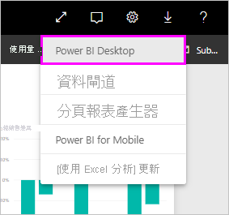
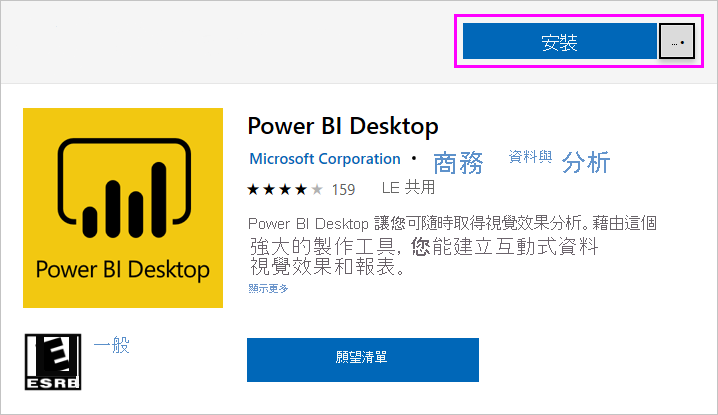
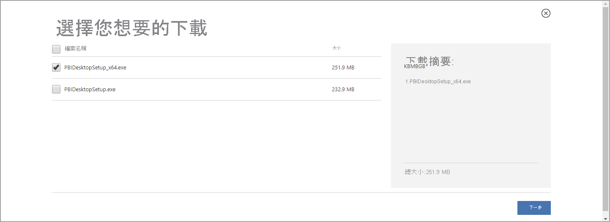
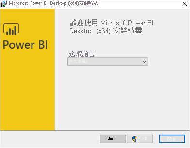
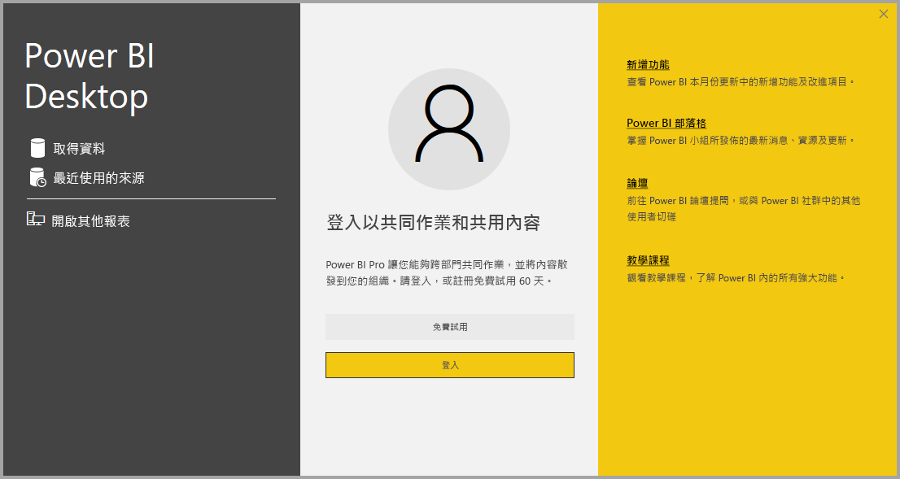

# <a name="get-power-bi-desktop"></a>取得 Power BI Desktop
Power BI Desktop 可讓您建立進階查詢、模型，以及將資料視覺化的報表。 透過 Power BI Desktop，您可以建置資料模型、建立報表，並將成果發佈到 Power BI 服務與他人共用。 Power BI Desktop 為免費下載。

下列各節會描述取得 Power BI Desktop 的兩種方式：

* [以應用程式形式從 Microsoft Store 安裝](#install-as-an-app-from-the-microsoft-store)。
* [直接下載，以可執行檔形式下載並安裝在電腦上](#download-power-bi-desktop-directly)。

任一方法皆可為電腦取得最新版的 Power BI Desktop，但仍需注意下列各節描述的部分差異。


> [!IMPORTANT]
> Power BI Desktop 會每月更新及釋出，並納入客戶意見反應與新功能。 僅支援最新版本的 Power BI Desktop；系統會要求連絡 Power BI Desktop 支援人員的客戶升級至最新版本。 您可從 [Windows Store](https://aka.ms/pbidesktopstore) 取得最新版本的 Power BI Desktop，或作為單一可執行檔，其中包含所[下載](https://www.microsoft.com/download/details.aspx?id=58494)及安裝在電腦上的所有支援語言。


## <a name="install-as-an-app-from-the-microsoft-store"></a>從 Microsoft Store 作為應用程式安裝
有幾種方式可從 Microsoft Store 存取最新版本的 Power BI Desktop。 

1. 使用下列其中一個選項之來開啟 Microsoft Store 的 [Power BI Desktop] 頁面：

   - 開啟瀏覽器並直接前往 Microsoft Store 的 [[Power BI Desktop] 頁面](https://aka.ms/pbidesktopstore)。

    - 從 [Power BI 服務](https://docs.microsoft.com/power-bi/service-get-started)選取右上角的**下載**圖示，然後選取 [Power BI Desktop]。

      

   - 前往 [Power BI Desktop 產品頁面](https://powerbi.microsoft.com/desktop/)，然後選取 [免費下載]。
  
2. 進入 Microsoft Store 的 [Power BI Desktop] 頁面後，選取 [安裝]。

     

從 Microsoft Store 取得 Power BI Desktop 有幾個優點：

* **自動更新**：只要有最新版本，Windows 就會自動在背景下載，所以您的版本一律為最新狀態。
* **較小的下載**：Microsoft Store 可確保僅將每個更新中有變更的元件下載到電腦，這樣每個更新的下載項目就會比較小。
* **不需要系統管理員權限**：直接下載並安裝套件時，您必須是系統管理員才能成功完成安裝。 但若從 Microsoft Store 取得 Power BI Desktop，就「不」需要系統管理員權限。
* **已啟用 IT 推出**：透過商務用 Microsoft Store，您可以更輕鬆地部署 Power BI Desktop，或對組織中的每個人「推出」

* **語言偵測**：Microsoft Store 版本包含所有支援的語言，並會在每次啟動時，檢查您電腦使用的語言。 此語言支援也會影響在 Power BI Desktop 中建立的模型當地語系化。 例如，建立 .pbix 檔案時，內建日期階層會比對 Power BI Desktop 使用的語言。

當您從 Microsoft Store 安裝 Power BI Desktop 時，適用下列考慮和限制：

* 如果使用 SAP 連接器，您可能需要將 SAP 驅動程式檔案移到 *Windows\System32* 資料夾。
* 從 Microsoft Store 安裝 Power BI Desktop，不會從 .exe 版本複製使用者設定。 您可能必須重新連線到最近的資料來源，然後重新輸入資料來源認證。 

> [!NOTE]
> Power BI Desktop 的 Power BI 報表伺服器版本與本文所討論版本為不同安裝。 如需 Power BI Desktop 報表伺服器版本的資訊，請參閱[建立 Power BI 報表伺服器的 Power BI 報表](../report-server/quickstart-create-powerbi-report.md)。
> 
> 

## <a name="download-power-bi-desktop-directly"></a>直接下載 Power BI Desktop
  
  若要從下載中心下載 Power BI Desktop 可執行檔，請在[下載中心頁面](https://www.microsoft.com/download/details.aspx?id=58494)中選取 [下載]。 然後，指定要下載的 32 位元或 64 位元安裝檔案。

  

### <a name="install-power-bi-desktop-after-downloading-it"></a>下載後即安裝 Power BI Desktop
完成下載後，系統會提示您執行安裝檔案。

從 2019 年 7 月版本開始，Power BI Desktop 會發行為單一 .exe 安裝套件，包含所有支援的語言，分為 32 位元和 64 位元版的 .exe 檔案。 .msi 套件自 2019 年 9 月版本開始終止，需要有 .exe 可執行檔才能安裝。 這種方法可讓散發、更新和安裝 (特別是針對系統管理員) 變得更為容易且更方便。 您也可以使用命令列參數自訂安裝流程，如[在安裝期間使用命令列選項](#using-command-line-options-during-installation)中所述。

在您啟動安裝套件後，Power BI Desktop 即會安裝為應用程式，並在您的桌面上執行。



> [!NOTE]
> 不支援將下載的 (MSI) 版本 (已淘汱) 和 Microsoft Store 版的 Power BI Desktop 安裝在同一部電腦上 (有時也稱為「並存」安裝)。 請先手動解除安裝 Power BI Desktop，再從 Microsoft Store 下載。
> 

## <a name="using-power-bi-desktop"></a>使用 Power BI Desktop
當您啟動 Power BI Desktop 時，會顯示歡迎畫面。



如果您是第一次使用 Power BI Desktop (即此安裝不是升級)，系統會提示您填寫表單或登入 Power BI 服務，才能繼續作業。

在這裡，您可以開始建立資料模型或報表，然後與其他人在 Power BI 服務上共用它們。 請參閱[後續步驟](#next-steps)一節，以取得協助您開始使用 Power BI Desktop 的指引連結。

## <a name="minimum-requirements"></a>最低需求
下列清單提供執行 Power BI Desktop 的最低需求：

> [!IMPORTANT]
> 2021 年 1 月 31 日之後，Windows 7 將不再支援 Power BI Desktop。 在該日期之後，Windows 8 或更新版本的 Windows 會支援 Power BI Desktop，但僅限於最新版本的 Power BI Desktop。 

* Windows 7 / Windows Server 2008 R2 或更新版本
* .NET 4.5
* Internet Explorer 10 或更新版本
* 記憶體 (RAM)：可用量至少為 1 GB，建議量為 1.5 GB 或以上。
* 顯示︰建議至少為 1440x900 或 1600x900 (16:9)。 不建議 1024x768 或 1280x800 等較低的解析度，因為某些控制項 (例如關閉啟動畫面) 需要更高的解析度才能顯示。
* Windows 顯示設定：如果您的顯示設定設成將文字、應用程式及其他項目的大小變更為超過 100%，就可能看不到某些必須互動才能繼續使用 Power BI Desktop 的對話方塊。 如果遇到此問題，請前往 [設定] > [系統] > [顯示] 來檢查您的 Windows 顯示設定，並使用滑桿將顯示設定調回至 100%。
* CPU：建議為 1 GHz 或更快的 32 位元或 64 位元 x86 處理器。

## <a name="considerations-and-limitations"></a>考量與限制

我們希望能為您提供絶佳的 Power BI Desktop 體驗。 因為您使用 Power BI Desktop 時可能會遇到一些問題，所以本節包含處理這些問題的解決方案或建議。 

### <a name="using-command-line-options-during-installation"></a>在安裝期間使用命令列選項 

安裝 Power BI Desktop 時，您可以使用命令列參數來設定屬性和選項。 這些設定對管理或在組織內輔助安裝 Power BI Desktop 的系統管理員來說特別有用。 這些選項適用於 .msi 和 .exe 安裝。 


|命令列選項  |行為  |
|---------|---------|
|-q、-quiet、-s、-silent     |無訊息安裝         |
|-passive     |在安裝期間只顯示進度列         |
|-norestart     |隱藏電腦重新開機需求         |
|-forcerestart     |安裝後在不顯示提示的情況下重新開機電腦         |
|-promptrestart     |如須重新開機電腦，請提示使用者 (預設)         |
|-l<>、-log<>     |將安裝記錄到特定檔案，並在 <> 中指定檔案         |
|-uninstall     |解除安裝 Power BI Desktop         |
|-repair     |修復安裝 (或在未安裝時安裝)         |
|-package、-update     |安裝 Power BI Desktop (只要沒有指定 -uninstall 或 -repair，此即為預設值)         |

您也可以使用下列以 *property = value* 語法指定的語法參數：

|參數  |意義  |
|---------|---------|
|ACCEPT_EULA     |需要值為 1，才能自動接受 EULA         |
|ENABLECXP     |值為 1 會註冊客戶經驗改進計畫，以擷取有關產品使用狀況的遙測資料         |
|INSTALLDESKTOPSHORTCUT     |值為 1 會在桌面新增捷徑         |
|INSTALLLOCATION     |您想要安裝它的檔案路徑         |
|LANGUAGE     |地區設定代碼 (例如 en-US、de-DE、pr-BR)，強制執行應用程式的預設語言。 如不指定語言，則 Power BI Desktop 會顯示 Windows 作業系統的語言。 您可以在 [選項] 對話方塊中變更此設定。         |
|REG_SHOWLEADGENDIALOG     |值為 0 會停止顯示登入 Power BI Desktop 之前出現的對話方塊。         |
|DISABLE_UPDATE_NOTIFICATION     |值為 1 時，會停用更新通知。         |


例如，您可以使用德文以下列選項和參數執行 Power BI Desktop，在沒有任何使用者介面的狀況下執行安裝作業： 

```-quiet LANG=de-DE ACCEPT_EULA=1```

### <a name="installing-power-bi-desktop-on-remote-machines"></a>在遠端電腦上安裝 Power BI Desktop

若要使用需要 Windows 安裝程式檔案 (.msi 檔案) 的工具，將 Power BI Desktop 部署到使用者，您可從 Power BI Desktop 安裝程式 .exe 檔案中擷取 .msi 檔案。 使用協力廠商工具，例如 WiX Toolset。

> [!NOTE]
> 身為協力廠商產品，WiX Toolset 選項可能會變更，恕不另行通知。 請參閱其文件以取得最新資訊，並聯繫其使用者郵寄清單以取得協助。

1. 在您下載 Power BI Desktop 安裝程式的電腦上，安裝最新版本的 [WiX Toolset](https://wixtoolset.org/)。
2. 以系統管理員身分開啟命令列視窗，巡覽至安裝 WiX Toolset 的資料夾。
3. 執行下列命令： 
    
    ```Dark.exe <path to Power BI Desktop installer> -x <output folder>```

    例如：

    ``` Dark.exe C:\PBIDesktop_x64.exe -x C:\output```

    輸出資料夾包含名為 *AttachedContainer* 的資料夾，其包含 .msi 檔案。

不支援將您從 .exe 解壓縮的安裝從 .exe 升級為 .msi。   為了進行此升級，您必須先將您有的舊版 Power BI Desktop 解除安裝。

### <a name="issues-when-using-previous-releases-of-power-bi-desktop"></a>使用舊版 Power BI Desktop 時的問題

使用過期的 Power BI Desktop 版本時，有些使用者會看到類似下列的錯誤訊息： 

「無法將儲存的資料庫還原至模型」 

更新至目前版本的 Power BI Desktop 通常會解決此問題。

### <a name="disabling-notifications"></a>停用通知
建議更新至最新版的 Power BI Desktop，才能使用最新的功能、效能、穩定性和其他改善。 某些組織可能不希望使用者更新至每一個新版本。 您可以使用下列步驟，透過修改登錄來停用通知：

1. 在登錄編輯器中巡覽至 **HKEY_LOCAL_MACHINE\SOFTWARE\Microsoft\Microsoft Power BI Desktop** 機碼。
2. 使用下列名稱，在機碼中建立新的 **REG_DWORD** 項目：**DisableUpdateNotification**。
3. 將新項目的值設為 **1**。
4. 重新開機電腦，使變更生效。

### <a name="power-bi-desktop-loads-with-a-partial-screen"></a>Power BI Desktop 載入部分畫面

在某些情況下 (包括特定的螢幕解析度設定)，某些使用者可能會看到 Power BI Desktop 轉譯的內容有大型黑色區域。 此問題通常是因為最新的作業系統更新影響項目轉譯方式所導致，並非是 Power BI Desktop 呈現內容的直接結果。 請遵循下列步驟解決此問題：

1. 按 [開始] 鍵，在顯示的搜尋列中輸入 *blurry*。
2. 在出現的對話方塊中，選取選項：[讓 Windows 修正模糊的應用程式]。
3. 重新啟動 Power BI Desktop。

後續的 Windows 更新發行後，可能會解決此問題。 
 

## <a name="next-steps"></a>後續步驟
安裝 Power BI Desktop 之後，請參閱下列內容以幫助您快速啟動並執行：

* [Power BI Desktop 是什麼？](desktop-what-is-desktop.md)
* [Power BI Desktop 中的查詢概觀](../transform-model/desktop-query-overview.md)
* [Power BI Desktop 中的資料來源](../connect-data/desktop-data-sources.md)
* [在 Power BI Desktop 中連線至資料](../connect-data/desktop-connect-to-data.md)
* [在 Power BI Desktop 中塑造及合併資料](../connect-data/desktop-shape-and-combine-data.md)
* [Power BI Desktop 中的常見查詢工作](../transform-model/desktop-common-query-tasks.md)   
