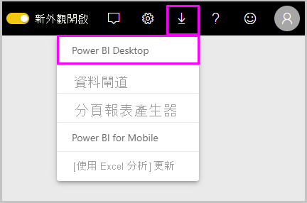
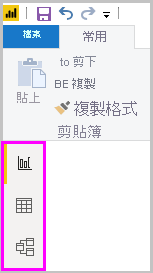
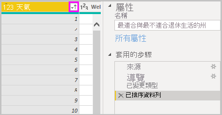
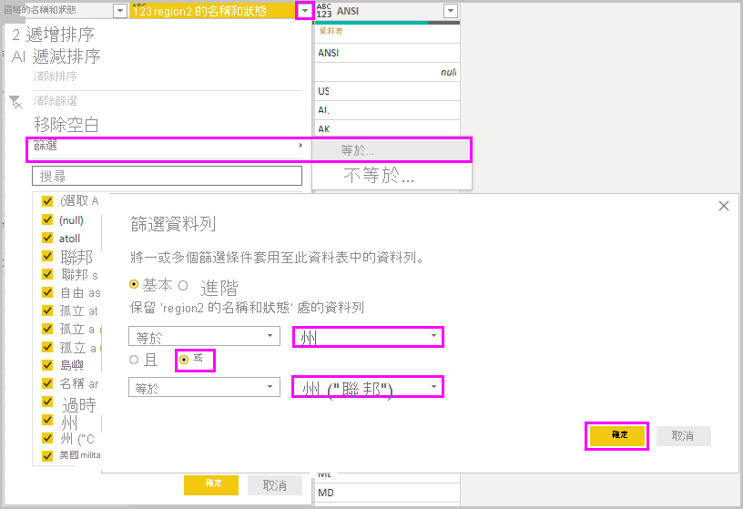
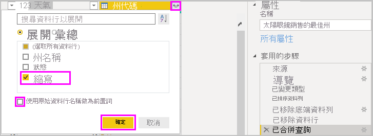
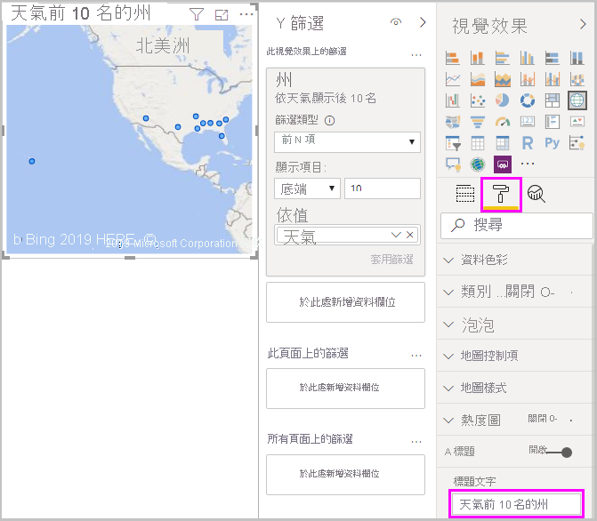
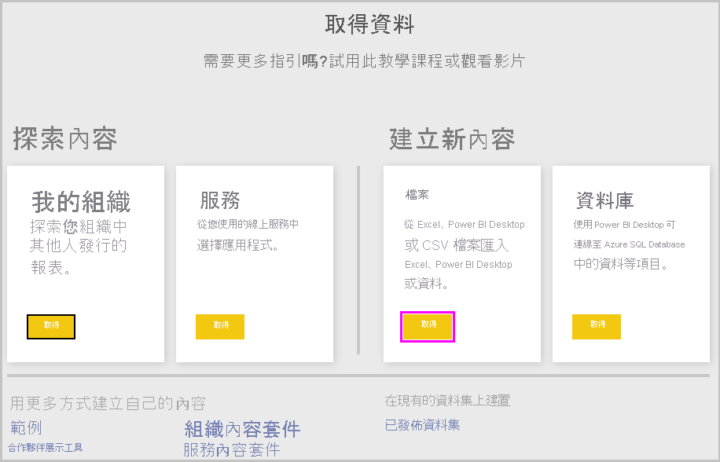
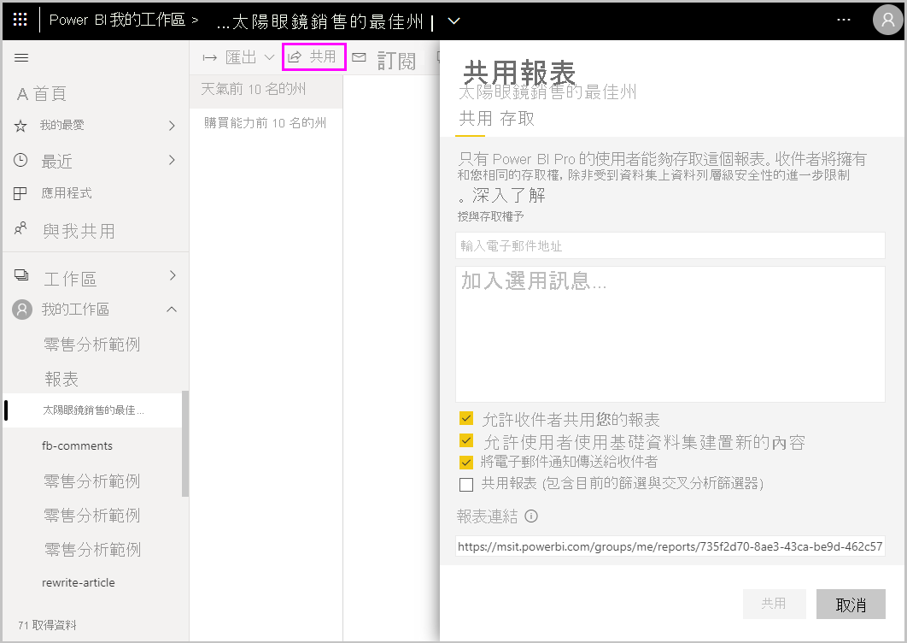

# 開始使用 Power BI Desktop
歡迎使用 Power BI Desktop 使用者入門指南。 此導覽說明 Power BI Desktop 的運作方式和功能，並說明如何建置穩固的資料模型和令人讚嘆的報表，來增強您的商業智慧。

若要快速概要了解 Power BI Desktop 的運作方式和使用方式，只要花幾分鐘時間掃視本指南中的螢幕擷取畫面即可。 若要更深入了解，您可以閱讀每一個章節、執行所有步驟，然後建立您自己的 Power BI Desktop 檔案，以張貼到 [Power BI 服務](https://app.powerbi.com/)並與其他人共用。

您也可以觀看 [Getting Started with the Power BI Desktop](https://www.youtube.com/watch?v=Qgam9M8I0xA) (開始使用 Power BI Desktop) 影片，並下載 [Financial Sample](https://go.microsoft.com/fwlink/?LinkID=521962) (財務範例) Excel 活頁簿以跟著影片進行。

## Power BI Desktop 的運作方式
使用 Power BI Desktop，您可以：
1. 連接到資料，包括多個資料來源。
1. 透過查詢將資料成形，以建立具洞察力和吸引力的資料模型。
1. 使用資料模型來建立視覺效果和報表。 
1. 共用您的報表檔案，讓其他人能利用、據以建置並共用。 您可以像任何其他檔案一樣共用 Power BI Desktop *.pbix* 檔案，但最有效的方法是將其上傳到 [Power BI 服務](https://preview.powerbi.com/)。 

Power BI Desktop 整合經過實證的 Microsoft 查詢引擎、資料模型化和視覺化技術。 資料分析師和其他人可以建立查詢、資料連線、模型和報表的集合，並輕鬆地與其他人共用。 透過結合 Power BI Desktop 和 Power BI 服務，就能更輕鬆地建置、共用和擴充來自資料世界的新見解，並為其建立模型。

Power BI Desktop 會集中、簡化並效率化設計與建立商業智慧儲存機制和報告的程序，這些程序在其他情況下可能散亂、不相關且棘手。
準備好要試試？ 讓我們開始吧。

> [!NOTE]
> 針對必須保持內部部署的資料和報告，可以使用個別且特製化版本的 Power BI，稱為 [Power BI 報表伺服器](../report-server/get-started.md)。 Power BI 報表伺服器使用個別且特製化版本的 Power BI Desktop，稱為適用於 Power BI 報表伺服器的 Power BI Desktop，這只適用於 Power BI 報表伺服器版本。 本文描述標準 Power BI Desktop。

## 安裝並執行 Power BI Desktop
若要下載 Power BI Desktop，請前往 [Power BI Desktop 下載頁面](https://powerbi.microsoft.com/desktop)並選取 [免費下載]  。 或若要下載選項，請選取[查看下載或語言選項](https://www.microsoft.com/download/details.aspx?id=58494)。 

您也可以從 Power BI 服務下載 Power BI Desktop。 選取頂端功能表列中的**下載**圖示，然後選取 [Power BI Desktop]  。

在 Microsoft Store 頁面上，選取 [取得]  ，然後遵循提示將 Power BI Desktop 安裝到您的電腦上。 從 Windows [開始]  功能表，或從 Windows 工作列中的圖示，啟動 Power BI Desktop。

Power BI Desktop 第一次啟動時，會顯示 [歡迎]  畫面。

從 [歡迎]  畫面，您可以**取得資料**、查看**最近使用的來源**、開啟最近使用的報表、**開啟其他報表**，或選取其他連結。 您也可以選擇是否在啟動時一律顯示 [歡迎]  畫面。 選取關閉圖示以關閉 [歡迎]  畫面。

Power BI Desktop 的左側有三個 Power BI Desktop 檢視圖示：從上到下分別為 [報表]  、[資料]  和 [關聯性]  。 目前檢視會以左側的黃色列表示，且您可以選取任何圖示來變更檢視。 

[報表]  檢視是預設檢視。 

![Power BI Desktop [報表] 檢視](media/desktop-getting-started/designer_gsg_blankreport.png)

Power BI Desktop 也包含 **Power Query 編輯器**，這會在另一個視窗中開啟。 在 **Power Query 編輯器**中，您可以建置查詢並轉換資料，然後將調整過的資料模型載入 Power BI Desktop 以建立報表。

## 連線至資料
安裝 Power BI Desktop 後，您就可以連接至持續擴展的資料世界。 若要查看多種可用的資料來源類型，請在 Power BI Desktop [首頁]  索引標籤中選取 [取得資料]   > [更多]  ，然後在 [取得資料]  視窗中捲動 [全部]  資料來源清單。 在此快速導覽中，您會連接到幾種不同的 **Web** 資料來源。

![從 [取得資料] 選取 [Web] 資料來源 ](media/desktop-getting-started/getdataweb.png)

假設您是任職於太陽眼鏡零售商的資料分析師。 您想要協助客戶鎖定在最陽光燦爛的地方銷售太陽眼鏡。 Bankrate.com 的 [Best and worst states for retirement](https://www.bankrate.com/retirement/best-and-worst-states-for-retirement/) (最適合和最不適合退休生活的州) 頁面針對這個主題提供有趣的資料。

在 Power BI Desktop [首頁]  索引標籤上，選取 [取得資料]   > [Web]  以連接到 Web 資料來源。 

![選取 [Web] 資料來源](media/desktop-getting-started/gsg_syw_2.png)

在 [從 Web]  對話方塊中，將網址 *https:\//www.bankrate.com/retirement/best-and-worst-states-for-retirement/* 貼到 [URL]  欄位中，然後選取 [確定]  。 

![將網址貼到 [從 Web] 對話方塊中](media/desktop-getting-started/gettingstarted_8.png)

若出現提示，請在 [存取 Web 內容]  畫面上，選取 [連接]  以使用匿名存取。 

Power BI Desktop 的查詢功能會開始運作，並連絡 Web 資源。 [導覽器]  視窗會傳回在該網頁找到的內容；在此案例中，其會傳回一個稱為 **Ranking of best and worst states for retirement** (最適合和最不適合退休生活的州排名) 的資料表及一份文件。 您對資料表有興趣，因此請選取該資料表以查看預覽。

此時，您可以選取 [載入]  載入資料表，或選取 [轉換資料]  在載入資料表之前進行變更。

當您選取 [轉換資料]  時，Power Query 編輯器會啟動，並顯示代表資料表的檢視。 [查詢設定]  窗格位於右側；您也可以在 Power Query 編輯器的 [檢視]  索引標籤中選取 [查詢設定]  來一律顯示該窗格。 

![Power Query 編輯器與 [查詢設定]](media/desktop-getting-started/designer_gsg_editquery.png)

如需如何連接至資料的詳細資訊，請參閱[連接至 Power BI Desktop 中的資料](../connect-data/desktop-connect-to-data.md)。

## 資料成形
現在已連接到資料來源，您可以調整資料以符合需求。 若要將資料「成形」  ，您可以提供逐步指示給 Power Query 編輯器，以在載入及呈現資料時調整資料。 成形不會影響原始資料來源，只會影響這個特定的資料檢視。 

> [!NOTE]
> 本指南中所使用的資料表資料可能會隨著時間而改變。 因此，您需要遵循的步驟可能會有所不同，而需要您針對如何調整步驟或結果發揮創意，這全都是學習樂趣的一部分。 

成形可能表示「轉換」  資料，例如重新命名資料行或資料表、移除資料列或資料行，或是變更資料類型。 Power Query 編輯器會將這些步驟循序擷取到 [查詢設定]  窗格中的 [套用的步驟]  下。 每次此查詢連接到資料來源時都會執行這些步驟，如此一來，資料便會一律以您指定的方式成形。 當您使用 Power BI Desktop 的查詢，或任何人使用您的共用查詢 (例如在 Power BI 服務中) 時，都會進行這個程序。 

請注意，[查詢設定]  中的 [套用的步驟]  已包含幾個步驟。 您可以選取每個步驟，以了解其在 Power Query 編輯器中的效果。 首先，指定 Web 來源，然後在 [導覽器]  視窗中預覽資料表。 在第三個步驟 [已變更類型]  中，Power BI 會在匯入資料時辨識整數資料，並自動將原始 Web [文字]  「資料類型」  變更為 [整數]  。 

![[查詢設定] 窗格，其中包含三個套用的步驟](media/desktop-getting-started/designer_gsg_appliedsteps_changedtype.png)

如果必須變更資料類型，請選取一或多個要變更的資料行。 按住 **Shift** 鍵選取幾個相鄰的資料行，或按 **Ctrl** 鍵選取不相鄰的資料行。 以滑鼠右鍵按一下資料行標頭，選取 [變更類型]  ，然後從功能表選擇新的資料類型，或在 [首頁]  索引標籤的 [轉換]  群組中下拉 [資料類型]  旁的清單，然後選取新的資料類型。

> [!NOTE]
> Power BI Desktop 中的 Power Query 編輯器使用功能區或右鍵功能表來提供可用工作。 您可以在功能區的 [首頁]  或 [轉換]  索引標籤中選取的大多數工作，也可以透過以滑鼠右鍵按一下項目，然後從顯示的功能表中進行選擇來加以存取。

您現在可以將自己的變更和轉換套用至資料，並在 [套用的步驟]  中看到結果。 

例如，針對太陽眼鏡銷售，您最感興趣的是天氣排名，因此您決定依 [天氣]  資料行而不是 [整體排名]  來排序資料表。 下拉 [天氣]  標頭旁的箭號，然後選取 [遞增排序]  。 資料現在會依天氣排名排序顯示，並在 [套用的步驟]  中顯示 [已排序資料列]  步驟。 

您不想要將太陽眼鏡銷售到天氣狀況最差的州，因此決定將其從資料表中移除。 從 [首頁]  索引標籤的 [縮減資料列]  群組，選取 [移除資料列]   > [移除底端資料列]  。 在 [移除底端資料列]  對話方塊中，輸入 *10*，然後選取 [確定]  。 

天氣狀況最差的最後 10 個資料列會隨即從資料表中移除，並在 [套用的步驟]  中顯示 [已移除底端資料列]  步驟。

您決定資料表中有太多不需要的額外資訊，並想要移除 [可負擔性]  、[犯罪]  、[文化特性]  和 [福利]  資料行。 選取您想要移除的每個資料行標頭。 按住 **Shift** 鍵選取數個相鄰的資料行，或按 **Ctrl** 鍵選取不相鄰的資料行。 

然後，從 [首頁]  索引標籤的 [管理資料行]  群組，選取 [移除資料行]  。 您也可以用滑鼠右鍵按一下其中一個選取的資料行標頭，然後從功能表選取 [移除資料行]  。 選取的資料行會隨即移除，並在 [套用的步驟]  中顯示 [已移除資料行]  步驟。

經過深思熟慮，您最後認為 [可負擔性]  可能與太陽眼鏡銷售相關。 您想要取回該資料行。 您可以選取步驟旁的刪除圖示 **X**，輕鬆地復原 [套用的步驟]  中的最後一個步驟。 現在重做步驟，只選取您想要刪除的資料行。 為了提高彈性，您可以分步驟逐一刪除每個資料行。 

您可以用滑鼠右鍵按一下 [套用的步驟]  窗格中的任何步驟，然後選擇將其刪除、重新命名、上下移動順序，或是新增或刪除後面的步驟。 針對中繼步驟，Power BI Desktop 會在變更可能影響後續步驟並中斷查詢時警告您。  

![修改 [套用的步驟]](media/desktop-getting-started/designer_gsg_install.png)

例如，如果不想再依 [天氣]  排序資料表，您可能會嘗試刪除 [已排序資料列]  步驟。 Power BI Desktop 會警告您刪除這個步驟可能會導致查詢中斷。 在依天氣排序之後移除了最後 10 個資料列，因此如果您移除排序，則會移除不同的資料列。 如果您選取 [已排序資料列]  步驟，並嘗試在此時新增中繼步驟，也會收到警告。  

![[刪除步驟] 警告](media/desktop-getting-started/deletestepwarning.png)

最後，您可以將資料表標題變更為與太陽眼鏡銷售相關，而不是與退休生活相關。 在 [查詢設定]  窗格中的 [屬性]  下，將舊標題取代為「太陽眼鏡銷售最佳的州」  。

成形資料的完成查詢如下所示：

如需如何將資料成形的詳細資訊，請參閱[在 Power BI Desktop 中將資料成形及合併](../connect-data/desktop-shape-and-combine-data.md)。

## 合併資料
各州的相關資料很有趣，且適用於建立額外的分析工作和查詢。 但有一個問題：大多數資料使用兩個字母的縮寫州代碼，而不是該州的完整名稱。 若要使用該資料，您需要某種方式來建立州名及其縮寫的關聯。

您很幸運。 有另一個公用的資料來源可執行該項工作，但資料還需要進行相當多的成形才能將其與太陽眼鏡資料表「合併」  。

若要將州縮寫資料匯入 Power Query 編輯器中，請從功能區中 [首頁]  索引標籤的 [新增查詢]  群組，選取 [新增來源]   > [Web]  。 

在 [從 Web]  對話方塊中，輸入州縮寫網站的 URL：https:\//en.wikipedia.org/wiki/美國各州縮寫列表  。

在 [導覽器]  視窗中，選取 [Codes and abbreviations for U.S. states, federal district, territories, and other regions] \(美國各州、聯邦行政區、領土及其他區域的代碼和縮寫\)  資料表，然後選取 [確定]  。 該資料表會隨即在 Power Query 編輯器中開啟。

除了 [Name and status of region] \(區域的名稱和狀態\)  、[Name and status of region2] \(區域2 的名稱和狀態\)  和 [ANSI]  之外，移除其他所有資料行。 若只要保留這些資料行，請按住 **Ctrl** 鍵並選取這些資料行。 然後，以滑鼠右鍵按一下其中一個資料行標頭，並選取 [移除其他資料行]  ，或從 [首頁]  索引標籤的 [管理資料行]  群組，選取 [移除其他資料行]  。 

下拉 [Name and status of region2] \(區域2 的名稱和狀態\)  資料行標頭旁的箭號，然後選取 [篩選]   > [等於]  。 在 [篩選資料列]  對話方塊中，下拉 [等於]  旁的 [輸入或選取值]  欄位，然後選取 [州]  。 

選取 [或]  ，然後在第二個 [等於]  欄位旁，選取 [State ("Commonwealth")] \(州 (「聯邦」)\)  。 選取 [確定]  。 

由於移除了 **Federal district** (聯邦地區) 和 **island** (島嶼) 等額外的值，您現在會有 50 州及其官方兩個字母縮寫的清單。 您可以用滑鼠右鍵按一下資料行標頭，然後選取 [重新命名]  ，將資料行重新命名得更有意義，例如 [州名]  、[狀態]  和 [縮寫]  。

請注意，所有這些步驟都會記錄在 [查詢設定]  窗格中的 [套用的步驟]  下。

成形的資料表現在如下所示：

在 [查詢設定]  的 [屬性]  欄位中，將資料表重新命名為「州代碼」  。 

當 [州代碼]  資料表成形之後，您就可以將這兩個資料表「合併」  成一個資料表。 因為您現在所擁有資料表是對資料套用查詢的結果，所以也稱為「查詢」  。 有兩個主要方式可結合查詢：「合併」  和「附加」  。 

當您有一或多個資料行要新增至另一個查詢時，您可「合併」  查詢。 當您有其他資料列要新增至現有的查詢時，您可「附加」  查詢。

在此案例中，您想要將 [州代碼]  查詢「合併」  成 [太陽眼鏡銷售最佳的州]  查詢。 若要合併查詢，請從 Power Query 編輯器左側的 [查詢]  窗格，選取並切換到 [太陽眼鏡銷售最佳的州]  查詢。 然後從功能區中 [首頁]  索引標籤的 [合併]  群組，選取 [合併查詢]  。

在 [合併]  視窗中，下拉欄位以從其他可用的查詢選取 [州代碼]  。 從每個資料表選取要比對的資料行，在此案例中為 [太陽眼鏡銷售最佳的州]  查詢中的 [州]  和 [州代碼]  查詢中的 [州名]  。 

若出現 [隱私權等級]  對話方塊，請選取 [略過這個檔案的隱私權等級檢查]  ，然後選取 [儲存]  。 選取 [確定]  。 

名為 [州代碼]  的新資料行會出現在 [太陽眼鏡銷售最佳的州]  資料表的右側。 其中包含已與 [太陽眼鏡銷售最佳的州] 查詢合併的 [州代碼] 查詢。 來自合併資料表的所有資料行會壓縮成 [州代碼]  資料行。 您可以「展開」  合併的資料表，並只包含所需的資料行。 

若要展開合併的資料表，並選取要包含哪些資料行，請選取資料行標頭中的**展開**圖示。 在 [展開]  對話方塊中，只選取 [縮寫]  資料行。 取消選取 [使用原始資料行名稱作為前置詞]  ，然後選取 [確定]  。 

> [!NOTE]
> 您可以嘗試如何帶入 [州代碼]  資料表。 試驗一下，如果您不喜歡結果，只要從 [查詢設定]  窗格中的 [套用的步驟]  清單刪除該步驟即可。 這是個自由重做的機會，您可以不限次數地任意執行，直到展開程序看起來是您要的方式為止。

如需成形及合併資料步驟的更完整描述，請參閱[在 Power BI Desktop 中將資料成形及合併](../connect-data/desktop-shape-and-combine-data.md)。

您現在有合併兩個資料來源的單一查詢資料表，其中每個資料來源都已經成形以符合需求。 此查詢可以作為許多其他相關資料連線的基礎，例如各州的人口統計資訊、財富水平或娛樂機會。

目前，您有足夠的資料，可在 Power BI Desktop 中建立相關報表。 由於這是一個里程碑，因此請從功能區的 [首頁]  索引標籤選取 [關閉並套用]  ，以在 **Power Query 編輯器**中套用變更，並將其載入至 Power BI Desktop 中。 您也可以只選取 [套用]  ，以便在 Power BI Desktop 中工作時，於 Power Query 編輯器中保持開啟查詢。 

將資料表載入至 Power BI Desktop 中之後，您可以對其進行其他變更，並重新載入模型來套用所做的任何變更。 若要從 Power BI Desktop 重新開啟 **Power Query 編輯器**，請在 Power BI Desktop 功能區的 [首頁]  索引標籤中選取 [編輯查詢]  。 

## 建置報表
在 Power BI Desktop [報表]  檢視中，您可以建置視覺效果和報表。 [報表]  檢視有六個主要區域：

![Power BI Desktop [報表] 檢視](media/desktop-getting-started/designer_gsg_reportview.png)

1. 頂端功能區，顯示與報表和視覺效果建立關聯的一般工作。
2. 中間的畫布區域，可在其中建立和排列視覺效果。
3. 底部的頁面索引標籤區域，可讓您選取或新增報表頁面。
4. [篩選]  窗格，您可以在其中篩選資料視覺效果。
5. [視覺效果]  窗格，您可以在其中新增、變更或自訂視覺效果，以及套用鑽研。
6. [欄位]  窗格，顯示您查詢中可用的欄位。 您可以將這些欄位拖曳到畫布、[篩選]  窗格或 [視覺效果]  窗格上，以建立或修改視覺效果。

您可以選取窗格頂端的箭號，展開和摺疊 [篩選]  、[視覺效果]  和 [欄位]  窗格。 摺疊窗格可在畫布上提供更多空間，以建置酷炫的視覺效果。 

若要建立簡單的視覺效果，只要選取欄位清單中的任何欄位，或將欄位從 [欄位]  清單拖曳到畫布上即可。 例如，將 [州]  欄位從 [太陽眼鏡銷售最佳的州]  拖曳到畫布上並查看其結果。

![拖曳 [州] 欄位以建立地圖視覺效果](media/desktop-getting-started/designer_gsg_reportfirstdrag.png)

請看！ Power BI Desktop 已辨識包含地理位置資料的 [州]  欄位，並自動建立地圖式視覺效果。 視覺效果會顯示資料模型中 40 州的資料點。 

[視覺效果]  窗格會顯示視覺效果的相關資訊，並可讓您進行修改。 

![[視覺效果] 窗格](media/desktop-getting-started/designer_gsg_visualizationtypes.png)

1. 這些圖示會顯示已建立的視覺效果類型。 您可以選取不同圖示來變更所選視覺效果的類型，或選取目前未選取視覺效果的圖示來建立新視覺效果。 
2. [視覺效果]  窗格中的 [欄位]  選項，可讓您將資料欄位拖曳到窗格中的 [圖例]  和其他欄位區域。 
3. [格式]  選項可讓您將格式設定和其他控制項套用至視覺效果。 

[欄位]  和 [格式]  區域中可用的選項取決於您所擁有視覺效果和資料類型。

您想要讓地圖視覺效果只顯示天氣狀況前 10 名的州。 若只要顯示前 10 名的州，請在 [篩選]  窗格中，將游標停留在 [州為 (全部)]  上方，然後展開顯示的箭號。 在 [篩選類型]  下，下拉並選取 [前 N 個]  。由於您想要顯示最低數字排名的項目，因此請在 [顯示項目]  下，選取 [底端]  ，然後在下一個欄位中輸入 *10*。

將 [天氣]  欄位從 [欄位]  窗格拖曳到 [依值]  欄位中，然後選取 [套用篩選]  。 

您現在只會在地圖視覺效果中看到天氣狀況前 10 名的州。 

選取 [視覺效果]  窗格中的**格式**圖示，選取 [標題]  ，然後在 [標題文字]  下鍵入「天氣狀況前 10 名的州」  ，以重新命名視覺效果。 

若要新增視覺效果，其會顯示天氣狀況前 10 名的州名及其排名 1 到 10，請選取畫布的空白區域，然後從 [視覺效果]  窗格選取**直條圖**圖示。 在 [欄位]  窗格中，選取 [州]  和 [天氣]  。 顯示您查詢中 40 州的直條圖，從最高的數字排名排到最低，或從最差的天氣狀況排到最佳。 

![[直條圖] 視覺效果](media/desktop-getting-started/gsg_share7.png)

若要切換排名順序，讓數字 1 先出現，請選取視覺效果右上方的 [更多選項]  省略符號，然後從功能表選取 [遞增排序]  。 

若要將資料表限制為前 10 名的州，請套用您對地圖視覺效果所套用的相同 [最後 10 個] 篩選。 

以重新命名地圖視覺效果的相同方式來重新命名視覺效果。 此外，在 [視覺效果]  窗格的 [格式]  區段中，將 [Y 軸]   > [軸標題]  從 [天氣]  變更為「天氣排名」  以更容易了解。 然後，將 [Y 軸]  選取器切換為 [關閉]  ，並將 [資料標籤]  切換為 [開啟]  。 

現在，天氣狀況前 10 名的州會依排名順序顯示，並提供其數字排名。 

您可以對 [可負擔性]  和 [整體排名]  欄位進行類似或其他視覺效果，或將數個欄位合併成一個視覺效果。 您可以建立各種相關報表和視覺效果。 這些 [資料表]  和 [折線與群組直條圖]  視覺效果會顯示天氣狀況前 10 名的州，以及其可負擔性和整體排名：

![[資料表] 和 [折線與群組直條圖] 視覺效果](media/desktop-getting-started/designer_gsg_report2costofliving.png)

您可以在不同報表頁面上顯示不同視覺效果。 若要新增頁面，請選取頁面列上現有頁面旁的 **+** 符號，或在功能區的 [首頁]  索引標籤中選取 [插入]   > [新增頁面]  。 若要重新命名頁面，請按兩下頁面列中的頁面名稱，或以滑鼠右鍵按一下該名稱並選取 [重新命名頁面]  ，然後鍵入新的名稱。 若要移至報表的其他頁面，請從頁面列選取該頁面。 

您可以從 [首頁]  索引標籤的 [插入]  群組，將文字方塊、影像和按鈕新增至報表頁面。若要設定視覺效果的格式化選項，請選取視覺效果，然後在 [視覺效果]  窗格中選取**格式**圖示。 若要設定頁面大小、背景及其他頁面資訊，請選取未選取視覺效果的**格式**圖示。

當您完成建立頁面和視覺效果時，請選取 [檔案]   > [儲存]  並儲存報表。 

如需報表的詳細資訊，請參閱 [Power BI Desktop 中的報表檢視](../create-reports/desktop-report-view.md)。

## 分享您的成果
現在您有 Power BI Desktop 報表，可以與其他人共用。 有幾種方式可分享您的成果。 您可以像任何其他檔案一樣散發報表 *.pbix* 檔案、從 Power BI 服務上傳 *.pbix* 檔案，或直接從 Power BI Desktop 發佈到 Power BI 服務。 您必須擁有 Power BI 帳戶，才能將報表發佈或上傳到 Power BI 服務。 

若要從 Power BI Desktop 發佈到 **Power BI** 服務，請從功能區的 [首頁]  索引標籤，選取 [發佈]  。

![選取 [發佈]](media/desktop-getting-started/gsg_syw_1.png)

系統可能會提示您登入 Power BI，或選取目的地。

當發佈程序完成時，您會看到下列對話方塊：

當選取連結以在 Power BI 中開啟報表時，您的報表會在 Power BI 網站的 [我的工作區]   > [報表]  下開啟。 

另一種分享成果的方式是從 **Power BI** 服務內載入它。 前往 *https:\//app.powerbi.com* 以在瀏覽器中開啟 Power BI。 在 Power BI [首頁]  頁面上，選取左下方的 [取得資料]  ，以開始載入 Power BI Desktop 報表的程序。

![在 Power BI [首頁] 頁面上選取 [取得資料]](media/desktop-getting-started/pbi_gsg_getdata1.png)

在下一個頁面上，從 [檔案]  區段選取 [取得]  。

在下一個頁面上，選取 [本機檔案]  。 瀏覽至您的 Power BI Desktop *.pbix* 檔案並加以選取，然後選取 [開啟]  。 

檔案匯入之後，您可以在 Power BI 服務左窗格中的 [我的工作區]   > [報表]  下查看該檔案。

當您選取檔案時，報表的第一頁會隨即顯示。 您可以從報表左側的索引標籤選取不同的頁面。 

您可以從報表畫布頂端選取 [更多選項]   > [編輯]  ，對 **Power BI** 服務中的報表進行變更。 若要儲存變更，請選取 [儲存複本]  。

您可以在 **Power BI** 服務中，從報表建立各種有趣的視覺效果，然後釘選到「儀表板」  。 若要了解 **Power BI** 服務中的儀表板，請參閱[設計絕佳儀表板的祕訣](../create-reports/service-dashboards-design-tips.md)。 如需有關建立、共用及修改儀表板的詳細資訊，請參閱[共用儀表板](../collaborate-share/service-share-dashboards.md)。

若要共用報表或儀表板，請選取已開啟報表或儀表板頁面頂端的 [共用]  ，或選取 [我的工作區]   > [報表]  或 [我的工作區]   > [儀表板]  清單中報表或儀表板名稱旁的**共用**圖示。

完成 [共用報表]  或 [共用儀表板]  畫面，以傳送電子郵件或取得連結來與其他人共用您的報表或儀表板。 

您可以使用 Power BI Desktop 和 Power BI 服務來製作許多與資料相關的醒目混搭與視覺效果。 

## 後續步驟
Power BI Desktop 支援連線到診斷連接埠。 其他工具可連線到診斷連接埠，並為診斷目的而執行追蹤。 使用診斷連接埠時，不支援對模型進行任何變更。*對模型進行變更可能會導致損毀以及資料遺失。*

如需 Power BI Desktop 中多項功能的詳細資訊，請參閱下列資源：

* [Power BI Desktop 中的查詢概觀](../transform-model/desktop-query-overview.md)
* [Power BI Desktop 中的資料來源](../connect-data/desktop-data-sources.md)
* [在 Power BI Desktop 中連線至資料](../connect-data/desktop-connect-to-data.md)
* [教學課程：在 Power BI Desktop 中將資料成形及合併](../connect-data/desktop-shape-and-combine-data.md)
* [Power BI Desktop 中的常見查詢工作](../transform-model/desktop-common-query-tasks.md)   
