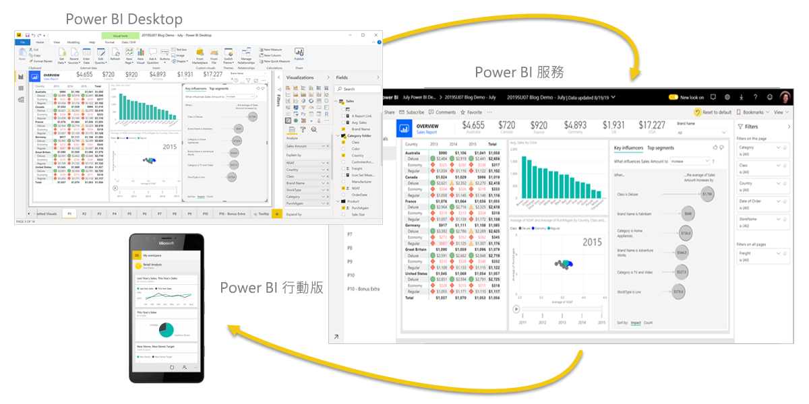
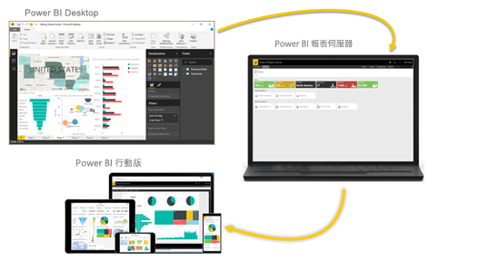

# Power BI 是什麼？
**Power BI** 是軟體服務、應用程式和連接器的集合，它們搭配使用來將不相關的資料來源轉換成相關、視覺上融入的互動式深入剖析。 不論您的資料是簡單的 Excel 試算表，或是一組雲端和內部部署混合式資料倉儲， Power BI 可讓您輕鬆地連線到資料來源、以視覺化方式檢視及探索重要資料，以及與任何人或您想要的任何人共用該資料。

## Power BI 的各部分
Power BI 是由多個項目所組成，這些項目以下列三種服務為首共同作業： 
- 稱為 **Power BI Desktop** 的 Windows 傳統型應用程式。
- 稱為 **Power BI 服務**的線上 SaaS (「軟體即服務」) 服務。 
- 適用於 Windows、iOS 和 Android 裝置的 Power BI **行動裝置應用程式**。

這三個元素&mdash;Power BI Desktop、服務以及行動裝置應用程式&mdash;旨在讓您透過最符合您和角色需求的方式來建立、共用和取用商業見解。

除了這三種服務以外，Power BI 也包含其他兩個項目：

- **Power BI Report Builder**，用於建立要在 Power BI 服務中共用的編頁報表。 如需詳細資訊，請參閱本文稍後的[編頁報表](#paginated-reports-in-the-power-bi-service)。
- **Power BI 報表伺服器**，這是一種內部部署報表伺服器，您可於該伺服器內透過 Power BI Desktop 建立 Power BI 報表，並加以發佈。 如需詳細資訊，請參閱本文稍後的[ Power BI 報表伺服器](#on-premises-reporting-with-power-bi-report-server)。

## Power BI 如何符合您的角色
Power BI 的使用方式可能取決於您在專案或小組中的角色。 其他角色的其他使用者可能以不同方式來使用 Power BI。

例如，您可能主要使用 **Power BI 服務**來檢視報表和儀表板。 負責處理數字、建立業務報表的同事，可能會大量使用 **Power BI Desktop** 或 **Power BI Report Builder** 來建立報表，並將這些報表發佈到 Power BI 服務以供檢視。 而銷售部門的同事可能主要使用 **Power BI 行動電話應用程式**來監視銷售額的進度，並鑽研新的潛在客戶詳細資料。

如果您是開發人員，便可以使用 Power BI API 將資料推送至資料集，或將儀表板和報表內嵌至您自己的自訂應用程式。 有新視覺效果的構想嗎？ 您可以自行建置並與其他人分享。  

您也可能會根據您嘗試達成的目標或您在給定專案中角色，在不同時間使用 Power BI 的每個元素。

Power BI 的使用方式取決於 Power BI 的哪些功能或服務是最適合您解決方案的工具。 例如，您可以使用 Power BI Desktop 來為自有小組建立客戶參與統計資料的報表，且您可以在 Power BI 服務中的儀表板上即時檢視庫存和製造進度。 您可根據 Power BI 資料集來建立可寄送發票的編頁報表。 您可以使用 Power BI 的每個部分，這就是其如此具有彈性且吸引人的原因。

探索與您角色相關的文件：
- 適用於[商務使用者](../consumer/end-user-consumer.md)的 Power BI
- 適用於[報表建立者](desktop-what-is-desktop.md)的 Power BI Desktop
- 適用於[企業報表建立者](../paginated-reports/paginated-reports-report-builder-power-bi.md)的 Power BI Report Builder
- 適用於[*系統管理員*](../admin/service-admin-administering-power-bi-in-your-organization.md)的 Power BI
- 適用於「開發人員」的 Power BI
    * [搭配 Power BI 使用內嵌式分析](../developer/embedded/embedding.md)
    * [什麼是 Azure Power BI Embedded？](../developer/embedded/azure-pbie-what-is-power-bi-embedded.md)
    * [Power BI 中的視覺效果](../developer/visuals/power-bi-custom-visuals.md)
    * [開發人員可如何利用 Power BI API？](../developer/automation/overview-of-power-bi-rest-api.md)

## Power BI 中的工作流程
Power BI 中其中一項一般工作流程是從連線至 Power BI Desktop 中的資料來源並建置報表開始。 接著，您會將該報表從 Power BI Desktop 發佈至 Power BI 服務並加以共用，讓 Power BI 服務中以及在行動裝置上的商務使用者可檢視報表並與報表互動。

此工作流程是常見的情況，並示範三個主要 Power BI 元素如何彼此互補。

以下是詳細的 [Power BI Desktop 與 Power BI 服務的比較](../fundamentals/service-service-vs-desktop.md)。

## Power BI 服務中的編頁報表

Power BI 服務中另一個牽涉到編頁報表的工作流程。 企業報表建立者會設計要列印或共用的編頁報表。 建立者也可在 Power BI 服務中共用這些報表。 這些報表稱為「編頁」，因為已將其格式化，可適當地符合頁面。 這些報表通常用於操作報表，或用於列印發票或文字記錄等表單。 即使資料表跨越多個頁面，它們也會在資料表中顯示所有資料。 Power BI 報表產生器是用於撰寫編頁報表的獨立工具。

:::image type="content" source="media/power-bi-overview/paginated-report-invoice-power-bi-service.png" alt-text="Power B I 服務中編頁報表的螢幕擷取畫面。":::

深入了解 Power BI 服務中的[編頁報表](../paginated-reports/paginated-reports-report-builder-power-bi.md)。

## 使用 Power BI 報表伺服器進行內部部署報告

若需要在內部部署環境 (例如防火牆後方) 保留報表，該怎麼做？  請繼續閱讀。

您可使用 Power BI 報表伺服器所提供現成工具與服務來建立、部署和管理 Power BI Desktop 中的 Power BI 報表，以及 Report Builder 中的編頁報表。

「Power BI 報表伺服器」是一個解決方案，您會將其部署在防火牆後方，然後以各種不同方式 (不論是在網頁瀏覽器中、行動裝置上還是以電子郵件形式檢視) 將報表傳遞給正確的使用者。 而由於「Power BI 報表伺服器」與雲端 Power BI 相容，因此您可以在準備就緒後就移至雲端。 

深入了解 [Power BI 報表伺服器](../report-server/get-started.md)。

## 後續步驟
- [快速入門：學習使用 Power BI 服務](../consumer/end-user-experience.md)   
- [教學課程：開始使用 Power BI 服務](service-get-started.md)
- [快速入門：在 Power BI Desktop 中連線至資料](../connect-data/desktop-quickstart-connect-to-data.md)
