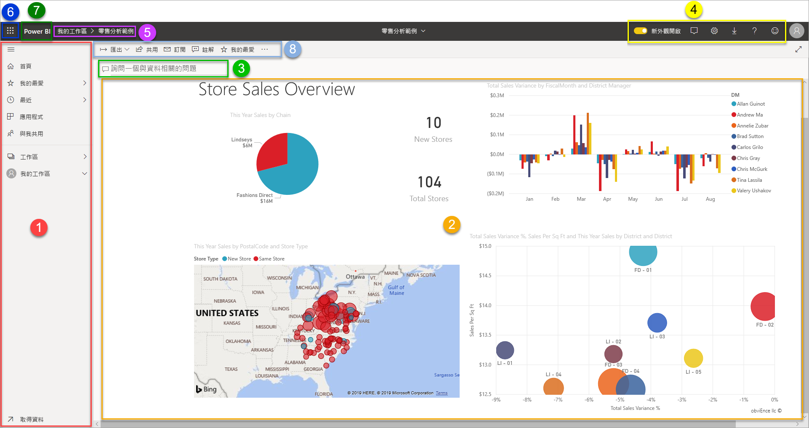
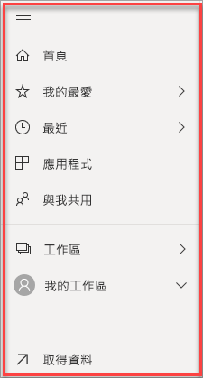

# Power BI 服務中的設計工具基本概念

此文章的目的是要協助您使用 Power BI 服務：有哪些不同的元素、如何搭配使用，及如何使用它們。 如果您已經[註冊 Power BI 服務](service-self-service-signup-for-power-bi.md)並已[新增一些資料](../connect-data/service-get-data.md)，將能更深入了解。 身為設計者，您的一般工作流程通常是從在 Power BI Desktop 中建立報表開始。 然後將它們發佈至 Power BI 服務，然後可以在服務中繼續修改。 也可以依據您在 Power BI 服務中的報表建立儀表板。 

針對此文章，如果您還沒有自己的報表，請嘗試安裝其中一個 [Power BI 範例](../create-reports/sample-datasets.md)。

![此圖顯示 Power B I 服務 [首頁] 畫面，包含如下所列出的編號區域瀏覽器。](media/service-basic-concepts/power-bi-home-screen.png)

當您在瀏覽器中開啟 Power BI 服務時，會從看到首頁開始。 以下是您可能會看到的元素：

1. [瀏覽] 窗格
2. Microsoft 365 應用程式啟動器
3. Power BI 首頁按鈕
4. 圖示按鈕，包括設定、說明與意見反應
5. 搜尋方塊
6. 我的最愛與常用儀表板、報表和工作區
7. 我的最愛與常用儀表板、報表和工作區
8. 您的工作區

在瀏覽器中，您和您報表與儀表板的終端使用者會在 Power BI 服務中獲得相同的開始體驗。

我們稍後會深入探討這些功能，不過首先來看 Power BI 的一些概念。 或者，您也可以先觀賞這段影片。  在影片中，Will 會檢閱基本概念，並介紹 Power BI 服務。

<iframe width="560" height="315" src="https://www.youtube.com/embed/B2vd4MQrz4M" frameborder="0" allowfullscreen></iframe>

## Power BI 概念
Power BI 包含五個主要的建構元素：*儀表板*、*報表*、*活頁簿*、*資料集*及*資料流程*。 這些建構元素組合而成*工作區*，並會依據*容量*建立。  在深入探討這五個建構元素之前，應先了解容量與工作區，所以我們將由此開始。

## 容量
容量是 Power BI 的核心概念，代表一組可以用於裝載及傳遞 Power BI 內容的資源 (儲存體、處理器與記憶體)。 容量可以_共用_，也可以_專用_。 共用的容量會提供給其他 Microsoft 客戶共用，而專用容量則會專供一位客戶使用。 專用容量需要[訂閱](../admin/service-premium-what-is.md)，這會在[管理進階容量](../admin/service-premium-capacity-manage.md)一文中詳細說明。

根據預設，工作區會依據共用容量建立。 在共用的容量中，工作負載是在與其他客戶共用的計算資源上執行。 由於容量必須共用資源，因此會加以設限，以確保「公平使用」，例如最大模型大小 (1 GB) 及每日重新整理頻率上限 (每天 8 次)。

## 工作區
工作區會依據容量建立。 工作區基本上就是 Power BI 儀表板、報表、活頁簿、資料集與資料流程的容器。

有兩種類型的工作區：「我的工作區」和「工作區」。

- [我的工作區] 是可供任何 Power BI 客戶處理自己的內容的個人工作區。 只有您可以存取您的 [我的工作區]。 您可以從 [我的工作區] 共用儀表板和報表。 如果您想要在儀表板和報表上共同作業，或建立應用程式，則應在工作區中工作。

-  *工作區*可用於共同作業，以及與同事共用內容。 您可以將同事新增至您的工作區，以及在儀表板、報告、活頁簿和資料集上共同作業。 但有一項例外，所有工作區成員都須具備 Power BI Pro 授權。 深入閱讀[新增工作區](../collaborate-share/service-create-the-new-workspaces.md)。 

    您也可以在工作區中為組織建立、發佈及管理*應用程式*。 您可以將工作區視為組成 Power BI 應用程式之內容的暫存區域與容器。 所以，何謂「應用程式」？ 應用程式集結了儀表板與報表，而建置這些儀表格與報表目的，則在提供關鍵計量給組織中的 Power BI 取用者。 應用程式皆能互動，但取用者無法編輯。 應用程式取用者 (可以存取應用程式的同事) 不一定需要 Pro 授權。  

若要深入了解一般共用，請從[共用您工作時使用儀表板的方式](../collaborate-share/service-how-to-collaborate-distribute-dashboards-reports.md)開始。

現在讓我們開始進入 Power BI 的五大建構元素。

## 資料流程
*資料流程*可協助組織統一不同來源的資料， 這非必要，通常複雜的大型專案才會使用。 資料流程代表資料已準備好，而且已經暫存，可以供資料集使用。 資料流程無法直接用為報表的來源。 其會利用龐大的 Microsoft 資料連接器集合，讓您能夠從內部部署及雲端資料來源擷取資料。

資料流程只會在工作區中建立及管理 (但不是*我的工作區*)，而且在 Azure Data Lake Storage Gen2 的 Common Data Model (CDM) 中，會以實體的形式儲存。 資料流程通常會定期重新整理，以儲存最新的資料。 其非常適合用於準備資料供資料集使用或可能重複使用。 如需詳細資訊，請參閱 [Power BI 中的自助資料準備](../transform-model/service-dataflows-overview.md)一文。

您的儀表板或報表中不能沒有資料 (您可能會有空白的儀表板及空白報表，但其中若無任何資料，就不會加以使用)，因此我們接著要介紹**資料集**。

## 資料集
「資料集」是您要在其中「匯入」或「連接」之資料的集合。 Power BI 可讓您連接和匯入各式各樣的資料集，並將所有資料整合到一個位置。 資料集也是資料流程的來源資料。

資料集與「工作區」相關聯，而單一資料集可以是許多工作區的一部分。 當您開啟工作區時，相關聯的資料集會列在 [資料集] 索引標籤之下。每個列出的資料集代表單一來源的資料，例如 OneDrive 上的 Excel 活頁簿、內部部署的 SSAS 表格式資料集，或 Salesforce 資料集。 其支援許多不同的資料來源，同時我們會不停新增新的資料來源。 查看[可搭配 Power BI 使用的資料集類型](../connect-data/service-get-data.md)清單。

在以下範例中，我已選取「銷售與行銷」工作區，並按下了 [資料集] 的索引標籤。

![Power B I 的螢幕擷取畫面，其中顯示已選取 [資料集] 的範例工作區。](media/service-basic-concepts/power-bi-datasets.png)

**一個** 資料集...

* 可以在一或多個工作區中反覆使用。
* 可以用在許多不同的報表中。
* 可在許多不同的儀表板中顯示該單一資料集的視覺效果。

  ![此圖顯示 [報表] 和 [儀表板] 的 [資料集] 關聯性。](media/service-basic-concepts/drawing2.png)

若要[連接資料集或匯入資料集](../connect-data/service-get-data.md)，請選取瀏覽窗格底部的 [取得資料]。 請遵循指示來連線到或匯入特定來源，並將資料集新增至作用中的工作區。 新的資料集會以黃色星號標示。 您在 Power BI 中執行的工作不會變更底層資料集。

具備 *admin*、*member* 或 *contributor* 角色的其他工作區成員，可以使用由其中一位工作區成員所新增的資料集。

您可以重新整理、重新命名、瀏覽及移除資料集。 使用資料集從頭開始建立報告，或執行[快速深入解析](../create-reports/service-insights.md)。  若要查看哪些報告和儀表板已經使用資料集，請選取 [檢視相關的]。 若要瀏覽資料集，請選取該資料集。 您實際上會在報表編輯器中開啟資料集，而在編輯器中，您可以建立視覺效果，開始深入探索資料。

現在讓我們進入下一個主題 - 報表。

### 深入瞭解
* [Power BI 服務中的資料集](../connect-data/service-datasets-understand.md)
* [Power BI 服務中的資料集模式](../connect-data/service-dataset-modes-understand.md)
* [什麼是 Power BI Premium？](../admin/service-premium-what-is.md)
* [取得 Power BI 的資料](../connect-data/service-get-data.md)
* [Power BI 的範例資料集](../create-reports/sample-datasets.md)

## 報表
Power BI 報表是一或多個頁面的視覺效果，例如折線圖、地圖及矩形式樹狀結構圖。 Virtualization 和 **_Visual_** 都是指視覺效果。 報表中的所有視覺效果都是來自單一資料集。 您可以在 Power BI 從頭開始建立報表、使用同事與您共用的儀表板進行匯入，或是 Power BI 可以在您從 Excel、Power BI Desktop、資料庫和 SaaS 應用程式連線到資料集時建立報表。  例如，當您連接到包含 Power View 工作表的 Excel 活頁簿時，Power BI 會根據這些工作表建立報表。 而當您連接至 SaaS 應用程式時，Power BI 則會匯入預先建立的報表。

有兩種模式可以檢視報表並與其互動：「閱讀檢視」和「編輯檢視」。 當您開啟報表時，它會在閱讀檢視中開啟。 若您有編輯權限，您會在左上角看到 [編輯報表]，並且可以在編輯檢視中檢視報表。  若報表是在工作區中，每位具備 *admin*、*member* 或 *contributor* 角色的成員都可以編輯。 他們可以存取該報表編輯檢視的所有探索、設計、建置和共用功能。 與他們共用報表的人員，可以在閱讀檢視中探索和與報表進行互動。

當您開啟工作區時，相關聯的報告會列在 [報告] 索引標籤之下。每個列出的報告只會根據一個基礎資料集，呈現一或多個頁面的視覺效果。 若要開啟報表，請選取該報表。

當您開啟應用程式時，您會看到儀表板。  若要存取基礎報表，請選取從報表釘選的儀表板磚 (稍後將詳細說明磚)。 請注意，並非所有圖格都是從報告釘選，所以您可能必須按一下幾個圖格來尋找報告。

根據預設，報告會在 [閱讀檢視] 中開啟。  請直接選取 [編輯報告]，在 [編輯檢視] 中開啟報告 (如果您有必要權限)。

在以下範例中，我已選取「銷售與行銷」工作區，並按下了 [報表] 的索引標籤。

![Power B I 的螢幕擷取畫面，其中顯示已選取 [報表] 的範例工作區。](media/service-basic-concepts/power-bi-reports.png)

**一個** 報表...

* 包含在單一工作區中。
* 可以與該工作區中的多個儀表板建立關聯。 從單一報表釘選的磚可以出現在多個儀表板上。
* 可使用一個資料集的資料建立而成。 Power BI Desktop 可以將超過一個資料來源合併成報表中的單一資料集，且該報表可匯入至 Power BI。

  ![此圖顯示 [報表] 和 [資料集] 的 [儀表板] 關聯性。](media/service-basic-concepts/drawing3new.png)

### 深入瞭解
- [匯入資料集以在 Power BI 服務中建立報表](../create-reports/service-report-create-new.md)
- [建立為 Power BI 行動裝置應用程式最佳化的報表](../create-reports/desktop-create-phone-report.md)

## 儀表板
「儀表板」是您在 **Power BI 服務**中所建立，或由同事在 **Power BI 服務**中建立並與您共用的項目。 其為含有零或多個磚與 Widget 的單一畫布。 從報告或從[問與答](../consumer/end-user-q-and-a.md)釘選的每個圖格會顯示從資料集建立並釘選到儀表板的單一[視覺效果](../visuals/power-bi-report-visualizations.md)。 整個報告頁面也可以當作單一圖格釘選到儀表板。 有許多方法可將磚加入儀表板中；本概觀主題無法全部涵蓋。 若要深入了解，請參閱 [Power BI 的儀表板磚](../create-reports/service-dashboard-tiles.md).

為何要建立儀表板？  以下只是部分原因：

* 所有必要的資訊一目了然，以利做出決策。
* 監視最重要的業務相關資訊。
* 確保所有同事都在相同的頁面上，並檢視與使用相同資訊。
* 監視企業、產品、業務單位或行銷活動等的狀況
* 建立較大型儀表板的個人化檢視 -- 放入所有重要的計量。

當您開啟工作區時，相關聯的儀表板會列在 [儀表板] 索引標籤之下。若要開啟儀表板，請選取該儀表板。 當您開啟應用程式時，您會看到儀表板。  每個儀表板表示基礎資料集其中一部分子集的自訂檢視。  如果您擁有儀表板，您也會有基礎資料集和報告的編輯存取權。  如果與您共用儀表板，您將能夠與儀表板和任何基礎報告互動，但是無法儲存任何變更。

您或同事有許多不同的方式可以[共用儀表板](../collaborate-share/service-share-dashboards.md)。 需要 Power BI Pro 才能共用儀表板以及檢視共用的儀表板。

**一個** 儀表板...

* 與單一工作區相關聯
* 可顯示許多不同資料集的視覺效果
* 可顯示許多不同報表的視覺效果
* 可以顯示從其他工具 (例如 Excel) 釘選的視覺效果

  ![此圖顯示 [儀表板] 和 [資料集] 與 [報表] 的關聯性。](media/service-basic-concepts/drawing1.png)

### 深入瞭解
* [建立空白儀表板，然後取得一些資料](../create-reports/service-dashboard-create.md)。
* [複製儀表板](../create-reports/service-dashboard-copy.md)
* [建立儀表板的手機檢視](../create-reports/service-create-dashboard-mobile-phone-view.md)

## 活頁簿
活頁簿是一種特殊的資料集。 如果您已閱讀 [資料集] 一節，您幾乎知道您需要了解活頁簿的一切。 但您可能想知道為什麼有時 Power BI 會將 Excel 活頁簿歸類為 [資料集]，而有時又會歸類為 [活頁簿]。

當您將 [取得資料] 用於 Excel 檔案時，您可以選擇 [匯入] 或 [連線] 到檔案。 當您選擇 [連線] 時，您的活頁簿會顯示在 Power BI 中，就像是在 Excel Online 中一樣。 但不同於 Excel Online，您有一些很棒的功能，可協助您將工作表中的項目釘選到儀表板。

您無法在 Power BI 中編輯活頁簿。 但如果您需要進行一些變更，您可以按一下 [編輯]，然後選擇在 Excel Online 中編輯活頁簿，或在電腦上以 Excel 開啟活頁簿。 您所做的任何變更都會儲存到 OneDrive 上的活頁簿。

### 深入瞭解
* [從 Excel 活頁簿檔案取得資料](../connect-data/service-excel-workbook-files.md)
* [從 Excel 發佈至 Power BI](../connect-data/service-publish-from-excel.md)

## [我的工作區] 中的儀表板
我們已涵蓋工作區和建置組塊。 讓我們將它合在一起，並檢閱構成 Power BI 服務儀表板體驗的各部分。

### 1.**瀏覽窗格**
使用瀏覽窗格在您的工作區與 Power BI 建構元素 (儀表板、報表、活頁簿和資料集) 之間尋找及移動。  

  

* 選取 [取得資料]，[將資料集、報表和儀表板新增至 Power BI](../connect-data/service-get-data.md)。
* 使用此圖示展開及摺疊瀏覽窗格 .
* 選取 [我的最愛] 以開啟或管理您最愛的內容。
* 選取 [最近] 以檢視和開啟您最近瀏覽過的內容
* 選取 [應用程式] 以檢視、開啟或刪除應用程式。
* 有同事與您共用內容嗎？ 選取 [與我共用] 來搜尋和排序該內容，以尋找您所需的內容。
* 選取 [工作區] 以顯示並開啟您的工作區。

按一下這些項目：

* 圖示或標題，以在內容檢視中開啟
* 向右箭號 (>)，以開啟 [我的最愛]、[最近] 和 [工作區] 的功能表飛出視窗。
* ＞形箭號圖示，以顯示 [我的工作區] 儀表板、報告、活頁簿和資料集的可捲動清單。

### 2.**畫布**
由於我們已開啟儀表板，所以畫布區域會顯示視覺效果圖格。 例如，如果我們已開啟報表編輯器，則畫布區域會顯示報表頁面。

儀表板是由[磚](../create-reports/service-dashboard-tiles.md)所組成。  圖格可在報告的 [編輯檢視]、[問與答]、其他儀表板中建立，而且可以從 Excel、SSRS 等項目釘選。 一種稱為 [Widget](../create-reports/service-dashboard-add-widget.md) 的特殊磚類型會直接加入儀表板中。 出現在儀表板上的圖格，為報表建立者/擁有者特別放置於此的。  將圖格加入儀表板中的動作稱為「釘選」 。

如需詳細資訊，請參閱 [[儀表板]](#dashboards)\(請見上方)。

### 3.**問與答的問題方塊**
瀏覽資料的方式之一為提問，讓 Power BI 問與答以視覺效果的形式為您解答。 [問與答] 可以用來將內容新增至儀表板或報告。

問與答會在連接到儀表板的資料集中尋找答案。  連接的資料集是指具有至少一個圖格釘選至該儀表板的資料集。

![Power B I 服務的螢幕擷取畫面，其中顯示 [問與答] 的問題方塊。](media/service-basic-concepts/power-bi-qna.png)

一旦您開始輸入問題，問與答就會帶您前往問與答的頁面。 您在輸入時，問與答會以修改措辭、自動填入、建議及更多方式，協助您詢問適當的問題並找尋最佳解答。 如果有您喜歡的視覺效果 (解答)，請予以釘選到您的儀表板中。 如需詳細資訊，請參閱 [Power BI 中的問與答](../consumer/end-user-q-and-a.md)。

### 4.**黑色標題列中的圖示**
右上角的圖示為您的資源，可供您設定、通知、下載、取得說明、開啟或關閉**新外觀**，並將意見反應提供給 Power BI 小組。  

### 5.**儀表板標題** (導覽路徑，也稱為階層連結)
您不一定能輕鬆地指出哪個工作區和儀表板為作用中，因此 Power BI 會為您建立導覽路徑。  在此範例中，我們看到工作區 (我的工作區) 和儀表板標題 (零售分析範例)。  如果我們開啟了報告，則報告的名稱會附加至導覽路徑的結尾。  路徑的每個部分都是作用中的超連結。  

請注意儀表板標題之後的 "C" 圖示。 此儀表板具有「機密」[資料分類標籤](../create-reports/service-data-classification.md)。 此標籤可識別資料的敏感性和安全性層級。 如果您的系統管理員已開啟資料分類，則每個儀表板將會設定一個預設標籤。 儀表板擁有者應變更此標籤，以符合其儀表板的適當安全性層級。

### 6.**Microsoft 365 應用程式啟動器**
透過應用程式啟動器，按一下即可輕鬆取得所有的 Microsoft 365 應用程式。 您可以從這裡快速地啟動您的電子郵件、文件、行事曆等等。

### 7.**Power BI 首頁**
選取 [Power BI] 將帶您回到 Power BI 首頁。

   

### 8.**灰色功能表列中標示的圖示**
螢幕的這個區域包含與內容互動 (在此例中，與儀表板互動) 的其他選項。  除了您可以看到之加上標籤的圖示，選取 [更多選項 (...)] 可顯示用於複製、列印、重新整理儀表板等選項。

   

## 後續步驟
- [Power BI 是什麼？](power-bi-overview.md)  
- [Power BI 影片](videos.md)  
- [報告編輯器.-.進行導覽](../create-reports/service-the-report-editor-take-a-tour.md)
- 有其他問題嗎？ [嘗試在 Power BI 社群提問](https://community.powerbi.com/)
