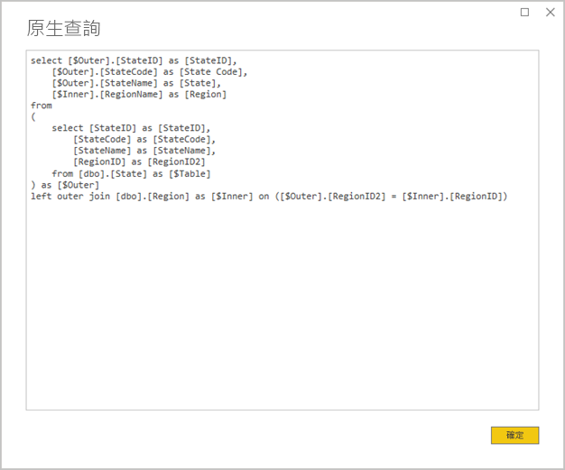

# <a name="directquery-model-guidance-in-power-bi-desktop"></a>Power BI Desktop 中的 DirectQuery 模型指南

本文針對使用 Power BI Desktop 或 Power BI 服務所開發 Power BI DirectQuery 模型來加以開發的資料製造模型者。 其中描述 DirectQuery 使用案例、限制和指導。 具體而言，本指導旨在協助判斷 DirectQuery 是否是您模型的適當模式，並根據 DirectQuery 模型改善報表效能。 本文適用於裝載在 Power BI 服務或 Power BI 報表伺服器的 DirectQuery 模型。

本文並不旨在提供 DirectQuery 模型設計的完整討論。 如需簡介，請參閱 [Power BI Desktop 中的 DirectQuery 模型](../desktop-directquery-about.md)一文。 如需更深入的討論，請直接參閱 [SQL Server 2016 Analysis Services 中的 DirectQuery](https://download.microsoft.com/download/F/6/F/F6FBC1FC-F956-49A1-80CD-2941C3B6E417/DirectQuery%20in%20Analysis%20Services%20-%20Whitepaper.pdf) 技術白皮書。 請記住，技術白皮書描述在 SQL Server Analysis Services 中使用 DirectQuery。 但是大部分的內容仍然適用 Power BI DirectQuery 模型。

本文並不直接涵蓋複合模型。 複合模型將會由至少一個 DirectQuery 來源 (可能更多) 組成。 本文中描述的指導至少有些部分仍然與複合模型設計相關。 但是，將匯入資料表與 DirectQuery 資料表合併的隱含式並不在本文範圍內。 如需詳細資訊，請參閱[在 Power BI Desktop 中使用複合模型](../desktop-composite-models.md)。

請務必了解 DirectQuery 模型會在 Power BI 環境 (Power BI 服務或 Power BI 報表伺服器) 及基礎資料來源上施加不同的工作負載。 若您判斷 DirectQuery 是適當的設計方法，則建議您在專案上與適當的人員接洽。 我們經常會發現成功的 DirectQuery 模型部署都是 IT 專業人員小組緊密合作的結果。 小組通常都是由模型開發人員和來源資料庫管理員組成。 其中也可以涉及資料架構師、資料倉儲和 ETL 開發人員。 通常，最佳化需要直接套用至資料來源以取得良好的效能結果。

## <a name="design-in-power-bi-desktop"></a>在 Power BI Desktop 中設計

Azure SQL 資料倉儲和 Azure HDInsight Spark 資料來源都可以直接進行連線，無需使用 Power BI Desktop。 在 Power BI 服務中透過「取得資料」及選擇資料庫標題即可達成此目的。 如需詳細資訊，請參閱[具有 DirectQuery 的 Azure SQL 資料倉儲](../service-azure-sql-data-warehouse-with-direct-connect.md)。

雖然直接連接相當方便，但不建議您使用這種方法。 主要原因是萬一基礎資料來源的結構描述產生變更，即無法重新整理模型結構。

建議使用 Power BI Desktop 來建立及管理所有的 DirectQuery 模型。 這種方法可提供完整的控制來定義您需要的模型，包括使用如階層、計算結果欄、量值等支援功能。 這也可以讓您在基礎資料來源結構描述產生變更時修訂模型設計。

## <a name="optimize-data-source-performance"></a>最佳化資料來源效能

關聯式資料庫來源可以透過數種方式最佳化，如下列項目符號清單所示。

> [!NOTE]
> 我們了解並非所有製造模型者都具備最佳化關聯式資料庫的權限或技能。 雖然其是為 DirectQuery 模型準備資料的慣用層，但有些最佳化仍然可以在模型設計中達成，而無須修改來源資料庫。 但是，最佳的最佳化結果通常都是透過將最佳化套用至來源資料庫來達成。

- **確保資料完整性已完成：** 維度類型資料表包含對應到事實類型資料表的唯一值 (維度索引鍵) 資料行特別重要。 事實類型維度資料行包含有效的維度索引鍵值也相當重要。 這些資料行可讓您設定更有效率的模型關聯性，其預期關聯性兩端都具有相符的值。 當來源資料缺少完整性時，建議新增「未知」維度記錄來有效修復資料。 例如，您可以將資料列新增至 **Product** 資料表，代表未知的產品，然後將其指派給超出範圍的索引鍵，例如 -1。 若 **Sales** 資料表中資料列包含遺漏的產品索引鍵值，即會將其替換成 -1。 這會確保每個 **Sales** 產品索引鍵值在 **Product** 資料表中都具有對應的資料列。
- **新增索引：** 在資料表或檢視上定義適當的索引，以支援針對預期報表視覺效果篩選和分組的具效率資料擷取。 若為 SQL Server、Azure SQL Database 或 Azure SQL 資料倉儲來源，請參閱 [SQL Server 索引架構與設計指南](/sql/relational-databases/sql-server-index-design-guide?view=sql-server-2017)，以取得索引設計指導的實用資訊。 若為 SQL Server 或 Azure SQL Database 揮發性來源，請參閱[開始使用資料行存放區來進行即時作業分析](/sql/relational-databases/indexes/get-started-with-columnstore-for-real-time-operational-analytics?view=sql-server-2017)。
- **設計分散式資料表：** 針對利用大規模平行處理 (MPP) 架構的 Azure SQL 資料倉儲來源，請考慮將大型的事實類型資料表設為雜湊分散，以及維度類型資料表，以跨所有計算節點進行複寫。 如需詳細資訊，請參閱[在 Azure SQL 資料倉儲中設計分散式資料表的指導](/azure/sql-data-warehouse/sql-data-warehouse-tables-distribute#what-is-a-distributed-table)。
- **確保必要資料轉換都已具體化：** 針對 SQL Server 關聯式資料庫來源 (以及其他關聯式資料庫來源)，可以將計算資料行新增至資料表。 這些資料行都是以運算式為基礎，例如 **Quantity** 乘以 **UnitPrice**。 計算資料行可以進行保存 (具體化)，且與一般資料行相似，有時候也可以為其編製索引。 如需詳細資訊，請參閱[計算資料行的索引](/sql/relational-databases/indexes/indexes-on-computed-columns?view=sql-server-2017)。

    請也考慮索引檢視表，這種檢視表可以更細微地預先彙總事實資料表。 例如，若 **Sales** 資料表是在訂單明細層級儲存資料，您即可以建立檢視來摘要此資料。 檢視可能是以 SELECT 陳述式為基礎，此陳述式會將 **Sales** 資料表資料依日期 (月份層級)、客戶、產品進行分組，並摘要量值 (例如銷售額、數量等)。接著便可以為檢視編製索引。 針對 SQL Server 或 Azure SQL Database 來源，請參閱[建立索引檢視表](/sql/relational-databases/views/create-indexed-views?view=sql-server-2017)。
- **具體化運算列表：** 常見的模型需求會涉及新增日期資料表，以支援以時間為基礎的篩選。 若要在組織中支援已知的以時間為基礎篩選，請在來源資料庫中建立資料表，並確保其載入了包含事實資料表日期的日期範圍。 也請確保其包含實用的時間間隔資料行，例如年、季、月、週等。

## <a name="optimize-model-design"></a>最佳化模型設計

DirectQuery 模型可以透過許多方式進行最佳化，如下列項目符號清單所述。

- **避免複雜的 Power Query 查詢：** 您可以透過移除套用任何轉換的 Power Query 查詢需求，以達成具效率的模型設計。 這表示每個查詢都會對應到單一關聯式資料庫來源資料表或檢視。 您可以透過選取 [檢視原生查詢]  選項來預覽 Power Query 套用步驟的實際 SQL 查詢陳述式表示。

    ![查詢編輯器的套用步驟會顯示五個步驟。 在最後一個名為「重新命名後資料行」的步驟上按一下滑鼠右鍵即會開啟操作功能表。 其中 [檢視原生查詢] 選項已啟用並已醒目提示。](media/directquery-model-guidance/directquery-model-guidance-query-editor-view-native-query.png)
    
    

- **檢查計算結果欄的使用和資料類型變更：** DirectQuery 模型支援新增計算和 Power Query 步驟來轉換資料類型。 但是，更佳的效能通常都是透過在可能情況下，於關聯式資料庫來源中具體化轉換結果來達成。
- **不要使用 Power Query 相對日期篩選：** 您可以在 Power Query 查詢中定義相對日期篩選。 例如，擷取去年建立的銷售訂單 (相對於今天的日期)。 這種篩選類型會轉譯成效率極低的原生查詢，如下所示：

    ```SQL
    …
    from [dbo].[Sales] as [_]
    where [_].[OrderDate] >= convert(datetime2, '2018-01-01 00:00:00') and [_].[OrderDate] < convert(datetime2, '2019-01-01 00:00:00'))  
    ```
    
    更佳的設計方法是在日期資料表中包含相對時間資料行。 這些資料行會儲存相對於目前日期的位移值。 例如，在 **RelativeYear** 資料行中，值零 (0) 代表目前年份，-1 則代表前一年等。建議在日期資料表中具體化 **RelativeYear** 資料行。 雖然效率較低，但也可以將其作為模型計算結果欄新增，以使用 [TODAY](/dax/today-function-dax) 和 [DATE](/dax/date-function-dax) DAX 函式的運算式為基礎。

- **確保量值簡單：** 至少在一開始，建議將量值限制在簡單的彙總。 彙總函式包含 SUM、COUNT、MIN、MAX 和 AVERAGE。 然後，若量值的回應性足夠，您便可以透過注意每個量值的效能來實驗更複雜的量值。 雖然 [CALCULATE](/dax/calculate-function-dax) DAX 函式可用來產生複雜的量值運算式以操縱篩選內容，但這些運算式可能會產生效能不佳且耗費資源的原生查詢。
- **避免計算結果欄上的關聯性：** 模型關聯性只能將單一資料表中單一資料行與不同資料表中的單一資料行建立關聯。 但有時候，使用多個資料行來建立資料表的關聯仍是必要的。 例如，**Sales** 和 **Geography** 資料表是使用兩個資料行來建立關聯：**Country** 和 **City**。 若要在資料表間建立關聯性，便需要單一資料行，且在 **Geography** 資料表中，資料行必須包含唯一值。 使用連字號分隔符號來串連國家/地區和城市，即可達成此結果。

    可以使用 Power Query 自訂資料行，或在模型中以計算結果欄來建立合併資料行。 但是，建議避免此操作，因為計算運算式會內嵌至來源查詢中。 這不僅效率不佳，也常會妨礙使用索引。 請改為在關聯式資料庫來源中新增具體化資料行，並考慮為其編製索引。 您也可以考慮將代理索引鍵資料行新增至維度類型資料表，這是在關聯式資料倉儲設計中常見的做法。
    
    本指導有一項例外，與使用 [COMBINEVALUES](/dax/combinevalues-function-dax) DAX 函式有關。 此函式的目的是支援多資料行模型關聯性。 這個函式會產生多資料行 SQL 聯結述詞，而非產生關聯性使用的運算式。
- **避免在「唯一識別碼」資料行上包含關聯性：** Power BI 並不原生支援唯一識別碼 (GUID) 資料類型。 在此類型的資料行間定義關聯性時，Power BI 將會使用涉及轉換的聯結來產生來源查詢。 此查詢時間資料轉換經常導致效能不佳。 在此案例經過最佳化之前，唯一因應措施是將資料行具體化為基礎資料庫中的替代資料類型。
- **隱藏關聯性的單側資料行：** 關聯性的單側資料行應進行隱藏。 (這通常是維度類型資料表的主索引鍵資料行。)隱藏時，即無法在 [欄位]  窗格中使用，因此無法用來設定視覺效果。 若可以使用多側資料行來根據資料行的值分組或篩選報表，即可以將多側資料行維持在可見狀態。 例如，考慮在 **Sales** 和 **Product** 資料表間存在關聯性的模型。 關聯性資料行包含產品的 SKU (庫存單位) 值。 若必須將產品的 SKU 新增至視覺效果，該 SKU 便應只在 **Sales** 資料表中可見。 當使用此資料行來篩選或在視覺效果中進行分組時，Power BI 將會產生不需要將 **Sales** 和 **Product** 資料表進行聯結的查詢。
- **設定關聯性來強制實行完整性：** DirectQuery 關聯性的**假設參考完整性**屬性會決定 Power BI 是否將會使用內部聯結，而非外部聯結來產生來源查詢。 這通常可以改善查詢效能，不過其確實取決於關聯式資料庫來源的詳細規格。 如需詳細資訊，請參閱 [Power BI Desktop 中的採用參考完整性設定](../desktop-assume-referential-integrity.md)。
- **避免使用雙向關聯性篩選：** 使用雙向關聯性篩選可能會導致執行效能不佳的查詢陳述式。 只有在必要時才使用此關聯性功能，這通常是跨橋接資料表實作多對多關聯性的情況。 如需詳細資訊，請參閱 [Power BI Desktop 中的多對多基數關聯性](../desktop-many-to-many-relationships.md)。
- **限制平行查詢：** 您可以設定 DirectQuery 為每個基礎資料來源開啟的連線數量上限。 這會控制同時傳送到資料來源的查詢數。

    ![Power BI Desktop 視窗已開啟，並已選取 [目前檔案 DirectQuery] 頁面。 [每個資料來源的連線數量上限] 屬性已醒目提示。](media/directquery-model-guidance/directquery-model-guidance-desktop-options-current-file-directquery.png)
    
    設定只會在模型中至少包含一個 DirectQuery 來源時啟用。 該值會套用至所有 DirectQuery 來源，以及任何新增至模型的新 DirectQuery 來源。

    增加 [每個資料來源的連線數量上限]  值可確保有更多查詢 (最多可達指定的最大數目) 可以傳送至基礎資料來源，這在單一頁面上有許多視覺效果時，或是許多使用者同時存取報表時很有用。 一旦達到最大連線數目，進一步的查詢會排入佇列，直到有連線可供使用。 增加此限制會導致基礎資料來源有更多的負載，所以設定不保證能改善整體效能。
    
    將此模型發佈至 Power BI 時，傳送到基礎資料來源的同時查詢數量上限也會取決於環境。 每個不同環境 (例如 Power BI、Power BI Premium 或 Power BI 報表伺服器) 都可能會施加不同的輸送量條件約束。 如需 Power BI Premium 容量資源限制的詳細資訊，請參閱[部署及管理 Power BI Premium 容量](https://docs.microsoft.com/power-bi/whitepaper-powerbi-premium-deployment)。

## <a name="optimize-report-designs"></a>最佳化報表設計

以 DirectQuery 資料集為基礎的報表可以透過許多方式進行最佳化，如下列項目符號清單所述。

- **啟用查詢縮小技術：** Power BI Desktop [選項及設定]  包含 [減少查詢] 頁面。 此頁面有三個有用的選項。 您可以預設停用交叉醒目提示和交叉篩選，雖然這可以透過編輯互動來進行覆寫。 您也可以在交叉分析篩選器和篩選上顯示 [套用] 按鈕。 在報表使用者按一下按鈕前，交叉分析篩選器或篩選選項不會進行套用。 若您啟用這些選項，我們建議您在初次建立報表時執行此操作。

    ![Power BI Desktop 視窗已開啟，並已選取 [目前檔案查詢縮小] 頁面。 這三個選項都可以用來減少傳送的查詢數，以及為交叉分析篩選器和篩選顯示 [套用] 按鈕。](media/directquery-model-guidance/directquery-model-guidance-desktop-options-current-file-query-reduction.png)
    
- **先套用篩選：** 初次設計報表時，我們建議您先在報表、頁面或視覺效果層級套用任何適用的篩選，再將欄位對應到視覺效果欄位。 例如，先在 **Year** (年份) 欄位上套用篩選，而非先在 **Country** (國家/地區) 和 **Sales**(銷售) 量值上進行拖曳，再針對特定年份進行篩選。 這是因為建置視覺效果的每個步驟都會傳送查詢，雖然可以在完成第一個查詢之前進行其他變更，但仍會為基礎資料來源帶來不必要的負載。 藉由及早套用篩選，通常可降低這些中繼查詢的成本，並使其更快。 此外，若無法及早套用篩選，便可能會導致超過 1 百萬的資料列限制，如上所述。
- **限制單頁上的視覺效果數目：** 開啟報表頁面 (以及套用頁面篩選) 時，會重新整理頁面上的所有視覺效果。 但是，Power BI 環境以及 [每個資料來源的連線數量上限]  模型設定會施加可以平行傳送的查詢數限制，如上所述。 因此，隨著頁面視覺效果的數量增加，其以循序方式重新整理的機率也會提高。 這會增加重新整理整個頁面所需的時間，也會增加視覺效果顯示不一致結果 (針對揮發性資料來源) 的機會。 因此，建議您限制任何頁面上的視覺效果數量，並改為擁有較為簡單的頁面。 以單一多資料列卡片視覺效果取代多個卡片視覺效果，可能會導致相似的頁面配置。
- **關閉視覺效果之間的互動：** 交叉醒目提示和交叉篩選互動，需要將查詢提交至基礎來源。 除非這些互動都是必要的，否則若回應使用者選取的時間長度可能變得相當不合理，便建議您關閉這些功能。 您可以針對整份報告 (如上述的「減少查詢」選項) 或根據案例來關閉這些互動。 如需詳細資訊，請參閱[如何在 Power BI 報表中相互進行視覺效果交叉篩選](../consumer/end-user-interactions.md)。

除了上述最佳化技術清單外，每個下列報告功能都可能導致效能問題：

- **量值篩選：** 包含量值的視覺效果 (或資料行彙總) 可以將篩選套用至這些量值。 例如，以下的視覺效果會根據 **Category** 顯示 **Sales**，但只適用於銷售額超過美金 $1,500 萬元的類別。

    ![資料表視覺效果包含兩個資料行：Category 和 Sales。 [篩選] 窗格會顯示在 Sales 量值上針對值超過美金 $1,500 萬元所進行的篩選。 資料表包含三個資料列，每個資料列都包含超過美金 $1,500 萬元的 Sales 值。](media/directquery-model-guidance/directquery-model-guidance-example-measure-filter.png)
    
    
    這可能會導致將兩個查詢傳送到基礎來源：
    
    - 第一個查詢會擷取符合條件的類別 (Sales > 美金 $1,500 萬元)
    - 第二個查詢接著會擷取視覺效果的必要資料，並將符合條件的類別新增到 WHERE 子句
    
    如此範例中具有的數百個或數千個類別，這執行起來通常沒有問題。 但是，如果類別數目更大，則效能可能會降低 (此外，如果有超過 1 百萬個類別符合條件，基於以上所述的 1 百萬個資料列限制，查詢將會失敗)。
- **TopN 篩選：** 您可以定義進階篩選來只根據依照量值排名的前 (或最後) N 個值進行篩選。 例如，只在上述視覺效果中顯示前五個類別。 與量值篩選相似，這也會導致將兩個查詢傳送到基礎資料來源。 不過，第一個查詢會傳回基礎來源中的所有類別，然後根據傳回的結果來決定前 N 項。 根據所涉及的資料行基數，這可能會導致效能問題 (或由於 1 百萬個資料列限制而查詢失敗)。
- **中位數**：一般而言，任何彙總 (Sum、Count Distinct 等) 都會發送至基礎來源。 不過，中位數則不然，因為基礎來源不支援這項彙總。 在這種情況下，會從基礎來源擷取詳細資料，然後 Power BI 會從傳回的結果評估中位數。 這在針對較少的結果數目計算中位數時沒有什麼問題，但如果基數很大，則會發生效能問題 (或由於 1 百萬個資料列限制而查詢失敗)。 例如，計算國家/地區人口的中位數可能很合理，但計算售價的中位數可能不適合。
- **多重選取交叉分析篩選器：** 在交叉分析篩選器和篩選中允許多重選取，可能會造成效能問題。 這是因為當使用者選取其他交叉分析篩選器項目時 (例如建置最多 10 個使用者有興趣的產品)，每個新的選取項目都會導致將新查詢傳送到基礎來源。 雖然使用者可以在查詢完成前選取下一個項目，但這樣會對基礎來源帶來額外的負載。 可以透過顯示 [套用] 按鈕來避免這種情況，如先前的查詢縮小技術所述。
- **視覺化總計：** 根據預設，資料表和矩陣會顯示總計和小計。 在許多情況下，額外查詢必須傳送到基礎來源以取得總計值。 這會套用在使用相異計數或中位數彙總時，以及所有透過 SAP HANA 或 SAP Business Warehouse 使用 DirectQuery 的案例。 若非必要，建議關閉這類總計 (使用 [格式] 窗格)。

## <a name="convert-to-a-composite-model"></a>轉換成複合模型

匯入及 DirectQuery 模型的優點可以透過設定模型資料表儲存模式，來合併成單一模型。 資料表儲存模式可以是 [匯入] 或 [DirectQuery]，或兩者皆是 (稱為「雙重」)。 當模型取得具有不同儲存模式的資料表時，稱為複合模型。 如需詳細資訊，請參閱[在 Power BI Desktop 中使用複合模型](../desktop-composite-models.md)。

您可以透過將 DirectQuery 模型轉換成複合模型來達成許多功能和效能上的強化。 複合模型的整合程度比單一 DirectQuery 來源更高，也可以包含彙總。 彙總資料表可以新增至 DirectQuery 資料表來匯入資料表的摘要表示。 這可以在視覺效果查詢較高層級的彙總時大幅強化效能。 如需詳細資訊，請參閱 [Power BI Desktop 中的彙總](../desktop-aggregations.md)。

## <a name="educate-users"></a>教育使用者

教育使用者如何有效地根據 DirectQuery 資料集使用報表非常重要。 報表作者應針對[最佳化報表設計](#optimize-report-designs section)中描述的內容進行學習。

我們建議針對以 DirectQuery 資料集為基礎的報表來教育報表取用者。 讓報表取用者了解一般資料架構 (包含任何本文所述的相關限制) 也會有所幫助。 讓報表取用者了解其需要預期有時候重新整理回應和互動篩選可能會相當緩慢。 當報表使用者了解為何會發生效能降低情況時，就不太可能會對報表和資料喪失信心。

傳遞以揮發性資料來源為基礎的報表時，請務必教育報表使用者使用 [重新整理] 按鈕。 讓報表使用者也了解其可能會看到不一致的結果，且重新整理報表可以解決報表頁面上的任何不一致。

## <a name="next-steps"></a>後續步驟

如需 DirectQuery 的詳細資訊，請參閱下列資源：

- [Power BI Desktop 中的 DirectQuery 模型](../desktop-directquery-about.md)
- [在 Power BI Desktop 中使用 DirectQuery](../desktop-use-directquery.md)
- [在 Power BI Desktop 中針對 DirectQuery 模型進行疑難排解](../desktop-directquery-troubleshoot.md)
- 有問題嗎？ [嘗試在 Power BI 社群提問](https://community.powerbi.com/)
