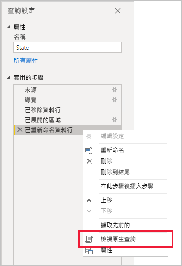
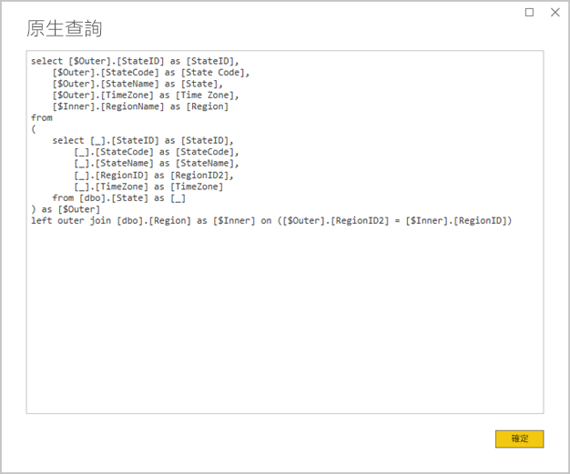
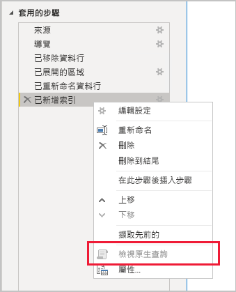

# <a name="the-importance-of-query-folding"></a>查詢折疊的重要性

本文適用於在 Power BI Desktop 中開發模型的製造資料模型者。 本文描述什麼是查詢折疊，以及其所以重要的原因。 本文也描述可能達成查詢折疊的資料來源和轉換，以及如何判斷是否可折疊您的 Power Query 查詢 (不論是完整或部分)。 最後，本文提供有關何時及如何達成查詢折疊的最佳做法指導方針。

## <a name="background"></a>背景

查詢折疊是 Power Query 查詢的一項功能，可產生單一查詢陳述式來擷取和轉換來源資料。 Power Query 混搭引擎會致力於盡可能達成查詢折疊，因為這會產生最有效率的路徑來將 Power BI 模型資料表連接到其基礎資料來源。

查詢折疊是建立資料模型的一個重要主題，原因有幾個：

- **匯入模型資料表：** 資料重新整理會針對匯入模型資料表有效率地進行 (就資源使用率和重新整理持續時間而言)
- **DirectQuery 和雙重儲存模式資料表：** 每個 DirectQuery 和雙重儲存模式資料表都必須以可折疊的 Power Query 查詢為基礎
- **累加式重新整理：** 累加式資料重新整理會很有效率 (就資源使用率和重新整理持續時間而言)。 事實上，累加式重新整理設定視窗會在判斷無法達成資料表的查詢折疊時，發出警告來通知您。 如果無法達成，累加式重新整理的目標會失敗。 混搭引擎接著必須擷取所有來源資料列，然後套用篩選來判斷累加的變更。

查詢折疊可能會針對整個 Power Query 查詢或其步驟子集進行。 當無法達成查詢折疊 (部分或完整) 時，Power BI 中的 Power Query 混搭引擎必須折衷自行處理資料轉換。 這可能涉及擷取來源查詢結果，若是大型資料集，則會耗費大量資源且很緩慢。

建議製造資料模型者致力於確保盡可能進行查詢折疊，以在其匯入模型設計中達成效率。

## <a name="sources-that-support-query-folding"></a>支援查詢折疊的來源

大部分具有查詢語言概念的資料來源都支援查詢折疊。 這可能包含關聯式資料庫、OData 摘要 (包括 SharePoint 清單)、Exchange 和 Active Directory。 不過，通常不支援一般檔案、Blob 和 Web 等資料來源。

## <a name="transformations-that-can-achieve-query-folding"></a>可達成查詢折疊的轉換

可折疊查詢之關聯式資料來源轉換是可撰寫為單一 SELECT 陳述式的轉換。 您可以使用適當的 WHERE、GROUP BY 和 JOIN 子句來建構 SELECT 陳述式。 該轉換也可能包含使用 SQL 資料庫所支援通用內建函式的資料行運算式 (計算)。

下列項目符號清單通常描述可折疊查詢的轉換。

- 移除資料行
- 重新命名資料行 (SELECT 資料行別名)
- 使用靜態值或 Power Query 參數篩選資料列 (WHERE 子句述詞)
- 群組和摘要 (GROUP BY 子句)
- 展開記錄資料行 (來源外部索引鍵資料行)，以達成兩個來源資料表的聯結 (JOIN 子句)
- 非模糊合併以相同來源為基礎的可折疊查詢 (JOIN 子句)
- 附加以相同來源為基礎的可折疊查詢 (UNION ALL 運算子)
- 使用「簡單邏輯」  來新增自訂資料行 (SELECT 資料行運算式)。 簡單邏輯是指不複雜的運算，可能包括使用在 SQL 資料來源中具有對等函式的 M 函式，例如數學或文字操作函式。 例如，下列運算式會傳回 **OrderDate** 資料行值的 Year 元件 (以傳回數值)。

    ```powerquery-m
    Date.Year([OrderDate])
    ```

- 樞紐和取消樞紐 (PIVOT 和 UNPIVOT 運算子)

## <a name="transformations-that-prevent-query-folding"></a>防止查詢折疊的轉換

下列項目符號清單通常描述防止查詢折疊的轉換。 這不是完整的清單。

- 合併以不同來源為基礎的查詢
- 附加 (聯集) 以不同來源為基礎的查詢
- 使用「複雜邏輯」  來新增自訂資料行。 複雜邏輯是指使用在資料來源中沒有對等函式的 M 函式。 例如，下列運算式會將 **OrderDate** 資料行值格式化 (以傳回文字值)。

    ```powerquery-m
    Date.ToText([OrderDate], "yyyy")
    ```

- 新增索引資料行
- 變更資料行資料類型

請注意，當 Power Query 查詢包含多個資料來源時，資料來源隱私權等級的不相容可能會防止進行查詢折疊。 如需詳細資訊，請參閱 [Power BI Desktop 隱私權等級](../desktop-privacy-levels.md)一文。

## <a name="determine-when-a-query-can-be-folded"></a>判斷何時可折疊查詢

在 Power Query 編輯器視窗中，您可以判斷何時可折疊 Power Query 查詢。 在 [查詢設定]  窗格中，當您以滑鼠右鍵按一下最後一個套用的步驟時，如果 [檢視原生查詢]  選項已啟用 (未呈現灰色)，則可折疊查詢。



若要檢視已折疊的查詢，請選取 [檢視原生查詢]  選項。 您會接著看到 Power Query 將對來源資料使用的原生查詢。



如果 [檢視原生查詢]  選項未啟用 (呈現灰色)，即表示無法折疊所有查詢步驟。 不過，這可能表示仍然可折疊步驟的子集。 您可以從最後一個步驟回溯檢查每個步驟來查看 [檢視原生查詢]  選項是否已啟用。 如果是這種情況，則您已了解在步驟順序中無法再達成查詢折疊。



## <a name="best-practice-guidance"></a>最佳做法指導方針

簡單來說，針對 DirectQuery 或雙重儲存模式資料表，Power Query 必須達成查詢折疊。 針對以關聯式來源為基礎的匯入資料表，且可建構單一 SELECT 陳述式時，確保進行查詢折疊有助於達成「最佳資料重新整理效能」  。 如果混搭引擎仍然必須處理轉換，則您應該致力於將其所需執行的工作減到最少，特別是針對大型資料集。

下列項目符號清單提供最佳做法指導方針。

- **盡可能將最多處理委派給資料來源：** 當無法折疊 Power Query 查詢的所有步驟時，找出防止查詢折疊的步驟。 如果可能，請將後續步驟移到較前面的順序，以便將其納入查詢折疊考量。 請注意，Power Query 混搭引擎可能具有足夠的智慧，能夠在產生來源查詢時重新排序您的查詢步驟。

針對關聯式資料來源，如果防止查詢折疊的步驟可在單一 SELECT 陳述式中或在預存程序的程序性邏輯內達成，請考慮使用原生查詢陳述式，如下所述。

- **使用原生 SQL 查詢：** 當 Power Query 查詢從關聯式來源擷取資料時，可以使用原生 SQL 查詢。 該查詢事實上可以是任何有效的陳述式，包括預存程序執行。 如果陳述式產生多個結果集，則只會傳回第一個結果集。 參數可以在陳述式中宣告，且建議您使用 [Value.NativeQuery](/powerquery-m/value-nativequery) M 函式以安全便利地傳遞參數值。 請務必了解 Power Query 混搭引擎無法折疊後續查詢步驟，因此請務必在原生查詢陳述式中包含所有 (或最多的) 轉換邏輯。

    使用原生 SQL 查詢時，有兩個需要謹記在心的重要考量：

    - 針對 DirectQuery 模型資料表，查詢必須是 SELECT 陳述式，且無法使用通用資料表運算式 (CTE) 或預存程序
    - 累加式重新整理無法利用原生 SQL 查詢，因此會強制 Power Query 混搭引擎擷取所有來源資料列，然後套用篩選來判斷累加的變更

    > [!IMPORTANT]
    > 原生查詢可能會比擷取資料達成更多目的。 您可以執行 (可能很多次) 任何有效的陳述式，包括修改或刪除資料的陳述式。 請務必套用最低權限原則，以確保用來存取資料庫的帳戶只具有必要資料的讀取權限。

- **準備和轉換來源中的資料：** 如果您發現無法折疊某些 Power Query 查詢步驟，則可能可以在資料來源中套用轉換。 這可以藉由撰寫以邏輯方式轉換來源資料的資料庫檢視，或藉由在 Power BI 查詢資料之前實際準備資料並將其具體化來達成。 關聯式資料倉儲是備妥資料的絕佳範例，通常是由預先整合的組織資料來源所組成。

## <a name="next-steps"></a>後續步驟

如需查詢折疊和相關主題的詳細資訊，請參閱下列資源：

- [在 Power BI Desktop 中使用複合模型](../desktop-composite-models.md)
- [Power BI Premium 中的累加式重新整理](../service-premium-incremental-refresh.md)
- [使用 Table.View 實作查詢折疊](/power-query/handlingqueryfolding)
- 有問題嗎？ [嘗試在 Power BI 社群提問](https://community.powerbi.com/)
