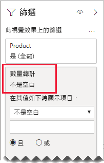

# <a name="bi-directional-relationship-guidance"></a>雙向關聯性指導方針

此文章以使用 Power BI Desktop 的資料模型製作人員為目標。 其提供您有關何時建立雙向模型關聯性的指導方針。 雙向關聯性是「雙向」進行篩選的關聯性。

[!INCLUDE [relationships-prerequisite-reading](includes/relationships-prerequisite-reading.md)]

一般來說，我們建議盡量減少雙向關聯性的使用。 其可能對模型查詢效能造成負面影響，而且可能為您的報表使用者帶來混亂的體驗。

雙向篩選可以解決特定需求的情況有以下三種：

- [特殊模型關聯性](#special-model-relationships)
- [交叉分析篩選器項目「包含資料」](#slicer-items-with-data)
- [維度對維度分析](#dimension-to-dimension-analysis)

## <a name="special-model-relationships"></a>特殊模型關聯性

建立下列兩個特殊模型關聯性類型時，雙向關聯性扮演著重要角色：

- **一對一**：所有一對一關聯性都必須是雙向的，否則不可能進行設定。 一般而言，我們不建議您建立這些類型的關聯性。 如需完整的討論與替代設計，請參閱[一對一關聯性指導方針](relationships-one-to-one.md)。
- **多對多**：當建立兩個維度類型資料表的關聯性時，需要橋接資料表。 需要雙向篩選，以確保篩選會在橋接資料表之間傳播。 如需詳細資訊，請參閱[多對多關聯性指導方針 (建立多對多維度關聯)](relationships-many-to-many.md#relate-many-to-many-dimensions)。

## <a name="slicer-items-with-data"></a>交叉分析篩選器項目「包含資料」

雙向關聯性可以提供交叉分析篩選器，將項目限制為資料存在的位置。 (如果您熟悉 Excel 樞紐分析表與交叉分析篩選器，這是從 Power BI 資料集或 Analysis Services 模型中取得資料時的預設行為)。為了協助說明其意義，請先考慮下列模型圖。


第一個資料表的名稱為 **Customer**，其中包含三個資料行：**Country-Region**、**Customer**，以及 **CustomerCode**。 第二個資料表的名稱為 **Product**，其中包含三個資料行：**Color**、**Product** 與 **SKU**。 第三個資料表的名稱為 **Sales**，其中包含四個資料行：**CustomerCode**、**OrderDate**、**Quantity** 與 **SKU**。 **Customer** 與 **Product** 資料表是維度類型的資料表，而且每個都與 **Sales** 資料表之間具有一對多關聯性。 每個關聯性都會以單一方向進行篩選。

為了協助描述雙向關聯性篩選的運作方式，此模型圖表已修改為顯示資料表資料列。 此文章中的所有範例都是以此資料為基礎。

> [!NOTE]
> 您無法在 Power BI Desktop 模型圖表中顯示資料表資料列。 在本文中，為了以清楚的範例來支援討論，已事先完成。


下列項目符號清單描述這三個資料表的資料列詳細資料：

- [客戶] 資料表有兩個資料列：
  - **CustomerCode** CUST-01、**Customer** 客戶-1、**Country-Region** 美國
  - **CustomerCode** CUST-02、**Customer** 客戶-2、**Country-Region** 澳洲
- **Product** 資料表有三個資料列：
  - **SKU** CL-01、**Product** T 恤、**Color** 綠色
  - **SKU** CL-02、**Product** 牛仔褲、**Color** 藍色
  - **SKU** AC-01、**Product** 帽子、**Color** 藍色
- **Sales** 資料表有三個資料列：
  - **OrderDate** 2019 年 1 月 1 日、**CustomerCode** CUST-01、**SKU** CL-01、**Quantity** 10
  - **OrderDate** 2019 年 2 月 2 日、**CustomerCode** CUST-01、**SKU** CL-02、**Quantity** 20
  - **OrderDate** 2019 年 3 月 3 日、**CustomerCode** CUST-02、**SKU** CL-01、**Quantity** 30

現在請考量下列報表頁面。


此頁面由兩個交叉分析篩選器與一個卡片視覺效果組成。 第一個交叉分析篩選器適用於 **Country-Region**，其有兩個項目：澳洲與美國。 其目前是由澳洲所配量。 第二個交叉分析篩選器適用於 **Product**，其有三個項目：帽子、牛仔褲與 T 恤。 未選取任何項目 (表示不會篩選任何產品)。 卡片視覺效果會顯示數量為 30。

當報表使用者以澳洲進行配量時，您可以限制 **Product** 交叉分析篩選器，以顯示資料與澳洲銷售相關聯的項目。 這就是顯示交叉分析篩選器項目「包含資料」的意思。 您可以透過設定 **Product** 與 **Sales** 資料表之間的關聯性以進行雙向篩選，來達成此行為。


**Product** 交叉分析篩選器現在會列出單一項目：T 恤。 此項目代表唯一銷售給澳洲客戶的產品。


我們會先建議您仔細考慮這種設計是否適用於您的報表使用者。 某些報表使用者發現體驗令人困惑。 他們不了解為什麼當他們與其他交叉分析篩選器互動時，交叉分析篩選器項目會動態地顯示或消失。

如果您決定要顯示交叉分析篩選器項目「包含資料」，我們不建議您設定雙向關聯性。 雙向關聯性需要更多處理，因此可能會對查詢效能產生負面影響，特別是當模型中的雙向關聯性數目增加時。

有一個更好的方法可以達到相同的結果：除了使用雙向篩選之外，您還可以將視覺效果層級篩選套用至 **Product** 交叉分析篩選器本身。

現在，我們來思考 **Product** 與 **Sales** 資料表之間的關聯性不再是雙向篩選的情況。 而且，下列量值定義已加入至 **Sales** 資料表中。

```dax
Total Quantity = SUM(Sales[Quantity])
```

若要顯示 **Product** 交叉分析篩選器項目「包含資料」，只需要使用「不是空白」條件，依**總數量**量值進行篩選。



## <a name="dimension-to-dimension-analysis"></a>維度對維度分析

涉及雙向關聯性的不同案例是將事實類型資料表視為橋接資料表。 如此一來，其就支援在不同維度類型資料表的篩選內容中分析維度類型的資料表資料。

使用此文章中的範例模型，請思考如何回答下列問題：

- 向澳洲客戶銷售了多少種顏色？
- 有幾個國家/地區購買了牛仔褲？

這兩個問題都可以回答，而「無需」在橋接事實類型資料表中摘要資料。 不過，其會要求篩選條件從一個維度類型資料表傳播到另一個維度類型資料表。 當篩選條件透過事實類型資料表傳播之後，可以使用 [DISTINCTCOUNT](/dax/distinctcount-function-dax) DAX 函式 (很可能是 [MIN](/dax/min-function-dax) 與 [MAX](/dax/max-function-dax) DAX 函式) 來達成維度類型資料表資料行的摘要。

當事實類型資料表的行為與橋接資料表相同時，您可以遵循多對多關聯性指導方針來建立兩個維度類型資料表的關聯。 其將需要至少設定一個關聯性，才能進行雙向篩選。 如需詳細資訊，請參閱[多對多關聯性指導方針 (建立多對多維度關聯)](relationships-many-to-many.md#relate-many-to-many-dimensions)。

不過，如此文章中所述，此設計可能會對效能造成負面影響，而且使用者會遇到與[交叉分析篩選器項目「包含資料」](#slicer-items-with-data)相關的結果。 因此，我們建議您改為使用 [CROSSFILTER](/dax/crossfilter-function) DAX 函式，在量值定義中啟用雙向篩選。 CROSSFILTER 函式可用來修改運算式評估期間的篩選方向，甚至停用關聯性。

請考慮加入至 **Sales** 資料表中的下列量值定義。 在此範例中，**Customer** 與 **Sales** 資料表之間的模型關聯性已設定為以「單一方向」進行篩選。

```dax
Different Countries Sold =
CALCULATE(
    DISTINCTCOUNT(Customer[Country-Region]),
    CROSSFILTER(
        Customer[CustomerCode],
        Sales[CustomerCode],
        BOTH
    )
)
```

在評估 **Different Countries Sold** 量值運算式時，**Customer** 與 **Sales** 資料表的關聯性會進行雙向篩選。

下列資料表視覺效果顯示每個銷售產品的統計資料。 **Quantity** 資料行只是數量值的總和。 **Different Countries Sold** 資料行代表已購買產品之所有客戶的國家/地區值相異計數。


## <a name="next-steps"></a>後續步驟

如需本文的詳細資訊，請參閱下列資源：

- [Power BI Desktop 中的模型關聯性](../transform-model/desktop-relationships-understand.md)
- [了解星型結構描述及其對 Power BI 的重要性](star-schema.md)
- [一對一關聯性指導方針](relationships-one-to-one.md)
- [多對多關聯性指引](relationships-many-to-many.md)
- [關聯性疑難排解指導方針](relationships-troubleshoot.md)
- 有問題嗎？ [嘗試在 Power BI 社群提問](https://community.powerbi.com/)
- 有任何建議嗎？ [貢獻想法來改善 Power BI](https://ideas.powerbi.com/)