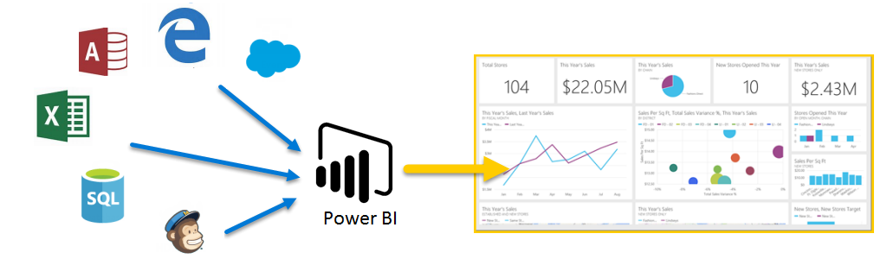

歡迎使用 Power BI 的**引導式學習**。 這個自學線上課程會依循序方式說明 Power BI；因此，您可以從頭建置您的知識。

這個課程設計成透過可了解的區塊形式提供指引，並且具有可協助您吸收概念、詳細資料和範例的邏輯流程。 它也包含許多視覺效果和影片，以協助您了解。

這個**引導式學習**課程包含許多**章節**，而且每個章節都有許多**主題**。 在這個＜開始使用＞  一節中的前幾個主題之後，幾乎每個主題都會包含描述所學習內容的影片。 影片下面的內容會進一步說明概念，可讓您以自己的步調進行檢閱和學習。

如果您是 Power BI **初學者**，本課程將協助您進行，如果您是 Power BI **老手**，本課程會將概念繫結在一起，並填滿其間的空隙。 我們希望您喜歡這個課程，並期待未來包括更多的內容。

## Power BI 是什麼？
**Power BI** 是軟體服務、應用程式和連接器的集合，它們搭配使用來將不相關的資料來源轉換成相關、視覺上融入的互動式深入剖析。 不論您的資料是簡單的 Excel 試算表還是一組雲端和內部部署混合式資料倉儲，**Power BI** 都可讓您輕鬆地連接到資料來源、以視覺化方式檢視 (或探索) 重要資料，以及與任何人或您想要的任何人共用該資料。

**Power BI** 可以十分簡單和快速；能夠透過 Excel 試算表或本機資料庫建立快速深入剖析。 但是 **Power BI** 也是穩定和企業等級、準備好進行廣泛模型化和即時分析，以及可進行自訂開發。 因此，它可以是您的個人報表和視覺效果工具，也可以是群組專案、部門或整個公司的分析和決策引擎。

## Power BI 的各部分
Power BI 包含稱為 **Power BI Desktop** 的 Windows 桌面應用程式、稱為 **Power BI 服務**的線上 SaaS (*軟體即服務*) 服務，以及 Windows 電話和平板電腦以及適用於 iOS 和 Android 裝置上的可用行動 Power BI **應用程式**。

**Desktop**、**服務**和 **Mobile** 這三個元素是設計成讓人員建立、共用和使用透過最有效方式服務他們或其角色的商業見解。

## Power BI 如何符合您的角色
Power BI 的使用方式可能取決於您在專案或小組中的角色。 而其他角色的其他人可能會以不同的方式使用 Power BI，這沒有問題。

例如，您可能主要使用 **Power BI 服務**，但是您的數字處理、業務報表建立同事可能會大量使用 **Power BI Desktop** (並將 Desktop 報表發行到 Power BI 服務，然後即可進行檢視)。 和另一個同事在銷售可能主要使用 Power BI 手機應用程式來監視進度，在 銷售配額，並向下鑽研到新的銷售潛在客戶詳細資料。

您也可能會根據您嘗試達成的目標或您在指定專案或工作中的角色，在不同的時間使用 **Power BI** 的每個元素。

您可能會在服務的即時儀表板中檢視庫存和製造進度，也會使用 **Power BI Desktop** 來建立有關客戶參與統計資料之專屬小組的報表。 Power BI 的使用方式取決於 Power BI 的哪些功能或服務是最適合您解決方案的工具，但您可以使用 Power BI 的每個部分，這是它這麼具有彈性且吸引人的原因。

我們將在這個**引導式學習**課程後面更深入地討論 **Desktop**、**服務**和 **Mobile** 應用程式這三個元素。 我們也會在 Power BI Desktop 中建立報表、在服務中進行共用，而且在即將推出的文件中也會在行動裝置上鑽研到報表。

## Power BI 中的工作流程
Power BI 中的一般工作流程是從建立報表的 **Power BI Desktop** 開始。 該報表接著會發行至 Power BI **服務**，然後進行共用，讓 **Power BI Mobile** 應用程式的使用者可以取用該資訊。

它不會一直以這種方式發生，這樣並不會有任何問題，但我們將使用該流程來協助您了解 Power BI 的各個部分，以及它們如何彼此互補。

我們現在已經有本課程的概觀、何謂 Power BI，以及它的三個主元素，讓我們查看 **Power BI** 的使用方式。

