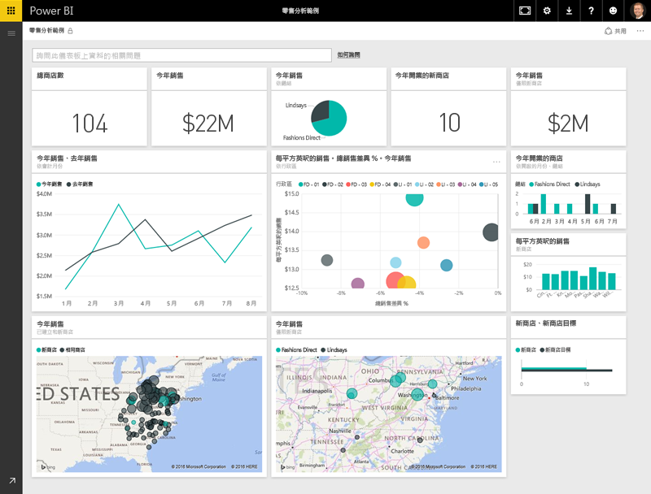
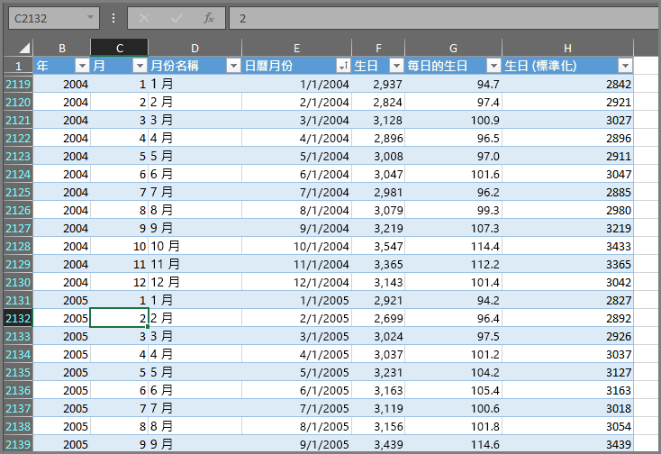
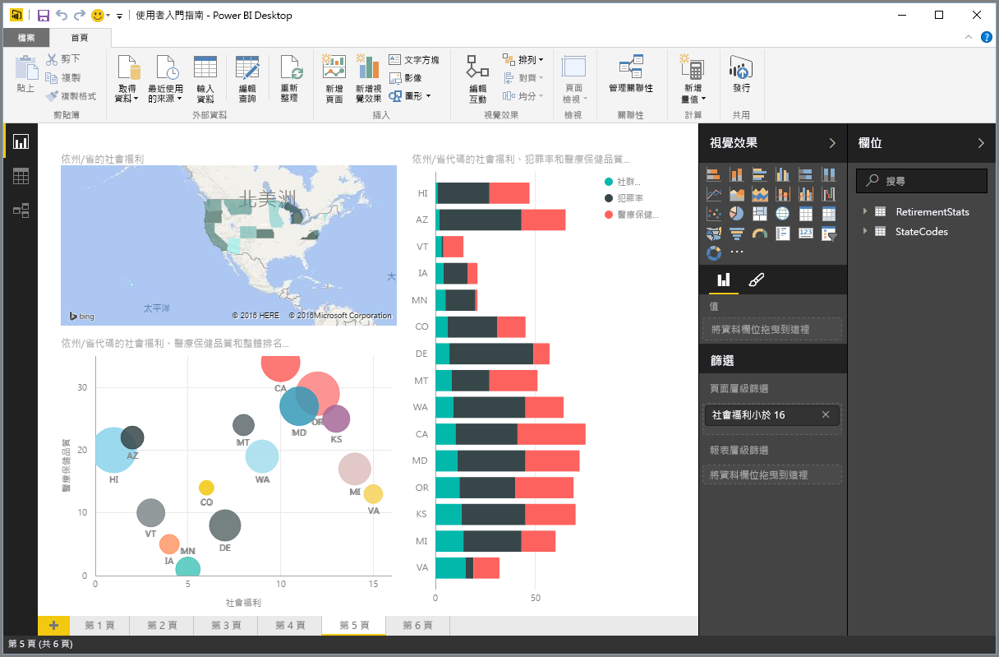
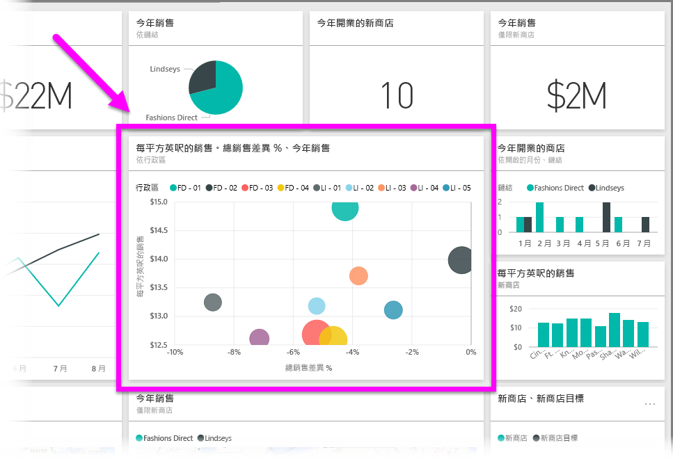

您在 Power BI 中執行的所有作業都可以分成幾個基本**建構元素**。 了解這些建構元素之後，即可展開每個建構元素，並開始建立精巧且複雜的報表。 畢竟，即使看似複雜的事物也是透過基本建構元素所建置 – 建築物是使用木材、鋼鐵、水泥和玻璃所建置。 汽車是使用金屬、結構和橡膠所製造。 當然，根據這些基本建構元素的排列方式，建築物和汽車也可以是基本或精巧的。

讓我們查看這些基本建構元素，並討論可使用它們建置的一些簡單事物，然後一併了解如何建立複雜事物。

Power BI 中的基本建構元素如下︰

* 視覺化
* 資料集
* 報表
* 儀表板
* 磚

## 視覺化
**視覺效果** (visualization) (有時也稱為**視覺效果** (visual)) 是以視覺方式呈現資料 (例如圖表、圖形、彩色地圖，或您可建立以視覺方式呈現資料的其他有趣事物)。 Power BI 提供各種不同的視覺效果類型，而且未來還會提供更多。 下列影像顯示 Power BI 服務中所建立的不同視覺效果集合。

視覺效果可以很簡單 (例如，代表重大事項的單一數字)，也可以在視覺上看起來十分複雜 (例如，顯示投票者對特定社會問題或關注之情感的漸層色彩圖)。 視覺效果的目標是透過提供內容和洞察力的方式來呈現資料，而這樣可能很難分辨原始數字或文字表格。

## 資料集
**資料集**是 Power BI 用來建立視覺效果的資料集合。

您的簡單資料集可以根據 Excel 活頁簿的單一資料表，與下列影像類似。

**資料集**也可以是許多不同來源的組合，您可以對其進行篩選和合併，以提供用於 Power BI 的唯一集合資料 (資料集)。

例如，您可以透過三個不同的資料庫欄位、一張網站資料表、一張 Excel 資料表以及線上電子郵件行銷活動結果來建立資料集。 這個唯一組合仍視為單一**資料集**，即使它是從許多不同來源一起提取也是一樣。

將資料帶入 Power BI 之前對其進行篩選，可讓您專注於您關切的資料。 例如，您也可以篩選您的連絡人資料庫，只在資料集中包含收到行銷活動電子郵件的客戶。 然後，您可以建立視覺效果，而這些視覺效果是根據活動中所含客戶的子集 (已篩選集合)。 篩選可協助您專注您的資料，以及您的努力。

Power BI 的重要且啟用部分是包含數種資料**連接器**。 不論您想要的資料是在 Excel 或 SQL 資料庫中、在 Azure 或 Oracle 中，還是在 Facebook、Salesforce 或 MailChimp 這類服務中，Power BI 的內建資料連接器都可讓您輕鬆地連接到該資料，並視需要進行篩選，然後帶入您的資料集中。

有了資料集之後，即可開始建立視覺效果，透過不同的方式來顯示該資料集的不同部分，並且使用您看到的內容來增加洞察力。 這時就會出現報表。

## 報表
在 Power BI 中，**報表**是一起出現在一或多頁的視覺效果集合。 就像您可能會為業務簡報建立的任何其他報表或您可能會為學校工作所寫的報表一樣，在 Power BI 中，**報表**是彼此相關之項目的集合。 下列影像顯示 Power BI Desktop 中的**報表**；在這個情況下，這是六頁報表的第五頁。 您也可以在 Power BI 服務中建立報表。

報表在必要時可讓您在多個不同頁面上建立許多不同的視覺效果，也可讓您以最適當描述您劇本的方式進行排列。

您可能會有每季銷售量的報表、特定區段中產品成長的報表，也可能會建立有關北極熊遷移模式的報表。 不論您的主題是什麼，報表都可讓您將視覺效果收集和組織到一或多個頁面。

## 儀表板
當您準備好共用報表中的單一頁面或共用視覺效果集合時，請建立**儀表板**。 Power BI **儀表板**是單一頁面中您可以與其他人共用的視覺物件集合，與汽車的儀表板十分類似。 通常，它是選取的視覺效果群組，可快速了解您嘗試呈現的資料或劇本。

儀表板必須放入單一頁面中，而單一頁面通常稱為「畫布」(畫布是 Power BI Desktop 或服務中的空白背景，您可以在其中放置視覺效果)。 請將它想像成藝術家或畫家所使用的畫布，畫布就是您可以在其中建立、合併和重做有趣和吸引人之視覺效果的工作區。
您可以與其他使用者或群組共用儀表板，這些使用者或群組接著可以在位於 Power BI 服務或在其行動裝置上時與您的儀表板互動。

## 磚
在 Power BI 中，**磚**是在報表或儀表板中找到的單一視覺效果。 它是包含每個個別視覺效果的矩形方塊。 在下列影像中，您會看到一個同時被其他磚框住的磚 (以亮方塊反白顯示)。

在 Power BI 中 *建立* 報表或儀表板時，可以視需要移動或排列磚來呈現您的資訊。 您可以視需要將它們變大、變更其高度或寬度，以及將它們放到其他磚下方。

如果您是 *檢視* 或 *使用* 儀表板或報表 (表示您不是建立者或擁有者，只是已與您共用儀表板或報表)，則可以與其互動，但不能變更磚的大小或變更其排列方式。

## 齊聚一堂
這些是 Power BI 中的基礎和其建構元素。 讓我們花一點時間進行檢閱。

Power BI 是服務、應用程式和連接器的集合，可讓您連接到您的資料 (不論它所在的位置為何)、視需要進行篩選，然後將它帶入 Power BI，以在其中建立可與其他人共用之吸引人的視覺效果。  

現在您已了解 Power BI 的許多基本建置元素，因此可以更明確地建立 *對您* 有意義的資料集，以及建立可呈現您劇本之視覺吸引人的報表。 使用 Power BI 所描述的劇本不需要複雜或太過複雜，才會吸引人。

對某些人來說，在資料集中使用單一 Excel 資料表，然後與其小組共用儀表板，就是使用 Power BI 的極具價值方式。

對其他人來說，使用與其他資料庫和即時來源合併的即時 Azure SQL 資料倉儲資料表，然後即時對其進行篩選以建立資料集來監視所有製造進度，才是他們所尋找的 Power BI 價值。

對於這兩類人員，處理程序都相同︰建立資料集，並建置吸引人的視覺效果，然後與其他人共用。 同樣地，兩者 (每一個) 的結果都會相同︰控管不斷擴充的資料，並將其轉換成可執行的洞察力。

不論您的資料洞察力需要簡單還是複雜資料集，Power BI 都可協助您快速上手，而且可以將您的需求擴充成資料所需的複雜性。 而且，因為 Power BI 是一項 Microsoft 產品，所以您可以相信它夠穩固、可擴充、可用於 Office 且可供企業使用。

現在，讓我們來看看它的運作方式。 我們會先快速查看 Power BI 服務。

