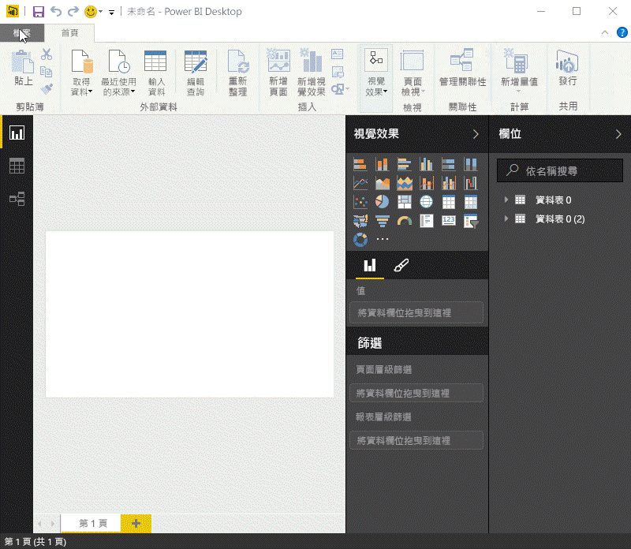
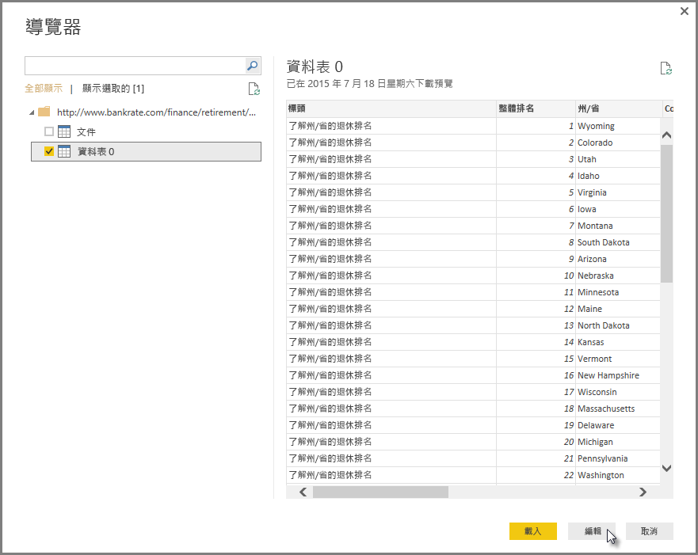
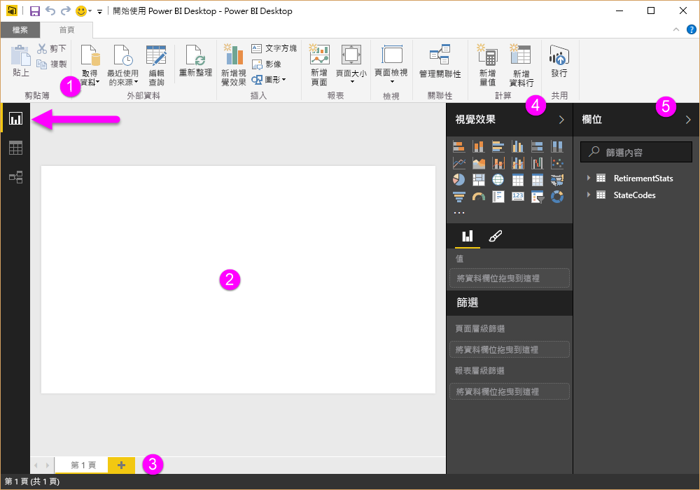
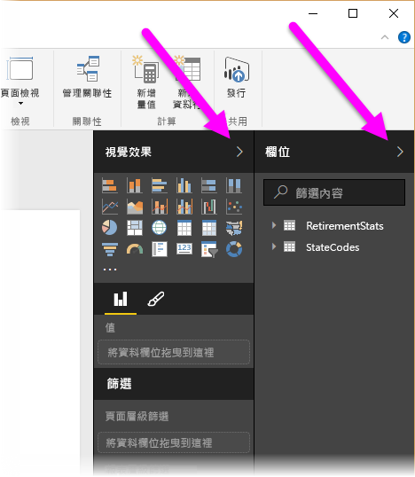
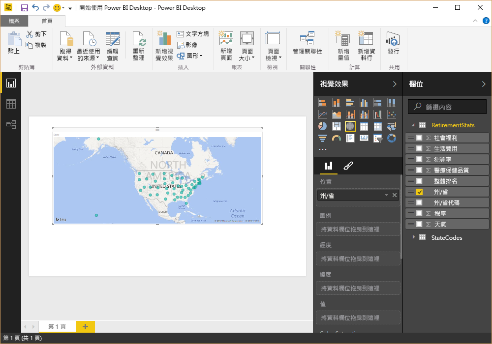
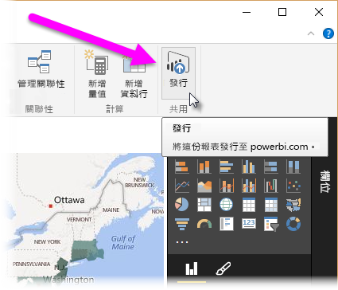
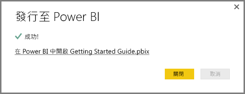
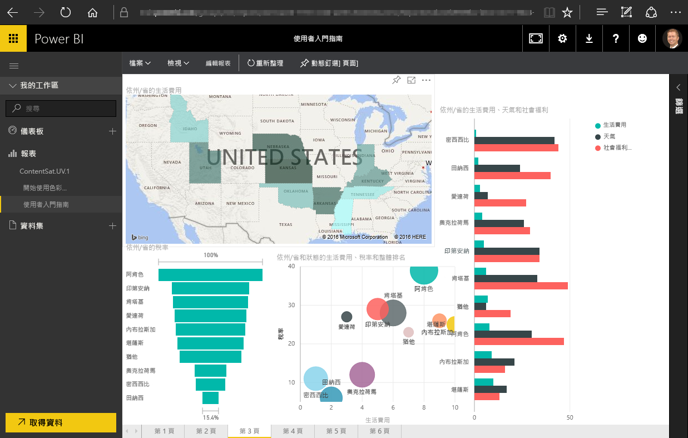
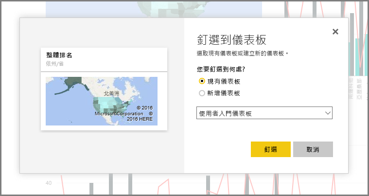
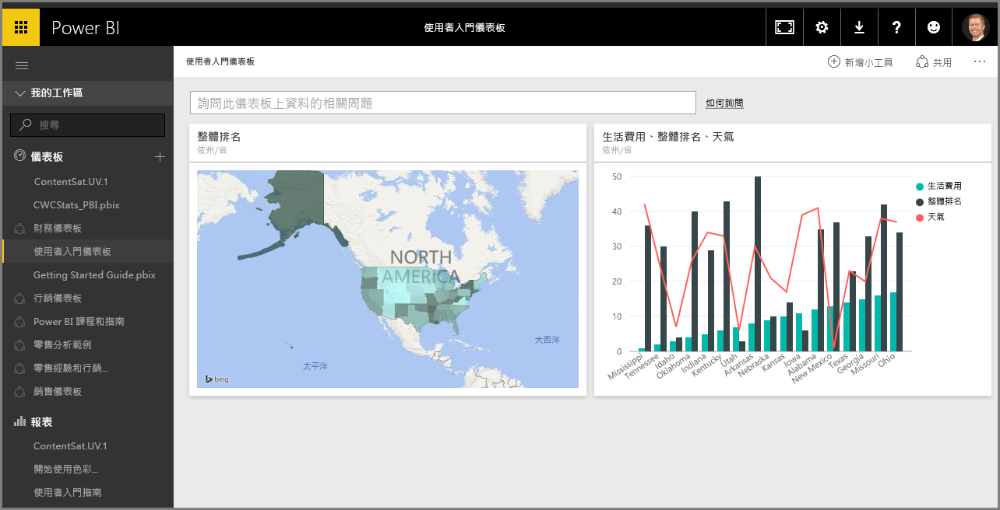

本主題中，我們深入查看 Power BI 的前兩個部分如何彼此搭配運作︰

* 在 **Power BI Desktop** 中建立報表
* 在 **Power BI 服務**中發行報表

我們將從 Power BI Desktop 開始，然後選取 [取得資料]。 即會出現資料來源的集合，讓您可以選擇資料來源。 下列影像顯示如何選取網頁作為來源，而在上方的影片中，將選取 **Excel** 活頁簿。

不論您選擇哪一個資料來源，Power BI 都會連接到該資料來源，並向您顯示可從該來源取得的資料。 下列影像是另一個範例，這個範例來自分析不同狀態及一些有趣淘汰統計資料的網頁。

在 Power BI Desktop [報表]  檢視中，您可以開始建立報表。

[報表]  檢視有五個主要區域：

1. 功能區，顯示與報表和視覺效果相關聯的常見工作
2. [報表]  檢視或畫布，在這裡會建立和排列視覺效果
3. 底部的 [頁面]  索引標籤區域，可讓您選取或加入報表頁面
4. [視覺效果]  窗格，您可以在這裡變更視覺效果、自訂色彩或座標軸、套用篩選、拖曳欄位等等
5. [欄位]  窗格，您可以在這裡將查詢項目和篩選拖曳至 [報表]  檢視，或拖曳至 [視覺效果]  窗格的 [篩選]  區域

[視覺效果]  和 [欄位]  窗格可以摺疊，方法是選取邊緣上的小箭號，在 [報表]  檢視中提供更多的空間，以建置酷炫的視覺效果。 修改視覺效果時，您也會看到向上或向下的箭號，這分別表示您可以展開或摺疊該區段。

若要建立視覺效果，只需要將欄位從 [欄位]  清單拖曳至 [報表]  檢視。 在本案例中，讓我們來拖曳 *RetirementStats* 的 State 欄位，看看結果如何。

看看它...Power BI Desktop 會自動建立地圖式視覺效果，因為可辨識 State 欄位包含地理位置資料。

現在讓我們快一點，使用一些視覺效果建立報表之後，我們已經準備好將這份報表發行至 Power BI 服務。 在 Power BI Desktop 的 [常用] 功能區上，選取 [發行]。

系統將提示您登入 Power BI。

當您已登入且發行程序已完成時，會看到下列對話方塊。 您可以選取連結 (在 [成功!] 下方) 以移至 Power BI 服務，您可以在其中看到您剛發行的報表。

當您登入 Power BI 時，會在服務中看到您剛發行的 Power BI Desktop 檔案。 在下列影像中，Power BI Desktop 中所建立的報表會顯示在 [報表] 區段中。

在該報表中，我可以選擇**釘選**圖示將該視覺效果釘選到儀表板。 下列影像顯示具有反白顯示方塊和箭號的釘選圖示。

當我選取該項目時，會顯示下列對話方塊，以將該視覺效果釘選到現有的儀表板，或建立新的儀表板。

從報表釘選幾個視覺效果時，即可在儀表板中看到它們。

當然，您還可以使用 Power BI 執行許多作業，例如共用您所建立的儀表板。 我們稍後在本課程會討論共用。

接下來，我們將查看只要連接到雲端服務 (例如 Facebook、Salesforce 和許多其他項目) 即可自動建立儀表板的功能。

