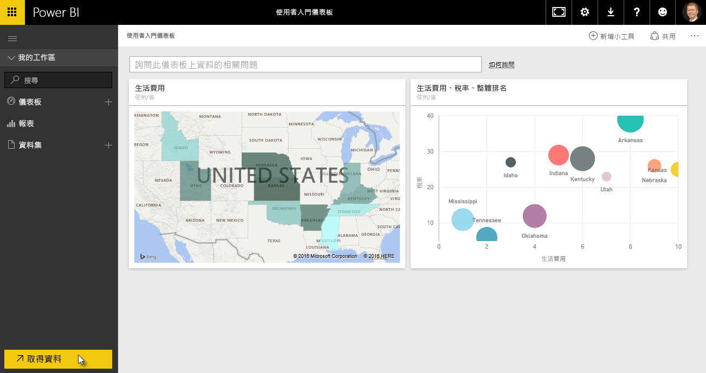
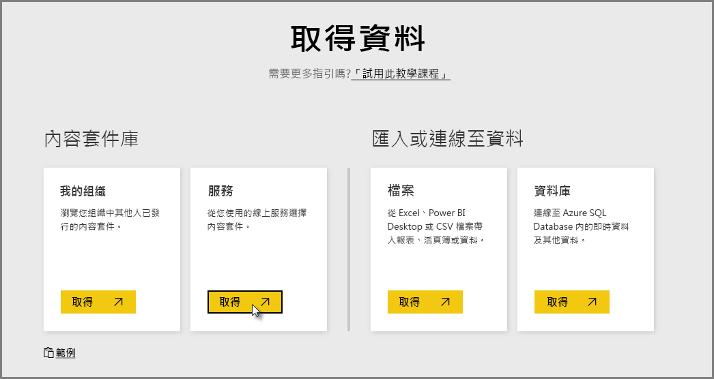
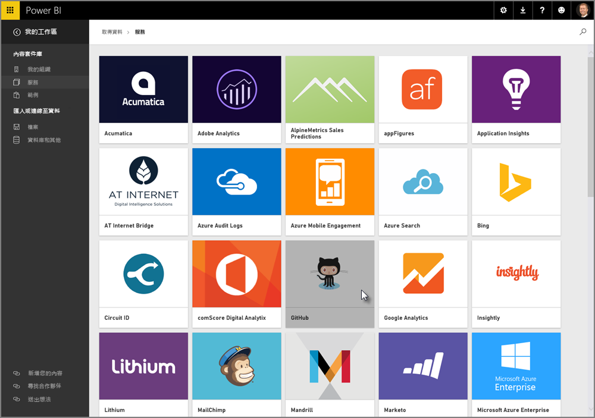
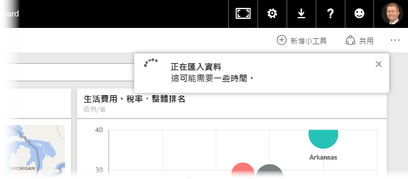
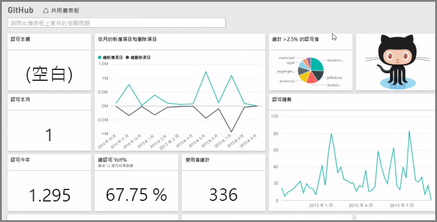
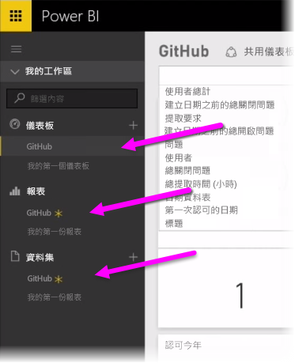
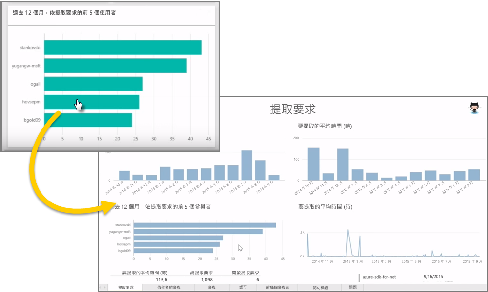
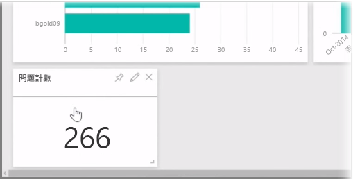
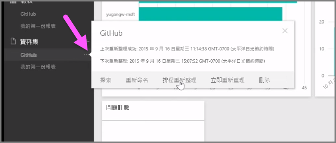

如我們所了解，Power BI 中的一般工作流程是在 Power BI Desktop 中建立報表，並將報表發行至 Power BI 服務，然後與其他人共用報表，讓他們可以在服務中或行動應用程式上檢視報表。

不過，有些人是從 Power BI 服務開始，因此讓我們快速查看服務，並了解在 Power BI 中快速建立視覺效果的簡單且普遍的方式︰ *內容套件* 。

**內容套件**是根據特定資料來源之預先設定的現成視覺效果和報表的集合 (例如 Salesforce)。 使用內容套件就像是以微波爐做出電視晚餐或訂購速食加值餐一樣︰只需要按幾下和註解，就可快速取得一組搭配好的主菜，並且是以整齊且可取用的包裝呈現。

因此，讓我們快速查看內容套件、服務和其運作方式。 在接下來的幾節中，我們將詳述內容套件 (和服務)；這有點像刺激您食慾的口味測試。

## 使用雲端服務建立創新的儀表板
使用 Power BI，可以輕鬆地連接到資料。 從 Power BI 服務，只要選取常用畫面左下角的 [取得資料]  按鈕即可。

*畫布* (Power BI 服務的中央區域) 會顯示 Power BI 服務中可用的資料來源。 除了一般資料來源 (例如 Excel 檔案、資料庫或 Azure 資料) 之外，Power BI 也可以輕鬆地連接到**軟體服務** (也稱為 SaaS 提供者或雲端服務) (例如 Salesforce、Facebook、Google Analytics 和整個其他 SaaS 服務)。

針對這些軟體服務，**Power BI 服務**提供一組預先排列在儀表板和報表中的現成視覺效果 (稱為**內容套件**)。 內容套件可讓您使用所選取服務的資料來快速啟動和執行 Power BI。 例如，當您使用 Salesforce 內容套件時，Power BI 會連接到您的 Salesforce 帳戶 (在您提供認證之後)，然後在 Power BI 中填入預先定義的一組視覺效果和儀表板。

Power BI 提供所有服務的內容套件。 下列影像顯示從 [服務]  方塊選取 [取得]  時顯示的第一個服務畫面 (依字母順序) (如前一個影像所示)。 如您在下面的影像中所見，有許多可以進行選擇。

基於我們的目的，我們將選擇 [GitHub]  。 GitHub 是用於線上原始檔控制的應用程式。 在我輸入 GitHub 內容套件的資訊和認證之後，即開始匯入資料。

載入資料之後，會顯示預先定義的 GitHub 內容套件儀表板。

除了**儀表板**之外，也提供為建立儀表板而產生的**報表** (為 GitHub 內容套件的一部分)，以及資料匯入期間所建立且用來建立 GitHub 報表的**資料集** (從 GitHub 提取的資料集合)。

在 [儀表板] 上，按一下任何視覺效果，即會自動將您帶到建立該視覺效果的 [報表]  頁面。 因此，按一下 \[Top 5 users by pull requests]  \(前 5 位使用者 (依提取要求)) 視覺效果時，Power BI 會在 [報表] 中開啟 \[提取要求]  頁面 \(建立該視覺效果的 [報表] 頁面)。

## 詢問資料相關的問題
您也可以詢問資料相關的問題，而 Power BI 服務會根據您的問題即時建立視覺效果。 在下列影像中，您可以看到 Power BI 根據 [自然語言查詢]  列中所輸入的資訊來建立可顯示已關閉問題計數的數字視覺效果。

擁有您想要的視覺效果之後，即可選取 [自然語言查詢] 列右邊的**釘選**圖示，將該視覺效果釘選到儀表板。 在此情況下，視覺效果會釘選到 GitHub 儀表板，因為它是目前選取的儀表板。

## 在 Power BI 服務中重新整理資料
您也可以選擇**重新整理**內容套件的資料集，或您在 Power BI 中使用的其他資料。 若要設定重新整理設定，請選取資料集旁邊的省略符號 (三個點)，即會出現功能表。

選取該功能表底端的 [排程重新整理]  選項。 [設定] 對話方塊隨即出現在畫布上，讓您設定符合您需求的重新整理設定。

這對快速查看 Power BI 服務而言就已足夠。 您可以使用服務執行更多的事項，這涵蓋在本課程後面。 也請記住，您可以連接許多不同類型的資料以及各種內容套件，數目隨時都會增加。

讓我們移至下一個主題，其中彙整這個＜開始使用＞  一節，並準備好進行下一步。

