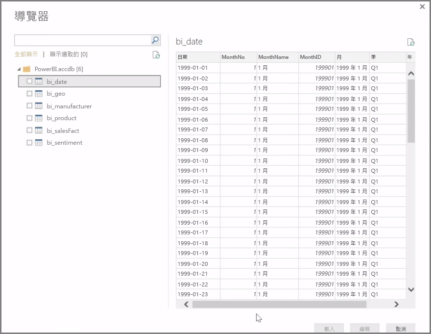
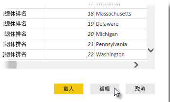

**Power BI Desktop** 可以連接至各種資料來源，包括內部部署資料庫、Excel 活頁簿和雲端服務。 目前，超過 59 種不同的雲端服務 (如 GitHub 和 Marketo) 有特定的連接器，您可以透過 XML、CSV、文字和 ODBC 來連接一般來源。 Power BI 甚至能直接從網站 URL 抓取表格式資料！ 不過，我們還是從頭開始，先開啟 Power BI Desktop 並連接資料。

當您啟動 **Power BI Desktop** 並跳過開始畫面後，您可以從 [主資料夾] 索引標籤的功能區中選擇取得資料。

Power BI Desktop 每個月都有更新，而且 \[Power BI Desktop What's New] \(Power BI Desktop 新增功能) 頁面會獲得所有更新、部落格連結和下載連結的相關資訊。

Power BI Desktop 中有各式各樣的可用資料來源。 選取建立連接的來源。 依選項不同，系統會要求您找到電腦或網路上的來源，或提示您登入服務驗證要求。

連線後看到的第一個視窗是 [導覽器]。 [導覽器] 會顯示資料表或資料來源實體，按一下其中一個項目即可預覽其內容。 接著立即匯入所選資料表或實體，或選取 [編輯] 在匯入前先轉換並清理資料。

一旦選取想要帶入 Power BI Desktop 的資料表，您就可以選取 [導覽器] 右下角的 [載入] 按鈕，選擇將資料表載入 Power BI Desktop。 不過，有時候您可能想要先變更這些資料表，再載入 Power BI Desktop。 您可能只想要客戶子集合，或是篩選只出現在特定國家/地區的銷售資料。 在這些情況下，您可以選取 [編輯] 按鈕，先篩選或轉換資料，再一次帶入 Power BI Desktop。

下節從編輯資料接續。

