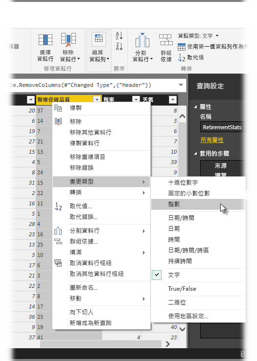
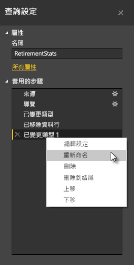
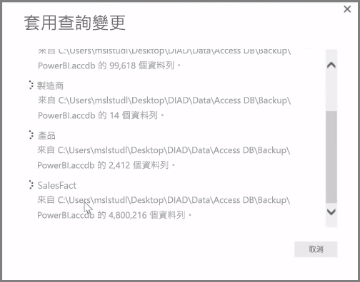

**Power BI Desktop** 包含的 [查詢編輯器]  ，是功能強大的資料形塑和轉換工具，可隨時為模型和視覺效果服務。 當您選取 [導覽器] 的 [編輯] 時，[查詢編輯器] 就會啟動並填入您從資料來源選取的資料表或其他實體。

您也可以使用 [首頁]  功能區的 [編輯查詢]  按鈕，直接從 **Power BI Desktop** 啟動 [查詢編輯器]  。

只要 [查詢編輯器] 載入可供塑造的資料，您就會看到幾個區段︰

1. 在功能區中，現在有許多按鈕可以與查詢中的資料互動。
2. 在左窗格中，會列出查詢 (每份資料表或每個實體一個) 以供選取、檢視及形塑。
3. 在中央窗格中，會顯示所選查詢的資料以供成形
4. [查詢設定] 視窗隨即顯示，列出查詢的屬性和套用的步驟。

在中央窗格中，以滑鼠右鍵按一下資料行即會顯示數種不同的可用轉換，例如從資料表移除資料行、以新名稱重複資料行，以及取代值。 在這個功能表中，您也可以使用常用的分隔符號將文字資料行分割成多個。

[查詢編輯器]  功能區包含其他工具，例如變更資料行的資料類型、加入科學記號，或擷取日期元素，例如星期幾。

套用轉換時，每個步驟都會出現在 [查詢編輯器]  右側之 [查詢設定]  窗格的 [套用的步驟]  清單中。 您可以使用這份清單復原或檢視特定的變更，或甚至變更步驟的名稱。 若要儲存轉換，請選取 [首頁]  索引標籤的 [關閉並套用]  。

只要選取 [關閉並套用]  ，[查詢編輯器] 就會套用您建立的查詢變更，將它們套用到 Power BI Desktop。

在 [查詢編輯器]  中轉換資料時，您有各式各樣的事情可做，包括進階轉換。 在下一節中，我們要探討幾個進階轉換，您會知道 [查詢編輯器]  提供您無數的資料轉換方法。

