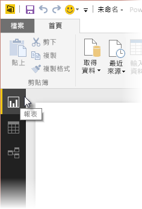
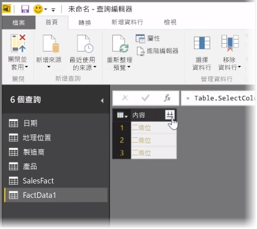
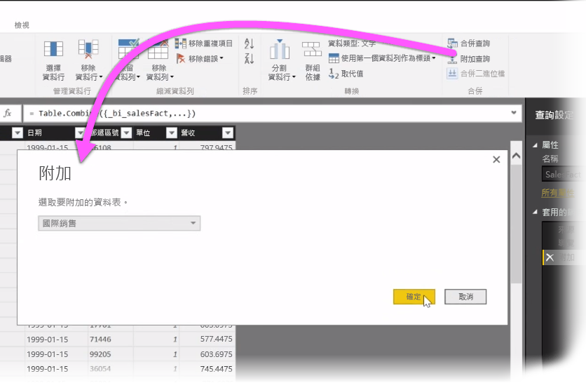
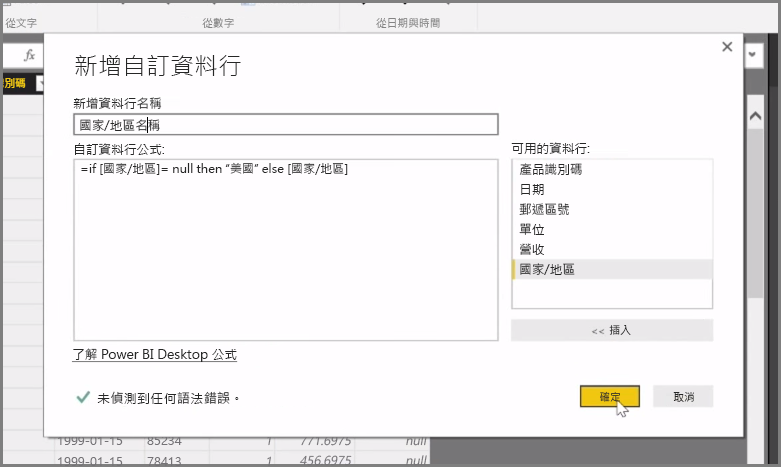

我們會在本文探討一些 **Power BI Desktop** 的進階資料匯入和清理技術。 只要在 [查詢編輯器] 中塑造資料並帶入 **Power BI Desktop**，您就有幾種不同的查看方式。 Power BI Desktop 中有三種檢視：[報表] 檢視、[資料] 檢視和 [關聯性] 檢視。 選取畫布左上角的各個檢視圖示，即可看到每一個檢視。 下圖選取的是 [報表] 檢視。 圖示旁邊的黃色列表示作用中的檢視。

若要變更檢視，只要選取其他兩個圖示的其中之一即可。 圖示旁邊的黃色列表示作用中的檢視。

Power BI Desktop 可以在模型化程序期間，隨時將來自多個來源的資料合併到單一報表。 若要將其他來源加入現有的報表中，請選取 [首頁] 功能區的 [編輯查詢]，然後選取 [查詢編輯器] 的 [新來源]。

**Power BI Desktop** 可以使用許多不同的可能資料來源，包括資料夾。 您可以連接到資料夾，一次匯入多個檔案的資料，例如一系列的 Excel CSV 檔案。 所選資料夾中包含的檔案在 [查詢編輯器] 中顯示為二進位內容，按一下 [內容] 資料行頂端的雙箭頭圖示可載入其值。

Power BI 最有用的工具之一是 [篩選]。 例如，選取資料行旁邊的下拉式箭號會開啟文字篩選檢查清單，您可以用它移除模型中的值。

您也可以合併和新增查詢，將多個資料表 (或不同資料夾的各種檔案資料) 轉換成單一資料表，只包含您想要的資料。 您可以使用 [新增查詢] 工具將新資料表的資料加入現有的查詢中。 Power BI Desktop 會嘗試比對以符合查詢中的資料行，您可依需要在 [查詢編輯器] 中調整。

最後，[新增自訂資料行] 工具會提供選項，讓進階使用者使用功能強大的 M 語言從頭撰寫查詢運算式。 您可以 M 查詢語言陳述式為基礎新增自訂資料行，依所想展現資料。

