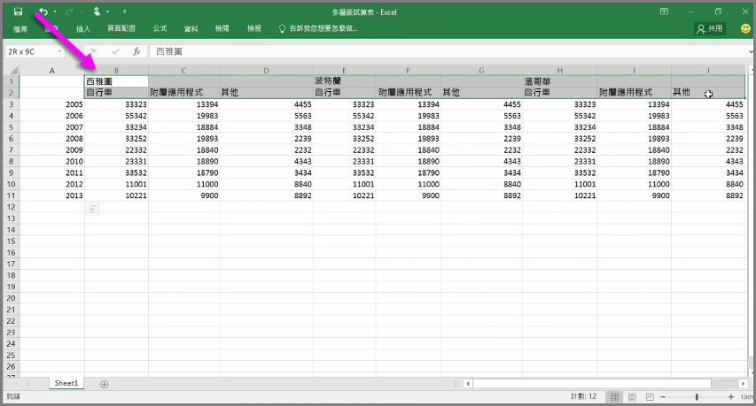
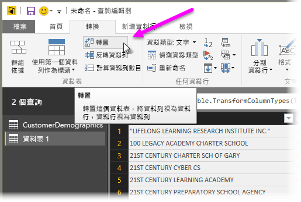
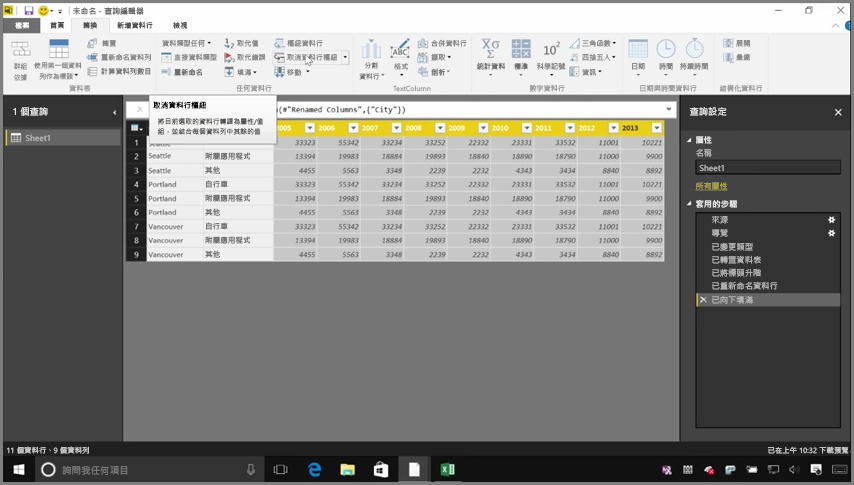
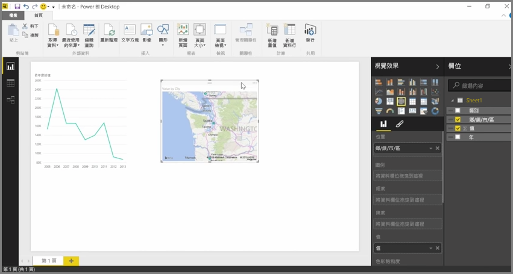

Power BI 幾乎可以匯入任何來源的資料，其視覺效果和模型工具最適合處理單欄式資料。 有時候資料不會格式化成簡單的資料行 (通常是 Excel 試算表)，而人眼感到舒適的表格配置不一定最適合自動化查詢。 例如，下列的試算表有跨越多個資料行的標頭。

幸好 Power BI 有工具可以快速將多欄資料表轉換成您可以使用的資料集。

## 調換資料
例如，使用 [查詢編輯器] 的 [調換]，您可以反轉資料 (將資料行變成資料列、將資料列變成資料行)，以便將資料打散成您可以操作的格式。

只要依影片所述做幾次，您的資料表就可以塑造成 Power BI 更容易使用的內容。

## 格式化資料
您也可能需要格式化資料，以便 Power BI 能夠正確分類及識別它匯入的資料。

使用一些轉換，包括 *將資料列升級成標頭* 再中斷標頭，使用 [填滿] 將 *null* 值變成指定資料行上下欄中的值，以及 [取消資料行樞紐] ，您可以將資料清理到可在 Power BI 使用的資料集。

透過 Power BI，您可以對資料試驗這些轉換，並判斷哪些類型可以讓資料成為 Power BI 可用的單欄式格式。 請記住，您採取的所有動作都會記錄在 [查詢編輯器] 的 [套用的步驟] 區段中，所以，如有轉換未依所想運作，您只要按一下步驟旁的 **x** 來復原它。

## 建立視覺效果
只要資料經過轉換及清理後成為 Power BI 可以使用的格式，您就可以開始建立視覺效果。

## 後續步驟
**恭喜您！** 您已完成本節的 Power BI **引導式學習** 課程。 您現在知道如何 **將資料** 放入 Power BI Desktop，以及如何 *塑造* 或 *轉換* 該資料，以便建立吸引人的視覺效果。

學習 Power BI 如何運作以及如何讓它 *為您* 工作的下一個步驟，是了解 **模型** 需要什麼。 如您所知， **資料集** 是基本的 Power BI 建構元素，但有些資料集很複雜，其組成為許多不同的資料來源。 而且有時候，您需要在您建立的資料集中新增自己特有的觸控 (或 *欄位* )。

您在下一節中會了解**模型**和其他許多內容。 下節見！

