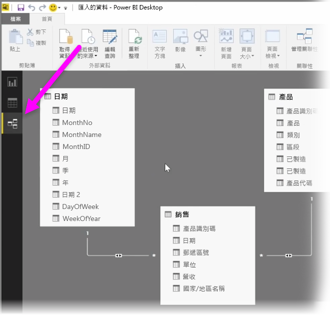
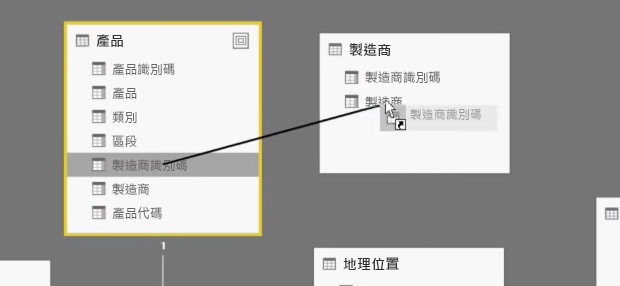
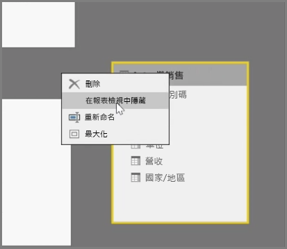
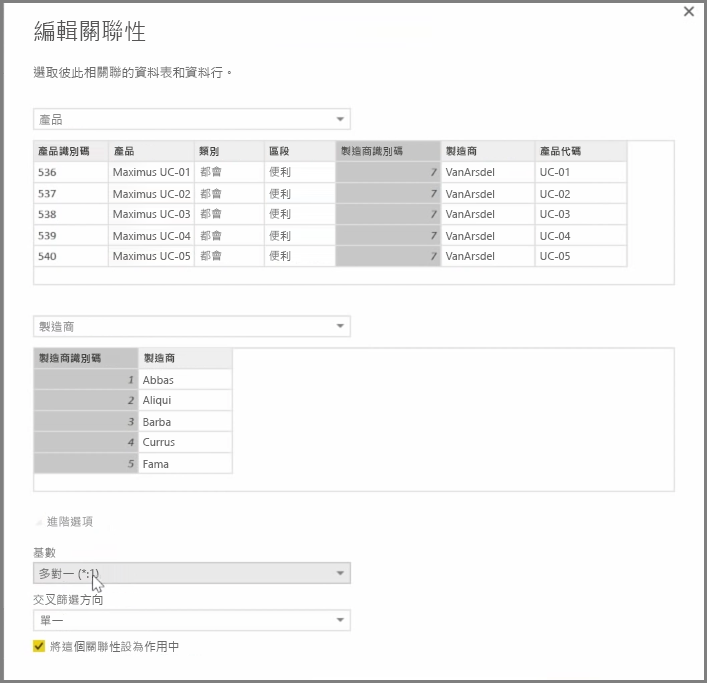

Power BI 可讓您以視覺化方式設定資料表或元素之間的關聯性。 若要查看資料的圖表檢視，請使用報表畫布旁螢幕最左側的 [關聯性檢視]  。

從 [關聯性]  檢視中，您可以看到代表每份資料表及其資料行的區塊，以及表示它們之間關聯性的線條。

新增和移除關聯性很簡單。 若要移除關聯性，請以滑鼠右鍵按一下它並選取 [刪除]  。 若要建立關聯性，請拖放要連結資料表的欄位。

若要隱藏報表中的資料表或個別資料行，請在 [關聯性] 檢視中以滑鼠右鍵按一下它，然後選取 [在報表檢視中隱藏]  。

如需資料關聯性的更詳細檢視，請選取 [首頁]  索引標籤中的 [管理關聯性]  。這會開啟 [管理關聯性]  對話方塊，以清單型式而不以視覺化圖表來顯示關聯性。 您可以在這裡選取 [自動偵測]  ，尋找新資料或更新資料的關聯性。 選取 [管理關聯性]  對話方塊中的 [編輯]  ，手動編輯關聯性。 您也可以在這裡找到設定關聯性的 [基數]  和 [交叉篩選方向]  進階選項。

\[基數] 選項為 \[Many to One]  \(多對一) 和 \[一對一]  。 \[Many to One]  \(多對一) 是事實維度類型關聯性；例如，每項產品有多個資料列的銷售資料表，和以專有唯一資料列列出產品之資料表的比對。 [一對一]  常用於連結參考資料表中的單一項目。

關聯性預設將設成雙向的交叉篩選。 單向的交叉篩選過去限制了關聯性的某些模型化功能。

設定資料間的正確關聯性，可讓您建立跨多個資料元素的複雜計算。

