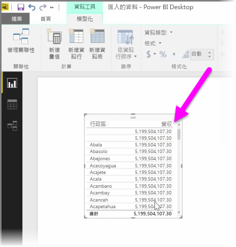
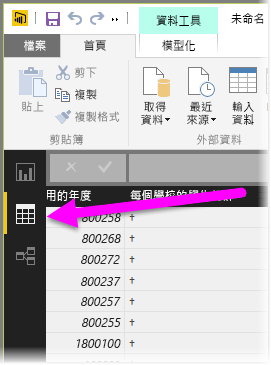

建立計算結果欄是擴充和增強資料的簡單方法。 **計算結果欄**是新的資料行，建立方法是定義轉換或合併現有資料之兩或多個元素的計算。 例如，您可以將兩個資料行合併成一個來建立新的資料行。

建立計算結果欄的一個有力因素是，沒有唯一欄位可用以建立關聯性時，它可建立資料表之間的關聯性。 當您在 Power BI Desktop 中建立簡單的資料表視覺效果，所有項目都取得相同的值，但您知道基礎資料不同時，缺少關聯性就顯而易見。

若要使用資料的唯一欄位來建立關聯性，您可以，例如，合併「區域號碼」和「電話號碼」資料行的值 (資料中有這些值時)，為「完整電話號碼」建立新的計算結果欄。 計算結果欄是有用的工具，可以迅速建立模型和視覺效果。

若要建立計算結果欄，請選取 Power BI Desktop 報表畫布左側的 [資料檢視]。

從 [模型] 索引標籤中，選取 [新增資料行]。 這可讓您啟用公式列，輸入使用 DAX (資料分析運算式) 語言的算式。 DAX 是 Excel 也使用的功能強大公式語言，可讓您建立穩健的計算。 當您輸入公式時，Power BI Desktop 會顯示符合的公式或資料元素，協助您更快建立公式。

當您輸入運算式時，Power BI 公式列會建議特定的 DAX 函數及相關的資料欄。

每份資料表只要建立了計算結果欄，就可以當成唯一索引鍵建立資料表間的關聯性。 移至 [關聯性] 檢視，就可以在資料表間拖曳欄位來建立關聯性。

回到 [報表] 檢視，現在每個區域都有不同的值。

建立計算結果欄也可以執行很多其他作業。

