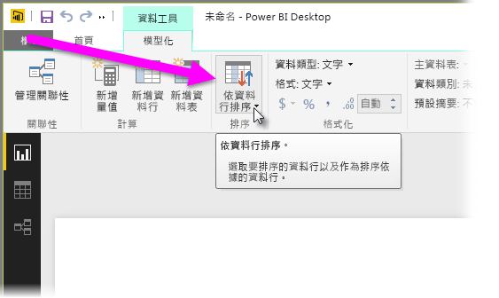
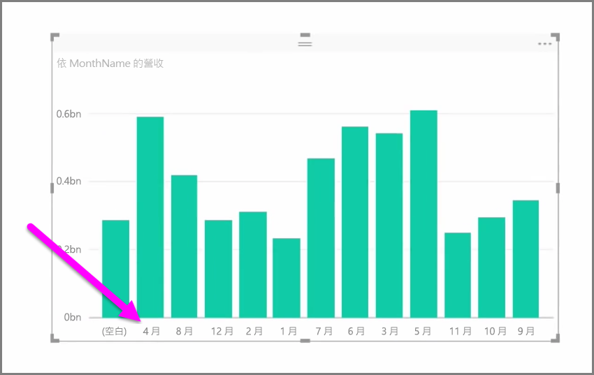
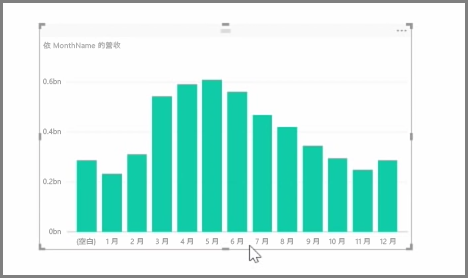

匯入的資料通常會包含報表和視覺化工作實際上不需要的欄位，因為它是額外的資訊，或者因為其他資料行已有可用資料。 Power BI Desktop 有最佳化資料的工具，為您建立報表和視覺效果以及檢視共用報表提供更多助力。

## 隱藏欄位
若要隱藏 Power BI Desktop [欄位] 窗格中的資料行，請以滑鼠右鍵按一下它，然後選取 [隱藏]。 請注意，隱藏的資料行並未刪除；如果您在現有的視覺效果中使用了該欄位，資料仍然位於該視覺效果中，而且資料也還可以用在其他視覺效果中，隱藏的欄位只是不顯示在 [欄位] 窗格中而已。

如果您在 [關聯性] 檢視中檢視資料表，隱藏的欄位則會以灰色呈現。再次強調，其資料仍然可用，也仍然是模型的一部分，只是從檢視中隱藏起來而已。 以滑鼠右鍵按一下欄位，選取 [取消隱藏]，即可取消隱藏任何已隱藏的欄位。

## 依其他欄位排序視覺效果資料
[模型] 索引標籤提供的 [依資料行排序] 工具，可以確保資料依您想要的順序顯示。

常見的範例為，包含月份名稱的資料預設依字母排序，所以 "August" (八月) 出現在 "February" (二月) 前面。

在這個例子中，依序選取 [欄位] 清單中的欄位和 [模型] 索引標籤的 [依資料行排序]，然後選擇要排序的欄位即可以修正問題。 在本例中， "MonthNo" 類別目錄排序選項會依預期順序排列月份。

設定欄位的資料類型是另一種最佳化資訊的方法，以便您正確處理資料。 若要從報表畫布變更資料類型，請選取 [欄位] 窗格中的資料行，然後使用 [格式] 下拉式功能表選取其中一個格式化選項。 為顯示該欄位所建立的所有視覺效果都會自動更新。

