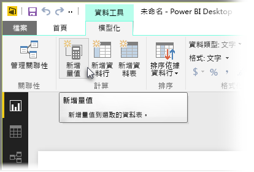
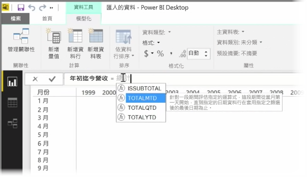
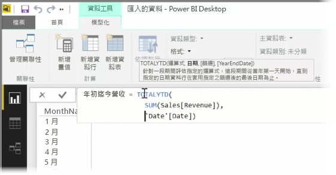
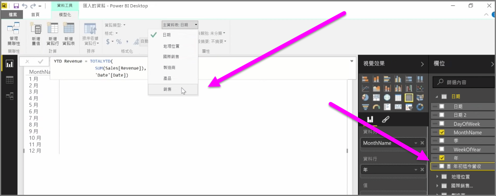

「量值」  是存在於 Power BI 資料模型中的計算。 若要建立量值，請在 [報表]  檢視中，從 [模型]  索引標籤選取 [新增量值]  。

DAX (Power BI 中的資料分析運算式語言) 很棒的一點就是擁有許多實用的函數，特別是以時間為基礎的計算函數，例如「年初至今」  或「每年」  。 使用 DAX，您可以定義一次時間量值，然後視需要依您資料模型中的許多不同欄位進行分割。

在 Power BI 中，定義的計算稱為「量值」  。 若要建立「量值」  ，請從 [常用]  索引標籤選取 [新增量值]  。這會開啟公式列，您可以在此輸入定義量值的 DAX 運算式。 當您輸入時，Power BI 會依您輸入的計算，建議相關的 DAX 函數和資料欄位，您也可以取得說明一些語法和函數參數的工具提示。

如果您的計算特別長，您可以在運算式編輯器中輸入 **ALT-Enter**，加入額外的分行符號。

建立新量值之後，它會出現在畫面右側 [欄位]  窗格的其中一個資料表中。 Power BI 會將新量值插入您目前選取的資料表，而且不論此量值在您資料中的實際位置為何，您都可以選取量值並使用 [主資料表]  下拉式功能表，輕鬆地移動量值。

量值的使用方式就像是任何其他資料表資料行︰只要將其拖放到報表畫布或視覺效果欄位即可。 量值也會與交叉分析篩選器緊密整合，以快速分割您的資料，這表示您可以定義一次量值，然後用於許多不同的視覺效果中。

**計算** DAX 函數是強大的函數，可進行各種實用的計算，特別適用於財務報告和視覺效果。

