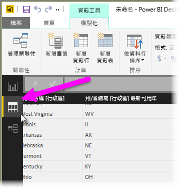
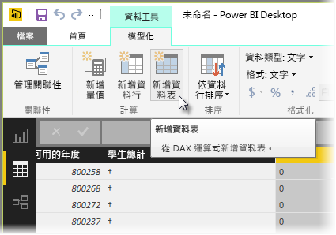
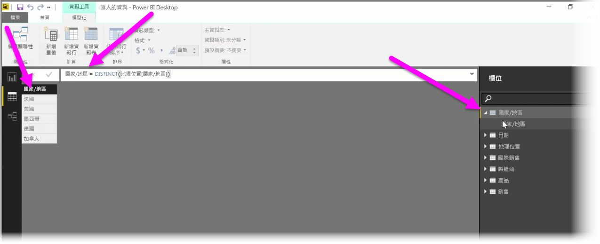

導出的資料表是 DAX 中的函數，可讓您表示一套完整的新模型功能。 例如，如果您想要執行不同類型的合併聯結，或根據作用中公式的結果來快速建立新的資料表，導出的資料表可協助您達到此目的。

若要建立導出的資料表，請移至 Power BI Desktop 中的 [資料檢視]  ，您可以從報表畫布左側啟用此功能。

從 [模型] 索引標籤選取 [新增資料表]  以開啟公式列。

在等號左側輸入新資料表的名稱，在右側輸入您要用來形成該資料表的計算。 完成計算之後，新資料表會出現在模型的 [欄位] 窗格中。

建立之後，您可以像是任何其他資料表，在關聯性、公式和報表中使用導出的資料表。

