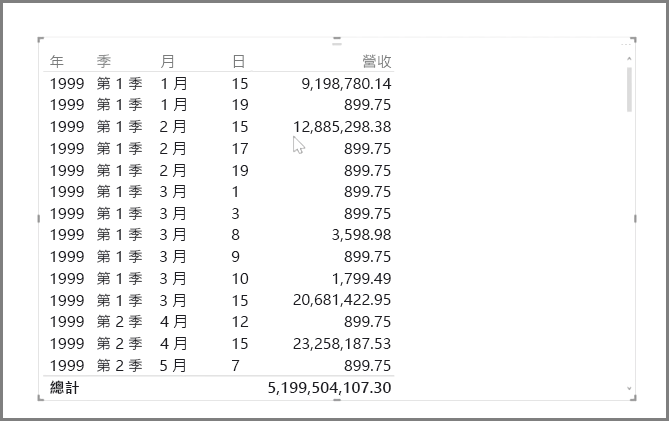
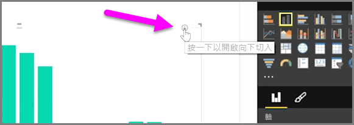
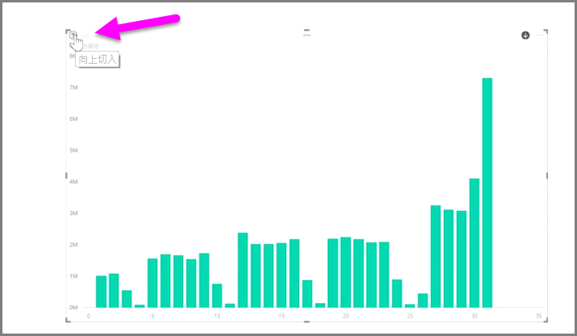
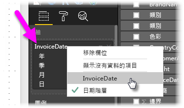
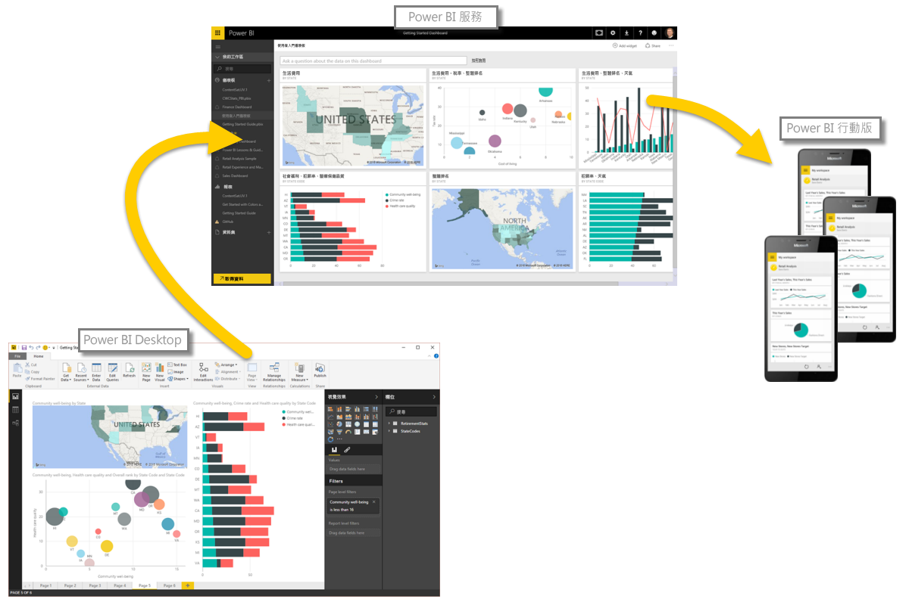

您可以使用 Power BI 輕鬆地分析以時間為基礎的資料。 Power BI Desktop 中的模型工具會自動包含產生的欄位，您只要按一下，就能向下鑽研年、季、月和日。  

當您使用日期欄位在報表中建立資料表視覺效果時，Power BI Desktop 會自動包含依時間週期劃分的細項。 例如，Power BI 已自動將 [日期]  資料表中的單一日期欄位分成「年」、「季」、「月」和「日」，如下圖所示。

視覺效果預設會在「年」  層級顯示資料，但您可以開啟視覺效果右上角的 [向下鑽研]  加以變更。

現在當您按一下圖表中的直條或線條時，就會向下鑽研到下一層時間階層，例如從「年」  到「季」  。 您可以繼續向下鑽研，直到您到達最細微的一層階層，在此範例中為「日」  。 若要在時間階層內回頭向上移動，請按一下視覺效果左上角的 [向上鑽研]  。

您也可以向下鑽研視覺效果上顯示的所有資料，而不是某個選取的週期，方法是使用同時位在視覺效果右上角的**全部鑽研**雙箭號圖示。

只要您的模型包含日期欄位，Power BI 就會自動為不同的時間階層產生不同的檢視。

若要回到個別日期，而不是使用日期階層，只要以滑鼠右鍵按一下 [欄位]  中的資料行名稱 (在下圖中，資料行的名稱是 *InvoiceDate*)，然後從出現的功能表中選取資料行名稱，而非 [日期階層]  。 您的視覺效果接著會顯示根據該資料行資料的資料，而且不使用日期階層。 需要回到使用日期階層？ 沒問題，只要再一次按滑鼠右鍵並從功能表選取 [日期階層]  。

## 後續步驟
**恭喜您！** 您已完成本節的 Power BI **引導式學習**課程。 既然您已了解*模型化*資料，您準備好深入了解有趣等候下一節中的項目：**視覺效果**。

之前提過，本課程讓您遵循一般的 Power BI 工作流程來建立您的知識︰

* 將資料帶入 **Power BI Desktop** 並建立報表。
* 發行至 Power BI 服務，在此建立新的**視覺效果**及建立儀表板
* 與其他人**共用**儀表板，尤其是行動工作者。
* 使用 **Power BI Mobile** 應用程式來檢視共用的儀表板和報表，並與之互動。

即使您可能不是單獨完成所有工作，還是會 *了解* 這些儀表板的建立方式，以及如何連接資料... 當您完成本課程時，您將能夠建立一個屬於自己的儀表板。

下一節見！

