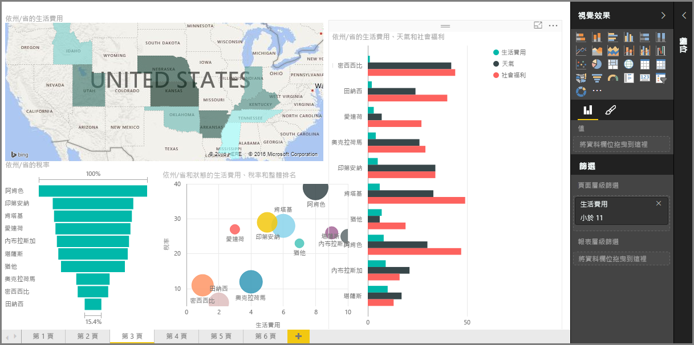

歡迎使用 Power BI **引導式學習**課程的＜視覺效果＞  一節。 準備開始進行好玩有趣且具啟發性的導覽，學習 Power BI 目前所提供的許多視覺效果。 而且不止這些，還有更多視覺效果將不斷推出！

當然，視覺效果是任何商業智慧工作的最終結果... 我們想要擷取資料、以吸引人且深入的方式呈現，並 *顯示* 重點部分。Power BI 提供各式各樣吸引人的視覺效果，自訂方式幾乎沒有限制，因此這是很重要的一節！

本節似乎有許多主題，但別擔心︰每個主題都很簡短，並提供您想得到的所有視覺效果，而且很容易吸收。 您可能會發現自己悠遊於本節中，想像如何讓這些視覺效果呈現自己的資料。

我們將會從視覺效果的主要功能開始，也就是我們都很熟悉的簡單視覺效果，請務必了解所有細節。 接著，我們將會探索更進階 (或至少較不常見) 的功能，並填滿您用來建立報表的工具箱。

請盡情享受，您可以在此學到許多內容！

## Power BI 的視覺效果簡介
視覺化資料是 Power BI 的其中一個核心部分 (我們在本課程稍早將其定義為基本建置組塊)，而建立視覺效果是尋找及分享您深入解剖析的最簡單方式。

Power BI 預設提供一套完整的視覺效果，從簡單的橫條圖到圓形圖到地圖，甚至是更難理解的供應項目，例如瀑布圖、漏斗圖、量表圖等等。 Power BI Desktop 也提供廣泛的頁面格式化工具 (例如圖案和影像)，可協助讓報表更生動。

