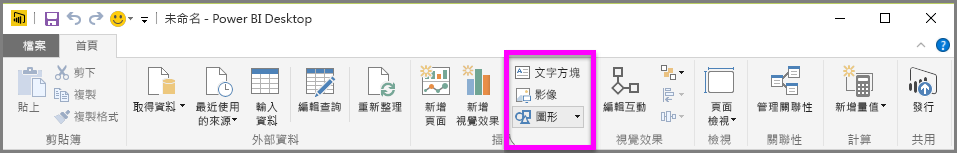

除了資料繫結視覺效果之外，您也可以加入靜態項目 (例如文字方塊、影像和圖案) 來改善報表的視覺化設計。 若要加入視覺項目，請從 [常用] 索引標籤選取 [文字方塊]、[影像] 或 [圖案]。

**文字方塊**是顯示視覺效果的大型標題、說明文字或一段簡短資訊的理想方式。 文字方塊可以透過撰寫的 URL，或藉由醒目提示錨點片語並選取文字方塊選項列上的連結符號，來包含連結。 您可以在文字方塊中包含 URL，Power BI 會自動偵測並啟用該連結。

選取 [影像] 會開啟檔案瀏覽器，您可以在此選取您電腦或其他網路來源中的影像。 根據預設，調整報表中影像的大小會維持其外觀比例，但您可以透過視覺格式設定選項來停用此設定。

**圖案**有五個不同的格式選項，包括矩形和箭頭。 圖案可以是不透明，或透明但具有彩色框線 (後者適用於在多組視覺效果周圍建立框線)。

