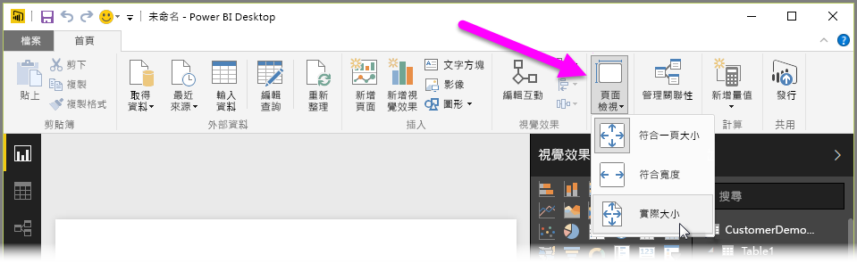
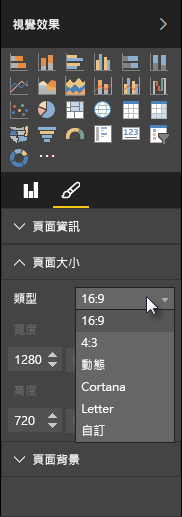

Power BI Desktop 可讓您控制報表頁面的配置和格式，例如大小和方向。

您可以使用 [常用] 索引標籤中的 [頁面檢視] 功能表，來變更報表頁面的縮放方式。 可用的選項包括 \[調整成一頁] \(預設)、\[符合寬度] 和 \[實際大小]。

您也可以變更頁面大小本身。 報表頁面預設為 16:9。 若要變更頁面大小，請確定未選取任何視覺效果，然後在 [視覺效果] 窗格中選取畫刷圖示，再選取 [頁面大小] 展開該區段。

頁面大小的選項包括 4x3 \(外觀比例較接近正方形) 和 \[動態] \(頁面會延伸填滿可用空間)。 此外，也提供報表的標準 Letter 大小。 請記住，變更頁面大小之後，您可能需要調整視覺效果的大小，以確保視覺效果完全在畫布上。

您也可以指定自訂頁面大小、依英吋或像素設定大小，以及變更整份報表的背景色彩。

另一個選項是選取 Cortana，這會調整報表大小，使其可作為使用 Cortana 搜尋的結果。

