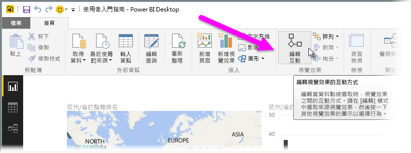
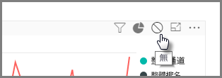
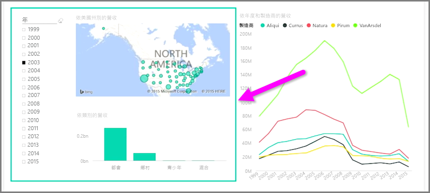

當您在相同的報表頁面上有多個視覺效果時，按一下或使用交叉分析篩選器來選取特定區段會影響該頁面上的所有視覺效果。 不過在某些情況下，您可能只想分割特定視覺效果。 特別是使用散佈圖等項目時，若將資料限制在特定區段，便會移除重要的意義。 所幸 Power BI Desktop 可讓您控制視覺效果之間的互動方式。

若要變更視覺效果之間的互動方式，請從 [常用]  功能區的 [視覺效果] 區段，選取 [編輯]  以開啟 [編輯模式]  。

>[!NOTE]
>自這段影片錄製以來，Power BI Desktop 中的**編輯互動**圖示已變更。
> 
> 

現在當您選取報表畫布上的視覺效果時，您會在它將影響的所有其他視覺效果右上角，看到一個不透明的 *篩選* 小圖示。 若要將某個視覺效果從互動中排除，請按一下右上角 *篩選* 圖示附近的 *無* 符號。

在某些情況下，您可以調整視覺效果之間所發生的篩選互動類型。 開啟 [編輯模式]  時，選取您要用來篩選的視覺效果。 如果您可以變更另一個視覺效果的互動類型，右上角的篩選圖示旁邊會出現 *圓形圖* 圖示。

按一下 *圓形圖* 圖示即可醒目提示分割的資料。 否則會篩選資料。 如前所述，您可以按一下 *無* 圖示來移除所有互動。

一個實用的設計秘訣是在彼此互動的視覺效果周圍繪製一個透明圖案，讓使用者清楚了解這兩者具有互動關係。

