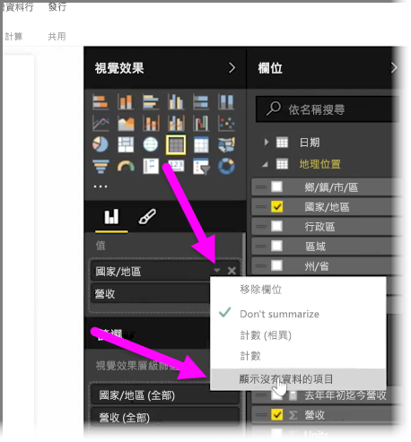
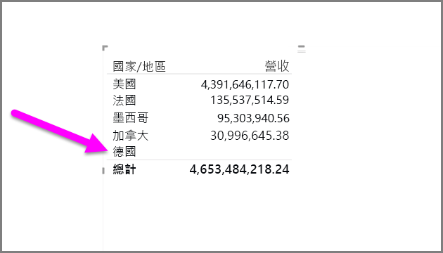
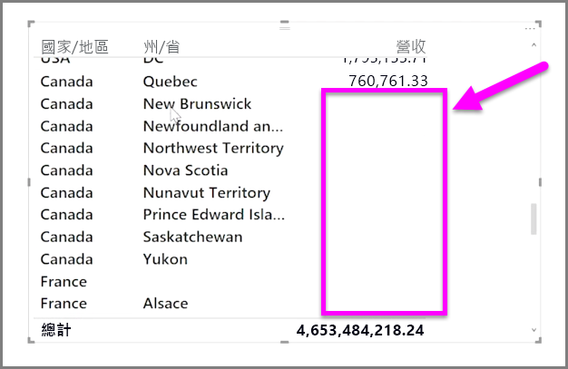

根據預設，資料行標題只有包含資料時，才會在報表中顯示。 例如，如果您依國家/地區顯示收益，但沒有挪威的銷售額，則挪威不會出現在視覺效果的任何地方。

若要顯示空白類別，請在 [視覺效果]  窗格中，按一下您要變更之欄位中的向下箭號，然後選取 [顯示沒有資料的項目]  。

任何空白資料行現在會出現在視覺效果中，但值為空白。

一旦您在 [視覺效果]  窗格中，針對任何欄位選取 [顯示沒有資料的項目]  ，就會套用至 [視覺效果] 窗格中顯示的所有欄位。 因此，如果您新增另一個欄位，也會顯示沒有資料的任何項目，而不必重新瀏覽下拉式功能表。

