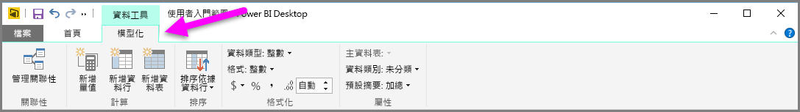
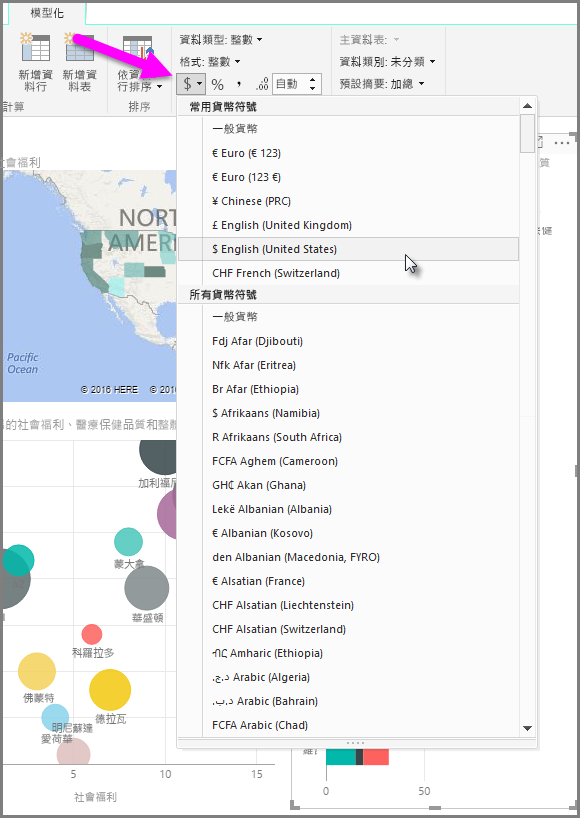
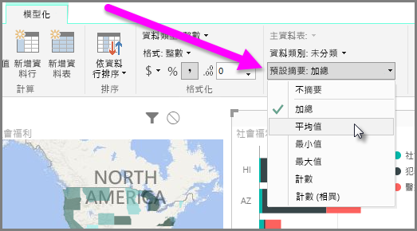
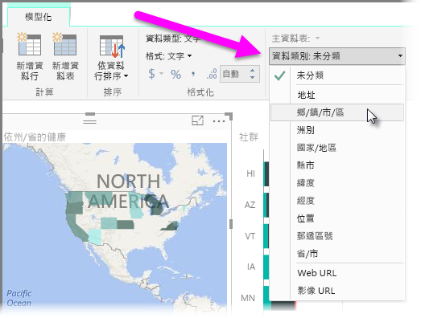

Power BI 提供可指派給模型欄位的屬性，這些屬性可協助以更清楚的方式來報告、視覺化及呈現資料。 例如，您有時想要取得一份數字清單的平均值，但 Power BI 卻自動加總該清單。 使用 Power BI，您可以調整這些數字清單的摘要方式。

## 透過摘要控制數值
讓我們舉例說明，並示範如何控制 Power BI 摘要數值資料欄位的方式。

在您的報表畫布上，選取一個視覺效果，然後在 [欄位] 窗格中，選取一個欄位。 [模型] 索引標籤隨即出現在功能區中，並顯示格式化資料的選項及資料屬性。

您可以選取貨幣符號下拉式清單，來選取所使用的貨幣符號類型，如下圖所示。

格式化欄位有許多不同的選項。 例如，您可以將貨幣格式變更為百分比格式。

您也可以變更 Power BI 摘要資料的方式。 選取**預設摘要**圖示可變更欄位的摘要方式，包括顯示總和、計數或平均值。

## 管理並釐清您的位置資料
在地圖上繪製位置時，可進行類似的變更。 選取您的地圖，然後在 [欄位] 窗格中，選取您要用於 [位置] 值的欄位。 在 [模型] 索引標籤上，選取 [資料類別]，然後從下拉式功能表選擇代表您位置資料的類別。 例如，選取省、縣市或鄉/鎮/市/區。

