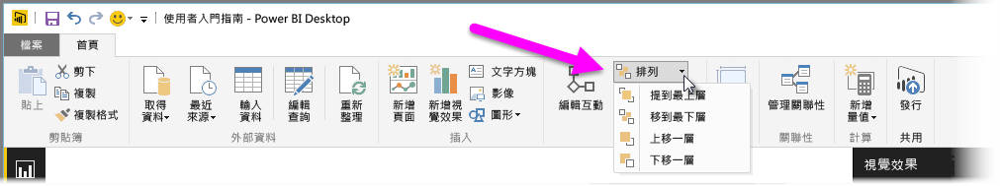
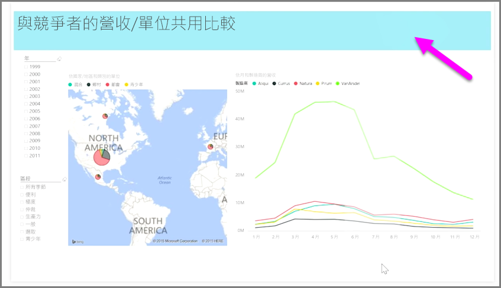

當您在報表上有許多項目時，Power BI 可讓您管理這些項目相互重疊的方式。 項目的分層方式或相互重疊的排列方式通常稱為圖層順序。

若要管理報表中項目的圖層順序，請選取一個項目，然後使用功能區之 [常用]  索引標籤上的 [排列]  按鈕，來變更其圖層順序。

藉由使用 [排列]  按鈕功能表中的選項，就能依照您想要的方式來排序報表項目。 您可以將視覺效果上移一層或下移一層，或者傳送到整個順序的最前方或最後方。

當您使用圖案作為裝飾背景或框線，或想要醒目提示個別圖表或圖形的特定區段時，使用 [排列] 按鈕會特別有用。 您也可以用來建立背景，例如以下用於報表標題背景的淺藍色矩形。

