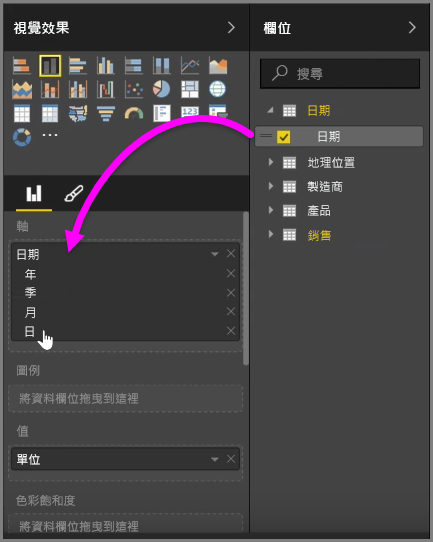
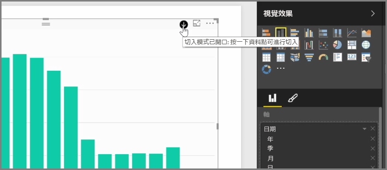
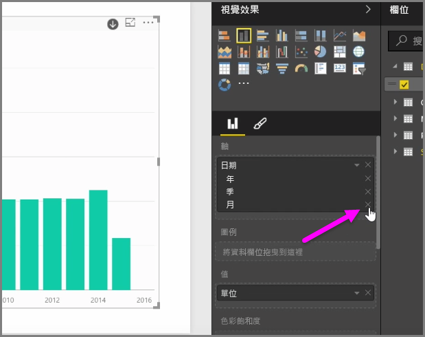
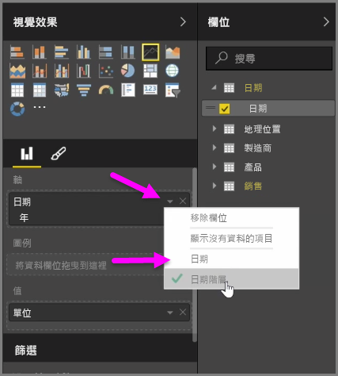
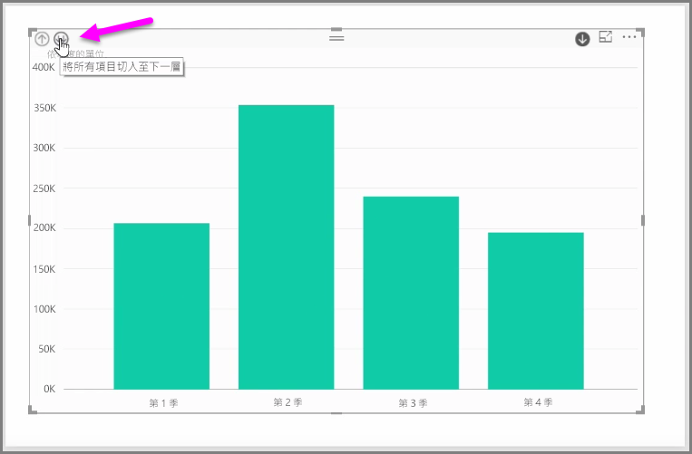

當您將 [日期] 欄位加入視覺效果的 [軸] 欄位值區時，Power BI 會自動加入包含「年」、「季」、「月」和「日」的時間階層。 如此一來，Power BI 就能讓您的視覺效果提供以時間為基礎的互動給檢視報表的使用者，讓使用者向下鑽研這些不同的時間層級。

有了此階層，您就可以開始向下鑽研時間階層。 例如，按一下圖表中的某年即可向下鑽研到此階層的下一個層級 (在本例中為「季」)，並接著在視覺效果中顯示該層級。

在此自動建立的階層中，您也可以管理允許其他人鑽研的共用報表層級。 若要這樣做，只要在 [視覺效果] 窗格中，按一下您要移除之階層旁邊的 X 即可。 已刪除的層級會從報表中移除，鑽研時不會再顯示該層級。

如果您需要取回該階層層級，只要移除 [日期] 欄位，然後從 [欄位] 窗格再次加入即可，系統會再次自動為您建立此階層。

您有時可能不想要某個視覺效果使用此階層。 若要控制此設定，您可以在將 [日期] 欄位加入視覺效果之後，選取欄位旁邊的向下箭號按鈕，然後選取 [日期] 而不是 [日期階層]。 系統會提示 Power BI 在視覺效果中顯示原始日期值。

您也可以同時展開目前可見的所有資料項目，而不是選取某一季或某一年。 若要這樣做，請選取視覺效果左上方的 *全部鑽研* 圖示，也就是向下雙箭號圖示。

