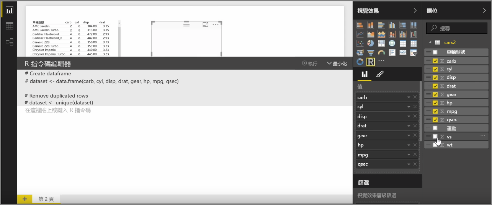
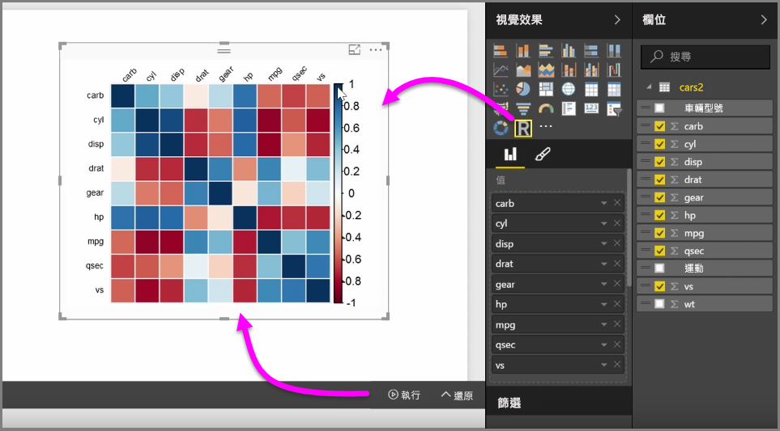
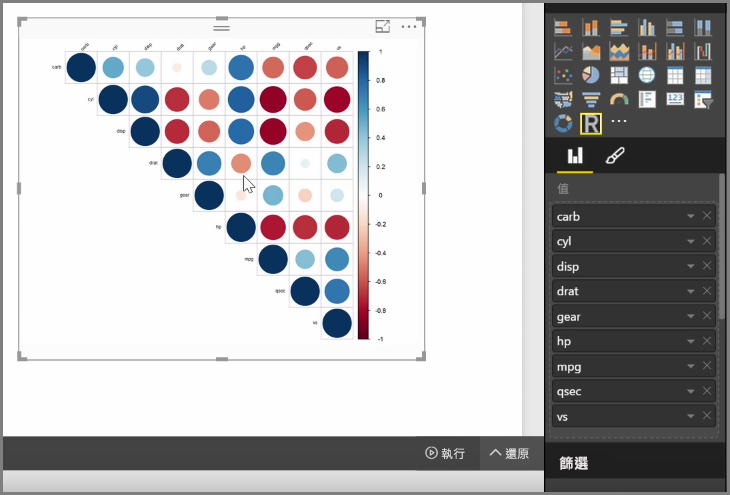

在 Power BI Desktop 中，您可以藉由與 R 整合，來執行分析和統計分析，並建立吸引人的視覺效果。您可以在 Power BI Desktop 報表中包含這些 R 視覺效果。

當您從 [視覺效果]  窗格選取 **R 視覺效果**圖示時，Power BI 會在畫布上建立一個預留位置來包含 R 視覺效果，然後提供 R 指令碼編輯器以供您直接在畫布上使用。 您可以將欄位加入 R 視覺效果，Power BI Desktop 會將其加入 R 指令碼編輯器窗格。

以下是 Power BI 在 R 指令碼編輯器中所產生的內容，您可以開始建立自己的 R 指令碼，以產生視覺效果。 指令碼完成之後，選取 [執行]  ，下列情況會隨即發生︰

1. 加入視覺效果的資料 (透過 [欄位]  窗格) 會從 Power BI Desktop 傳送到 R 的本機安裝
2. 在 Power BI Desktop R 指令碼編輯器中建立的指令碼會在 R 的本機安裝中執行
3. 然後 Power BI Desktop 會從 R 安裝取回視覺效果並在畫布上顯示

所有作業都會相當快速地進行，並在畫布上的 **R 視覺效果**中顯示結果。

您可以變更 R 視覺效果，方法是調整 R 指令碼，然後選取 [執行]  。 在下圖中，我們將視覺效果變更為顯示圓形，而不是正方形。

由於 R 視覺效果就像是 Power BI Desktop 中的任何其他視覺效果，因此您也可以與之互動並建立與畫布上其他視覺效果的連接。 當您透過篩選或醒目提示與畫布上其他視覺效果互動時，R 視覺效果會像是任何其他 Power BI 視覺效果一樣自動回應，而不需要調整 R 指令碼。

這是直接在 Power BI Desktop 中使用 R 功能的絕佳方式。

## 後續步驟
**恭喜您！** 您已完成 Power BI **引導式學習**課程的＜視覺效果＞  一節。 您已精通 Power BI 所提供的許多視覺效果，並已了解如何使用、修改及自訂這些視覺效果。 還有一個好消息︰Power BI Desktop 和 Power BI 服務的視覺效果基本上相同，因此您學習到的內容適用於兩項產品。

您現在準備好前往雲端並投入 Power BI 服務，您可以在此**探索資料**。 如您所知，此工作流程類似如下︰

* 將資料帶入 **Power BI Desktop** 並建立報表。
* 發行至 Power BI 服務，在此建立新的**視覺效果**及建立儀表板
* 與其他人**共用**儀表板，尤其是行動工作者。
* 使用 **Power BI Mobile** 應用程式來檢視共用的儀表板和報表，並與之互動。

不論您是建立報表，或只是檢視報表並與之互動，您現在都知道如何建立所有酷炫的視覺效果，以及這些視覺效果如何連接到資料。 接下來，我們將探討這些視覺效果和報表的操作方式。

下一節見！

