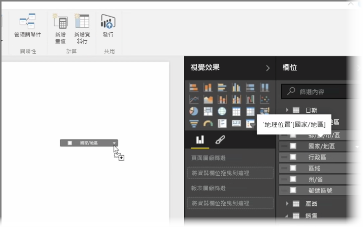
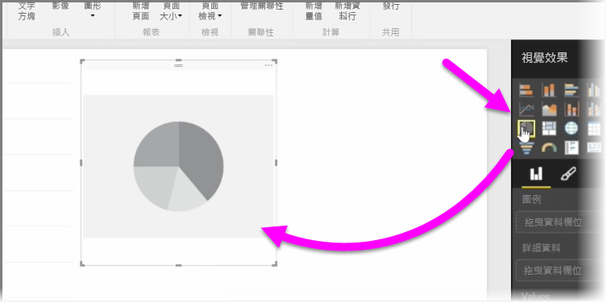
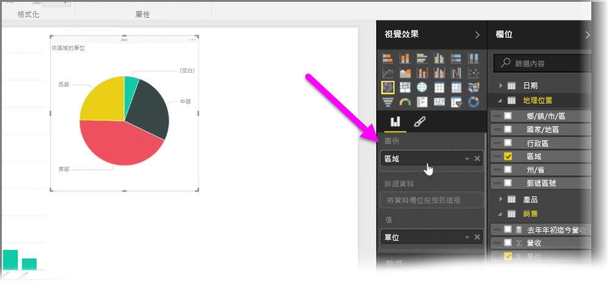
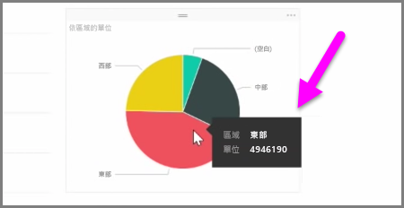
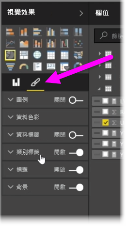

在本文中，您將了解如何建立新的橫條圖、圓形圖和矩形式樹狀結構圖，以及如何配合您的報表加以自訂。

有兩種不同的方式，可讓您在 Power BI Desktop 中建立新的視覺效果︰

* 您可以將欄位名稱從 [欄位]  窗格拖放到報表畫布。 您的視覺效果預設會顯示為資料表。
  
  
* 您也可以在 [視覺效果]  窗格中，按一下您要建立的視覺效果類型。 使用此方法時，預設視覺效果會是類似您選取之視覺效果類型的空白預留位置。
  
  

建立圖形、地圖或圖表之後，您可以開始將資料欄位拖曳到 [視覺效果]  窗格下半部，以建立及組織您的視覺效果。 可用的欄位會隨著您選取的視覺效果類型而改變。 當您拖放資料欄位時，您的視覺效果會自動更新以反映變更。

您可以調整視覺效果的大小，方法是選取視覺效果，然後向內或向外拖曳控點。您也可以將視覺效果移至畫布上的任何位置，方法是按一下後再拖曳視覺效果。 如果您想要在不同的視覺效果類型之間進行轉換，請選取您要變更的視覺效果，然後只要從 [視覺效果]  窗格中的圖示選取不同的視覺效果即可。 Power BI 會嘗試將您選取的欄位盡可能轉換成類似的新視覺效果類型。

當您將滑鼠停留在部分視覺效果時，您會看到包含該區段詳細資料的工具提示，例如標籤和總值。

在 [視覺效果]  窗格中，選取**畫刷**圖示對視覺效果進行外觀變更，例如背景對齊、標題文字和資料色彩。

對視覺效果進行外觀變更的可用選項會因您選取的視覺效果類型而異。

