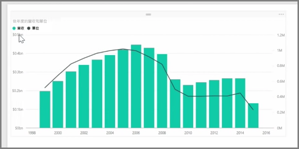
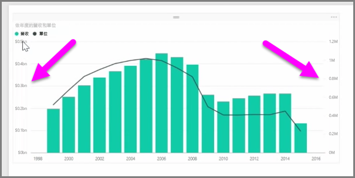
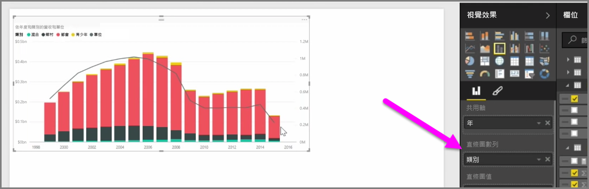

當您想要視覺化具有不同刻度的兩個量值時 (例如收益和單位)，同時顯示不同軸刻度之線條和直條的**組合圖**會很有用。 Power BI 預設支援許多不同類型的組合圖，包括熱門的**折線圖**和**堆疊直條圖**。

當您建立組合圖時，您會有一個 \[共用軸]  \(X 軸) 欄位，以及兩個欄位的值 (在本例中為直條圖和折線圖)。 兩個 Y 軸圖例會分別出現在視覺效果的兩側。

您也可以依類別分割每個直條圖，方法是將類別拖曳到 [視覺效果] 窗格的 [直條圖數列] 欄位。 當您這麼做時，每個直條會根據每個類別中的值依比例著色。

組合圖可讓您有效地以單一視覺效果視覺化具有不同刻度的多個量值。

