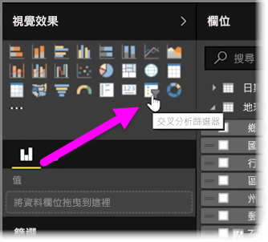
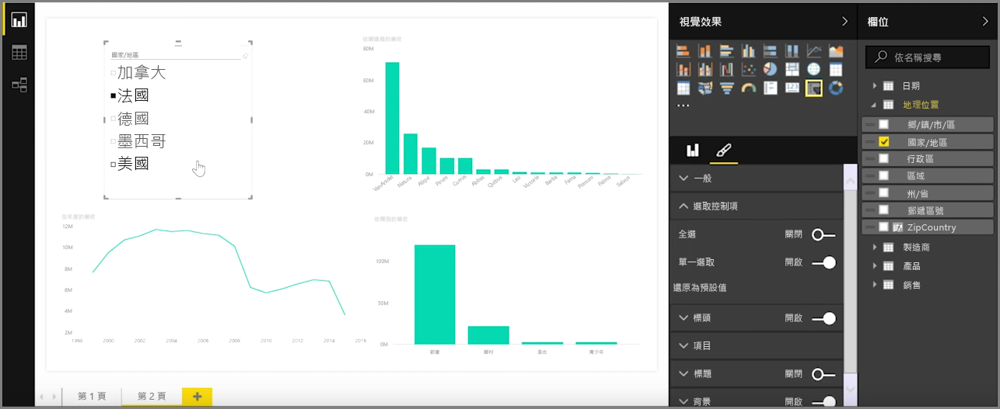
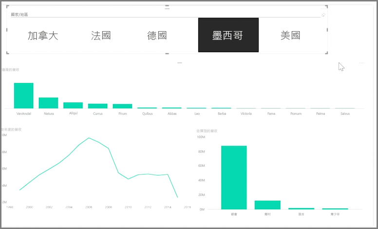

交叉分析篩選器是其中一個最強大的視覺效果類型，特別適用於複雜的報表。 **交叉分析篩選器**是 **Power BI Desktop** 中畫布上的視覺效果篩選，可讓檢視報表的任何人依特定值分割資料，例如依年或依地理位置。

若要將交叉分析篩選器加入報表，請從 [視覺效果]  窗格選取 [交叉分析篩選器]  。

將分割所要依據的欄位拖放到交叉分析篩選器預留位置上方。 視覺效果會變成具有核取方塊的項目清單。 這些項目就是您的篩選 - 選取其中一個區段旁邊的方塊，便會根據您的選擇，篩選或 *分割* 相同報表頁面上的所有其他視覺效果。

您可以使用幾個不同的選項來格式化交叉分析篩選器。 您可以將它設定為接受一次進行多個輸入，或切換為 [單一選取]  模式來一次使用一個。 您也可以新增 [全選]  選項至交叉分析篩選器項目，當您有特別長的清單時，這會很有幫助。 將交叉分析篩選器的方向從預設的垂直變更為水平，就會變成選取列，而不是檢查清單。

