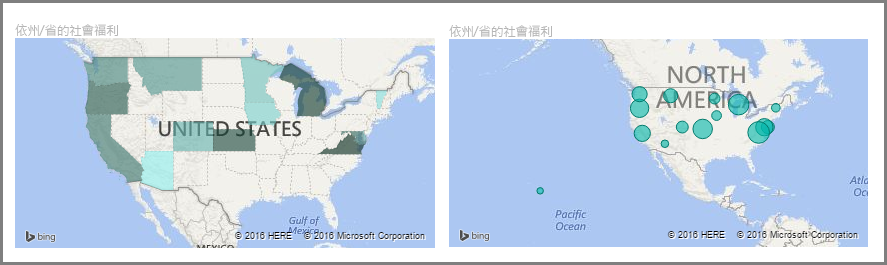
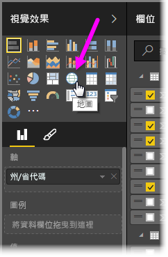
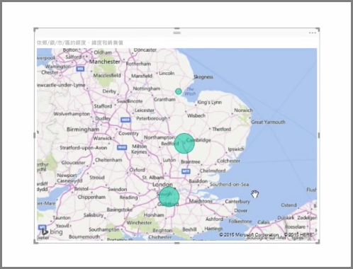
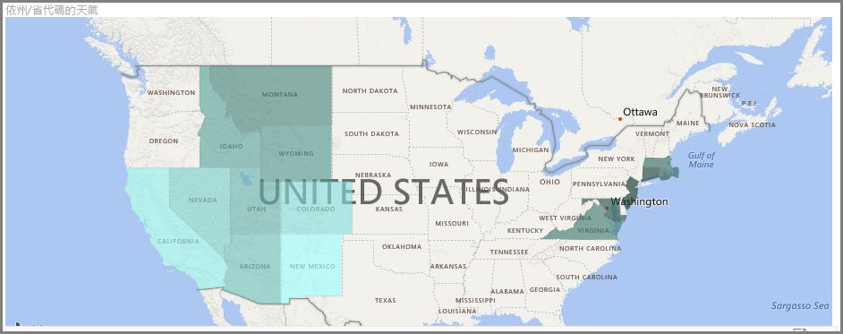
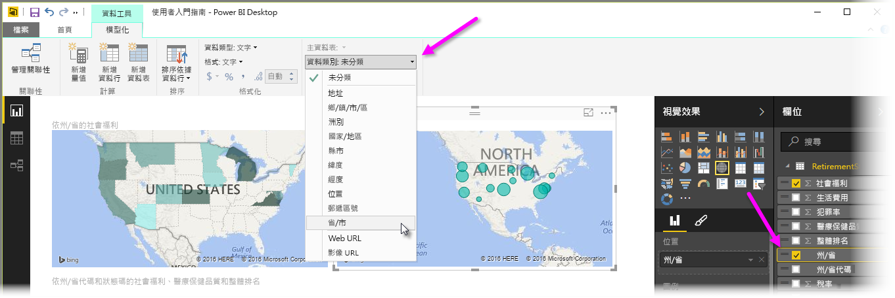

Power BI 有兩種不同的地圖視覺效果類型︰泡泡地圖會在地理位置上方放置一個泡泡，而形狀地圖會實際顯示您要視覺化的區域形狀。

> [!NOTE]
> 使用國家或地區時，請使用三個字母的縮寫，以確保地理編碼在地圖視覺效果中運作正常。 請「不要」  使用兩個字母的縮寫，因為可能無法正確辨識某些國家或地區。
> 如果您只有兩個字母的縮寫，請參閱[此外部部落格文章](https://blog.ailon.org/how-to-display-2-letter-country-data-on-a-power-bi-map-85fc738497d6#.yudauacxp)，以了解如何將兩個字母的國家/地區縮寫與三個字母的國家/地區縮寫產生關聯的步驟。
> 
> 

## 建立泡泡地圖
若要建立泡泡地圖，請在 [視覺效果]  窗格中，選取 [地圖]  選項。 您必須在 [視覺效果]  選項的 [位置]  值區中新增一個值，才能使用地圖視覺效果。

Power BI 對於能接受的位置值類型很有彈性，從更一般的詳細資料 (例如城市名稱或機場代碼)，到非常特定的緯度和經度資料。 將欄位新增至 [大小]  貯體，即可依欄位變更每個地圖位置的泡泡大小。

## 建立形狀地圖
若要建立形狀地圖，請在 [視覺效果] 窗格中，選取 [區域分布圖]  選項。 如同泡泡地圖，您必須在 [位置] 值區中新增一個值，才能使用此視覺效果。 將欄位新增至 [大小] 貯體，即可依欄位變更填滿色彩的濃度。

視覺效果左上角的警告圖示指出地圖需要更多位置資料，才能正確地繪製值。 這是在位置欄位中的資料模稜兩可時特別常見的問題，例如使用「華盛頓」  等可能表示州或行政區的區域名稱。 解決此問題的一個方法是將資料行重新命名為更具體的名稱，例如「州」  。 解決此問題的另一個方法是選取 [模型] 索引標籤中的 [資料類別]  ，手動重設資料類別。您可以在此指派資料的類別，例如「州」或「城市」。

