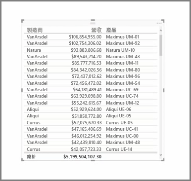
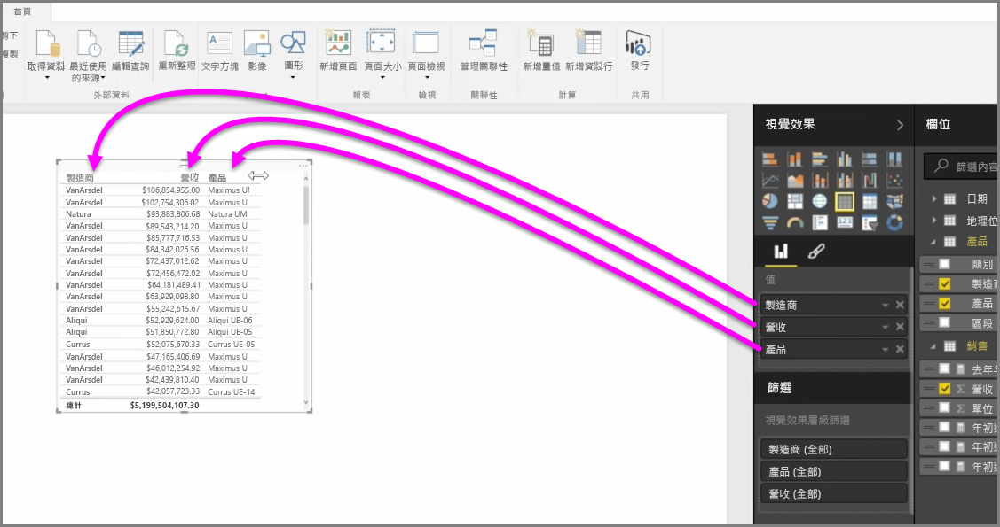
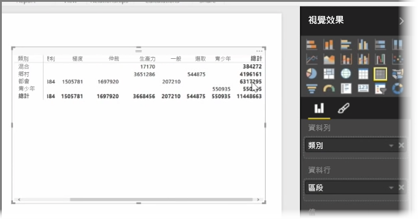

除了豐富的圖表之外，Power BI Desktop 還支援更多的表格式視覺效果。 事實上，當您擷取某個類別欄位或文字欄位並拖曳到報表畫布時，預設會取得資料表結果。 您可以向上及向下捲動資料表，一開始會依字母順序排序。

如果資料表中有數值資訊 (例如收益)，最下方會顯示總和。 您可以按一下資料行的標題，切換為遞增或遞減順序，來手動排序每個資料行。 如果資料行的寬度不足以顯示所有內容，請按一下並左右拖曳標題將它展開。

[視覺效果] 窗格之 [值] 值區中的欄位順序，決定這些欄位在資料表中的顯示順序。

**矩陣**類似於資料表，但其資料行和資料列的標題類別不同。 如同資料表，數值資訊會自動加總並顯示在矩陣的右下方。

矩陣有許多外觀選項可用，例如自動調整資料行大小、切換資料列和資料行總計、設定色彩等等。 建立矩陣時，請確定的您類別資料 (非數字資料) 位於矩陣左方且數值檔案位於右方，以確保水平捲軸會出現且捲動行為可正常運作。

