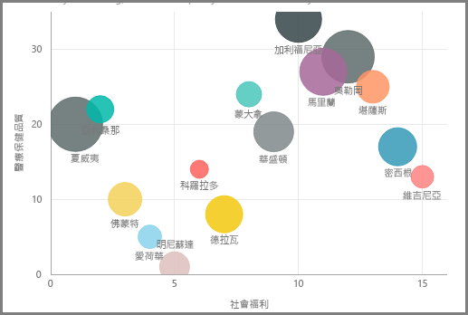
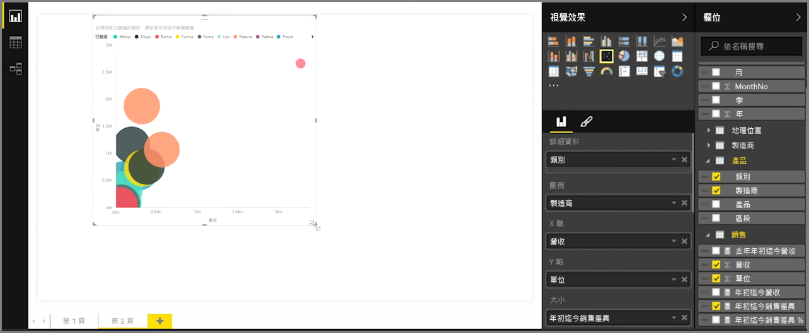
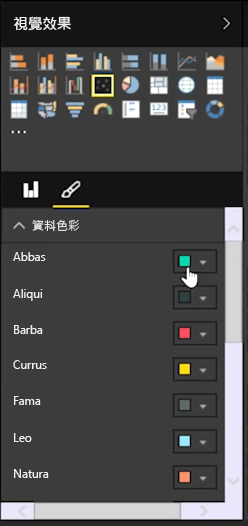
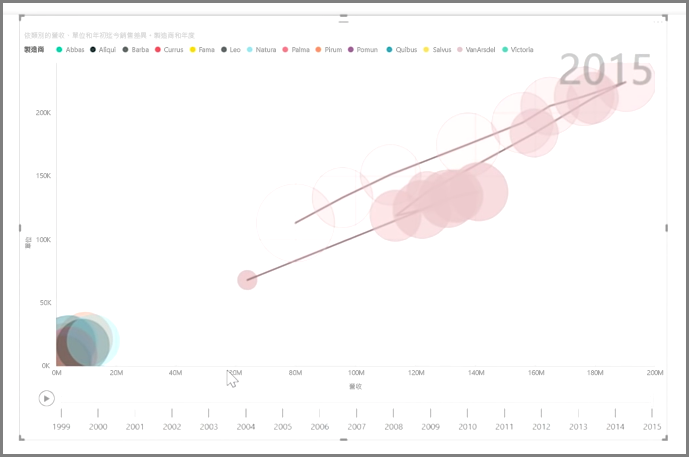

如果您想要比較兩個不同的量值 (例如單位銷售額與收益的比較)，散佈圖是常用的視覺效果。

若要建立空白圖表，請從 [視覺效果]  窗格選取 [散佈圖]  。 將您要比較的兩個欄位從 [欄位]  窗格拖放到 [X 軸]  和 [Y 軸]  選項值區。 此時，散佈圖可能只會在視覺效果中央出現一個小泡泡；您需要在 [詳細資料]  值區中新增一個量值，以指出您要分割資料的方式。 例如，若要比較項目銷售額和收益，或許您想要依類別、製造商或每月銷售額來分割資料。

在 [圖例]  值區中新增一個額外的欄位即可根據欄位的值以色彩編碼您的泡泡。 您也可以在 [大小]  值區中新增一個欄位，以根據該值改變泡泡大小。

散佈圖也有許多視覺格式設定選項，例如開啟每個彩色泡泡的外框，以及切換個別標籤。 您也可以變更其他圖表類型的資料色彩。

您可以在 [播放軸]  值區中，新增一個以時間為基礎的欄位，以建立泡泡圖在一段時間內變化的動畫。 在動畫期間按一下泡泡即可查看其路徑軌跡。

>[!NOTE]
>請記住，如果您在散佈圖中只看到一個泡泡，這是因為 Power BI 正在彙總您的資料，這是預設行為。 在 [視覺效果]  窗格的 [詳細資料]  值區中新增一個類別，以取得更多泡泡。
> 
> 

