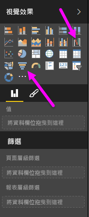
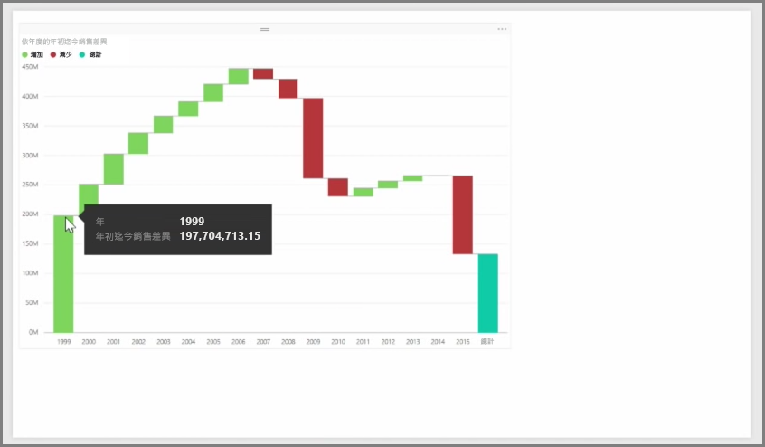
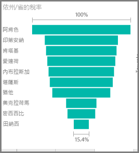

瀑布圖和漏斗圖是 Power BI 中所包含的其中兩個較有趣 (可能不常見) 的標準視覺效果。 若要建立任一種類型的空白圖表，請從 [視覺效果]  窗格中選取其圖示。

**瀑布圖**通常用來顯示某個值經過一段時間的變化。

瀑布圖只有兩個貯體選項：[類別]  和 [Y 軸]  。 請將以時間為基礎的欄位 (例如 [年]  ) 拖曳到 [類別]  值區，並將您要追蹤的值拖曳到 [Y 軸]  值區。 預設會以綠色顯示數值增加的時間週期，並以紅色顯示數值減少的時間週期。

**漏斗圖**通常用來顯示某個處理程序 (例如準銷售案源或網站保留工作) 的變化。

**瀑布圖**和**漏斗圖**都能加以分割並以視覺化方式進行自訂。

