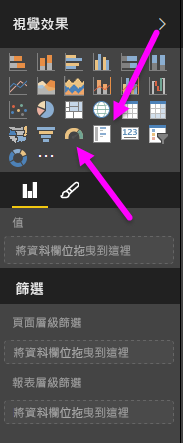
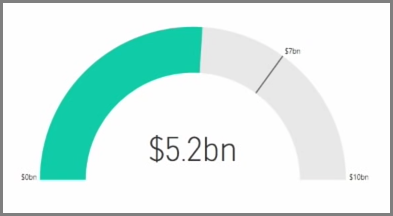
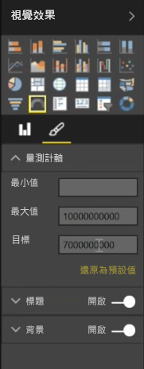
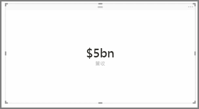

一般來說，視覺效果是用來比較兩個以上不同的值。 不過，有時在您建立報表時，可能只想追蹤一段時間的單一關鍵效能指標 (KPI) 或度量。 若要在 Power BI Desktop 中執行此作業，您可以使用**量測計**或**單一數字卡**視覺效果。 若要建立任一種類型的空白圖表，請從 [視覺效果] 窗格中選取其圖示。

若您是要建置儀表板並想顯示特定目標的進度，量測計就非常實用。 若要建立量測計，請從 [視覺效果] 窗格中選取其圖示，然後將您想要追蹤的欄位拖曳至 [值] 的值區。

量測計預設會顯示為 50%，或 [值] 的雙倍，而您可使用兩種方式來調整此設定。 若要以動態方式設定值，請將欄位拖曳至 [最小]、[最大] 和 [目標] 值區。 或者，使用視覺效果的格式化選項，以手動方式自訂您的量測計範圍。

卡片視覺效果只會顯示欄位的數值表示法。 預設卡片視覺效果會使用顯示單位以保持數字簡短；例如，顯示 "$5bn" 而不是 "$5,000,000,000"。 使用視覺效果格式化選項來變更所使用的單位，或完全停用。

您可以透過卡片來顯示已與文字串連的自訂量值，這是一種非常有趣的應用方式。 若要使用之前的範例，您可以搭配自訂量值讓卡片包括進階的 DAX 函數並顯示類似於 "Total revenue this year: $5bn" 或 "Progress on unit sales this year:" 的項目，然後加入代表進度的數字。

