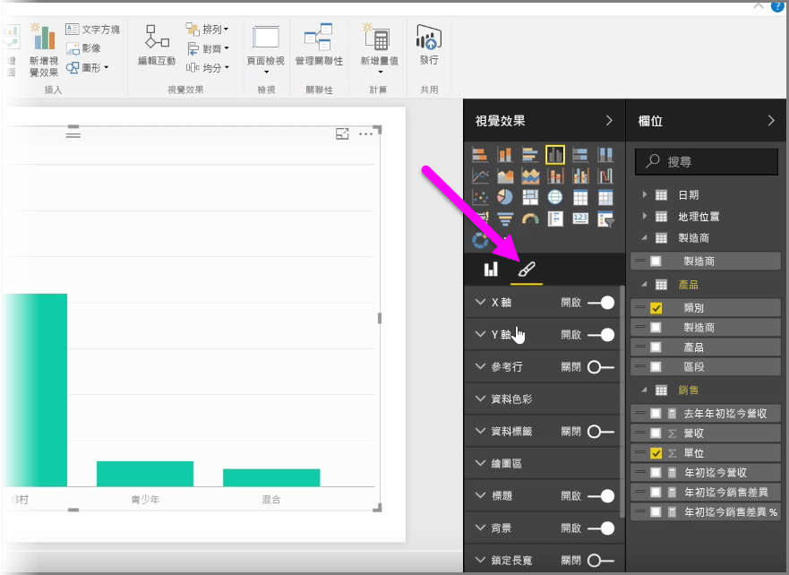
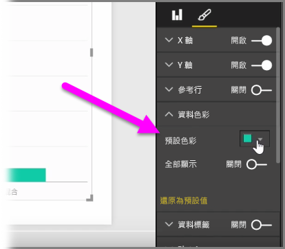
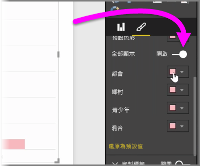
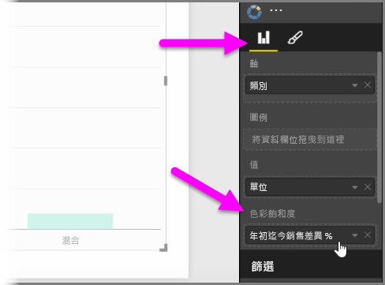
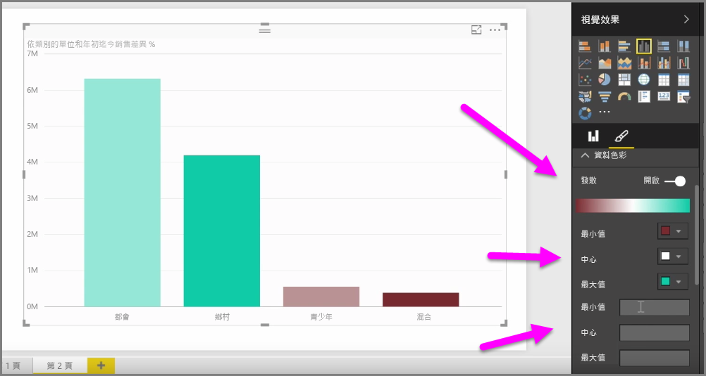
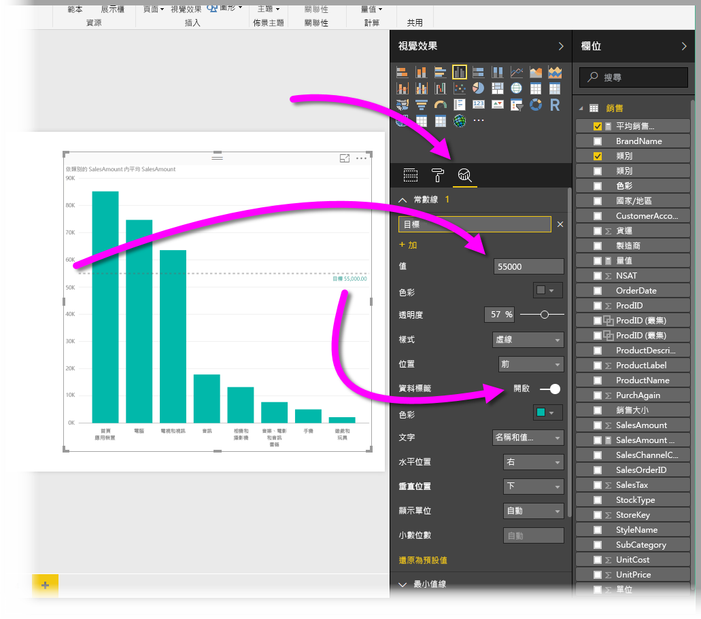
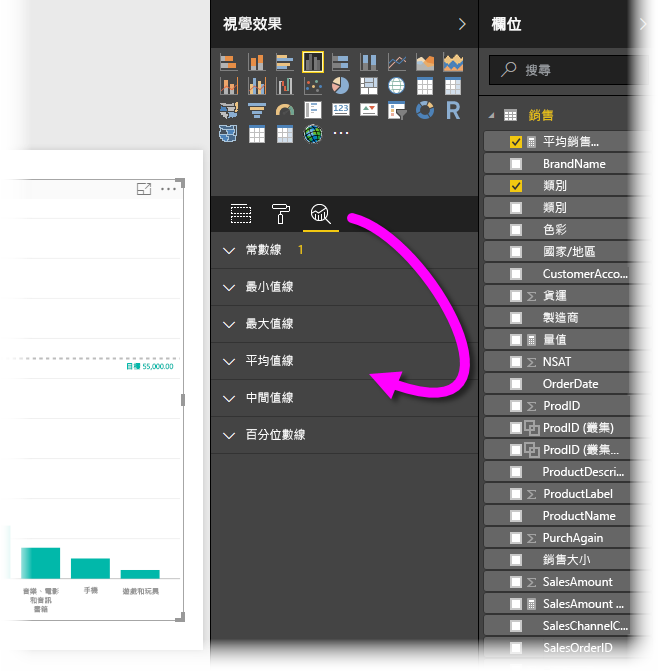

很多時候，您可能需要修改圖表或視覺效果中使用的色彩。 Power BI 可讓您充分掌控色彩的顯示方式。 若要開始使用，請選取 [視覺效果]  窗格中的某個視覺效果，然後按一下**畫刷**圖示。

您可透過許多選項來變更視覺效果的色彩或格式。 您可以選取 [預設色彩]  旁邊的色彩選擇器，然後選取所要的色彩，以變更視覺效果的所有橫條色彩。

您也可以將 [全部顯示]  滑桿切換為開啟，藉此變更每個橫條 (或其他項目，視您選取的視覺效果類型而定) 的色彩。 當您這樣做時，每個項目都會顯示色彩選取器。

您也可以依據值或量值來變更色彩。 若要這樣做，請將欄位拖曳到 [視覺效果] 窗格中的 [色彩飽和度]  值區 (請注意，此適用於**欄位區**區段而非**畫刷**區段)。

此外，您可以在填滿資料元素色彩時，變更所使用的色階和色彩。 您也可以將 [發散] 滑桿切換為開啟，以選取發散色階，並設定三種色彩之間的色階。 您也可以設定在圖表上顯示的「小」  、「中」  和「大」  值。

您也可以使用這些值來建立規則，例如，將特定色彩設為高於零，而另一種色彩設為低於零。

另一個使用色彩的便利工具是設定「常數線」  ，有時也稱為「參考線」  。 您可以設定常數線的值與其色彩，甚至可以在參考線中包含標籤。 若要建立常數線 (及其他相關線條)，請選取 [分析]  窗格 (類似放大鏡)，然後展開 [參考線]  區段。

您可以為視覺效果建立的許多其他線條 (也位於 [分析]  窗格中)，例如線下限、線上限、平均線、中線和百分位數線。

最後，您可以建立個別視覺效果的框線；如同其他控制項，您也可以指定該框線的色彩。

