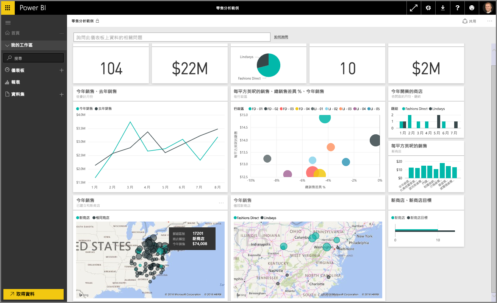
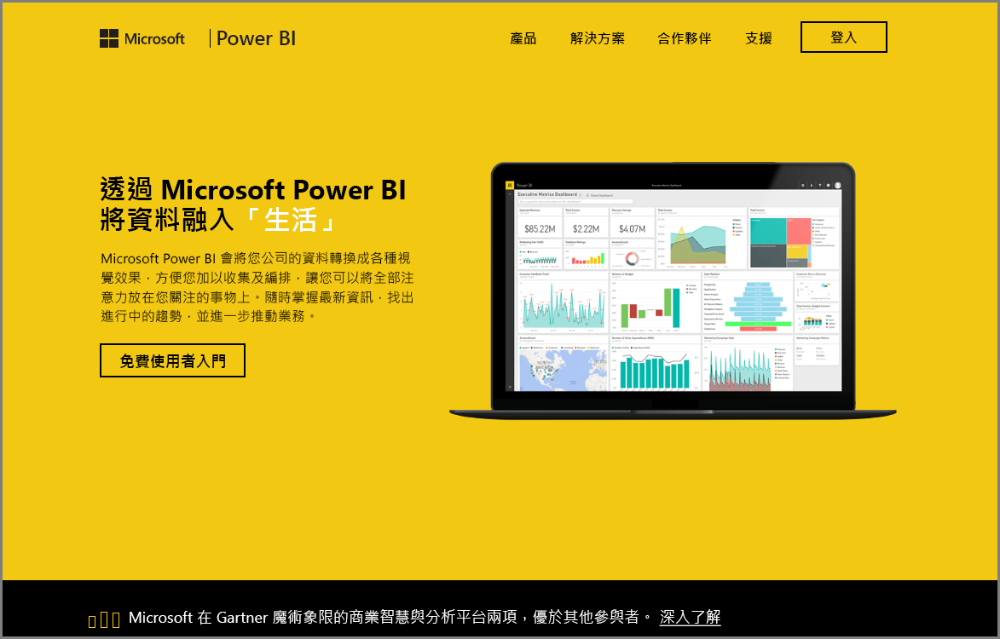

歡迎使用 Power BI **引導式學習**課程的＜探索資料＞  一節。 現在，您已了解 Power BI Desktop 以及如何取得資料並將其視覺化，即可開始探索 Power BI 服務中的資料。

本節有值得您了解的豐富內容，以及 Power BI 絕佳的互動與共用功能。 讓我們開始這場生動有趣的課程吧！

## Power BI 服務簡介
*了解 Power BI 服務能為您的組織帶來哪些幫助*

Power BI 服務是 **Power BI Desktop** 的自然延伸模組，其具有上傳報表、建立儀表板，以及使用自然語言詢問資料相關問題等功能。 您可以使用此服務來設定資料重新整理時間、與組織共用資料，以及建立自訂的 Service Pack。

在下列主題中，我們會探索 Power BI 服務，讓您了解其如何將商業智慧資料轉變成資料見解，以及驅動決策的共同作業環境。

