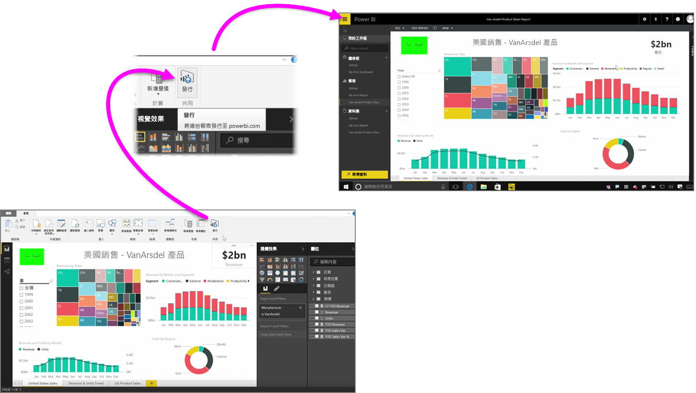

您可以快速又輕鬆地將報表發佈至 Power BI 服務。

在 **Power BI Desktop** 中製作完成報表之後，只要選取 Power BI Desktop 中 [常用] 索引標籤的 [發佈] 按鈕，即會開始程序。

系統會將您的報表和資料 (包括視覺效果、查詢和自訂量值) 封裝在一起，並上傳至 Power BI 服務。

> [!NOTE]
> Power BI Desktop 報表通常是指 **.pbix** 檔案，這是在 Windows 中指定的副檔名。
> 

上傳完成之後，會顯示一個對話方塊通知您發佈程序成功，其中也會提供連結，讓您透過網頁瀏覽器直接移至 Power BI 服務中的報表。

完成了！將報表從 Power BI Desktop 發佈至 Power BI 服務就是這麼簡單！

