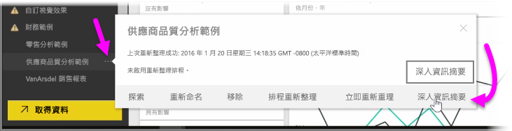
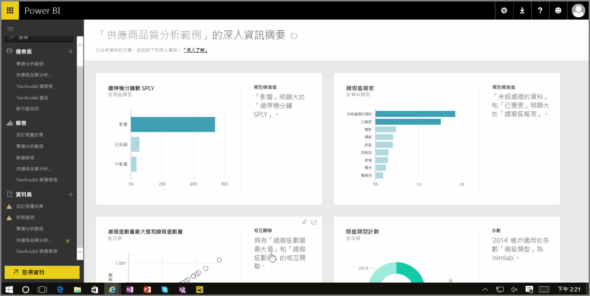

在 Power BI 服務中使用儀表板、報表或資料集時，您可以讓 Power BI 尋找資料的快速深入剖析。 在 Power BI 左窗格的 [資料集]  區段中，選擇您感興趣之資料集旁邊的*省略符號* (三個點)。 隨即出現選項功能表，您可在最右邊看到名為 [快速深入剖析]  的選項。

當您選取 [快速深入剖析] 時，Power BI 會執行一些機器學習並搜尋資料，同時進行分析以尋找快速深入剖析。 服務右上角會顯示通知，指出 Power BI 正在尋找深入資訊。

約 15 秒之後，該通知即會變更並告知您 Power BI 已找到一些深入資訊。

當您選取通知上的 [檢視深入資訊]  按鈕時，會出現一頁視覺效果，其中顯示 Power BI 找到的深入資訊，如下圖所示。 您可以向下捲動頁面，以檢視和思考其中的多項深入資訊。

如同任何其他視覺效果一般，您可在 [快速深入剖析] 頁面上與視覺效果互動，您也可以將其釘選到儀表板中 (若有的話)，或進一步篩選任意數量的視覺效果，來搜尋其他深入資訊，以滿足好奇心。

使用 [快速深入剖析]  時，您可以讓 Power BI 執行工作，找出資料中的極端值和趨勢，然後在儀表板中使用這些結果，或進一步精簡並篩選結果以取得您認為最重要的深入資訊。

