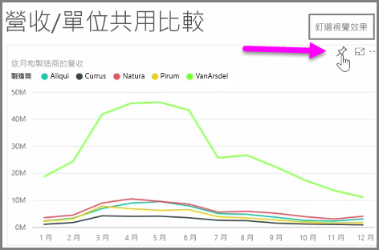
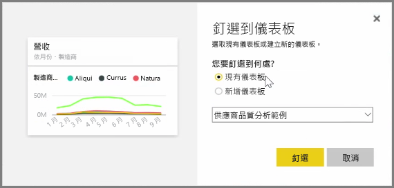
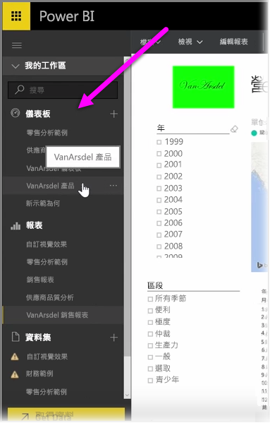
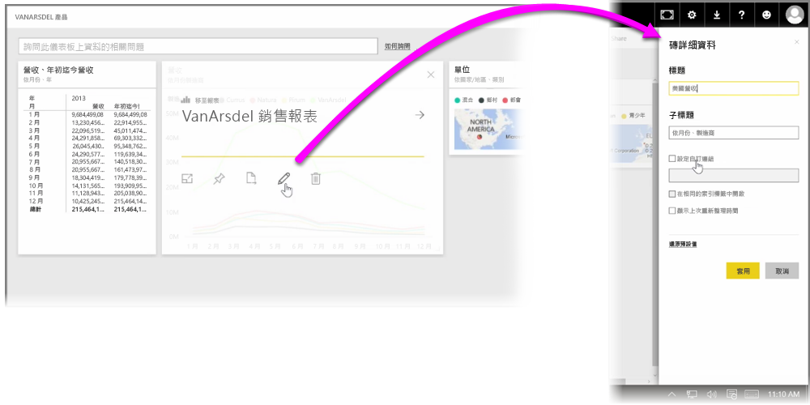

Power BI 中的**儀表板**是一個視覺效果集合頁面，這些視覺效果都是透過 Power BI 服務建立的。 您可以**釘選**報表的視覺效果 (不論是使用 Power BI Desktop 製作和發佈的報表或在 Power BI 服務中建立的報表)，藉此建立儀表板。 將視覺效果**釘選**至儀表板時，就像把圖片釘在公佈欄上一樣，系統會將視覺效果固定在特定的位置，供其他人瀏覽。 若要釘選視覺效果，請在 Power BI 服務中開啟該視覺效果的報表。 將滑鼠停留在要釘選的視覺效果上，並選取**釘選**圖示。

對話方塊隨即出現，您可在其中的下拉式功能表中選取視覺效果的目的地儀表板，或建立新的儀表板。 您也可以取得儀表板的釘選視覺效果預覽。 您可以將多份報表和頁面的視覺效果釘選至單一儀表板，以便將不同資料集和來源結合為單一頁面的深入資訊。

在 [儀表板] 中，您可以釘選任何類型的視覺效果，包括圖表、地圖、影像和圖形，以將其加入儀表板中。 將視覺效果釘選到儀表板之後，該視覺效果即為**磚**。

您的儀表板 (包括任何新建的儀表板) 會顯示在 Power BI 服務左側的 [儀表板] 區段中。 從清單中選取儀表板以便檢視。

若有需要，您也可以變更儀表板上的視覺效果配置。 若要調整磚的大小，請往內或往外拖曳其控點。若要移動磚，只要按一下磚再將其拖曳到儀表板的不同位置即可。 將滑鼠停留在磚上，並按一下**鉛筆**圖示以開啟 [磚詳細資料]，即可在其中變更 [標題] 或 [子標題]。

按一下儀表板的磚，即可從報表來源檢視報表。 這可讓您快速檢視視覺效果下方的基礎資料。 您也可以使用 [磚詳細資料] 中的 [設定自訂連結] 欄位，變更該連結。

您可以將某個儀表板的磚釘選到另一個儀表板，例如，當您有一個儀表板的集合，而想要建立一個摘要儀表板的情況。 作業程序是相同的：將滑鼠停留在磚上，然後選取**釘選**圖示。 您可輕鬆建立與變更儀表板。 您也可以自訂儀表板，讓儀表板頁面完全符合需求。

