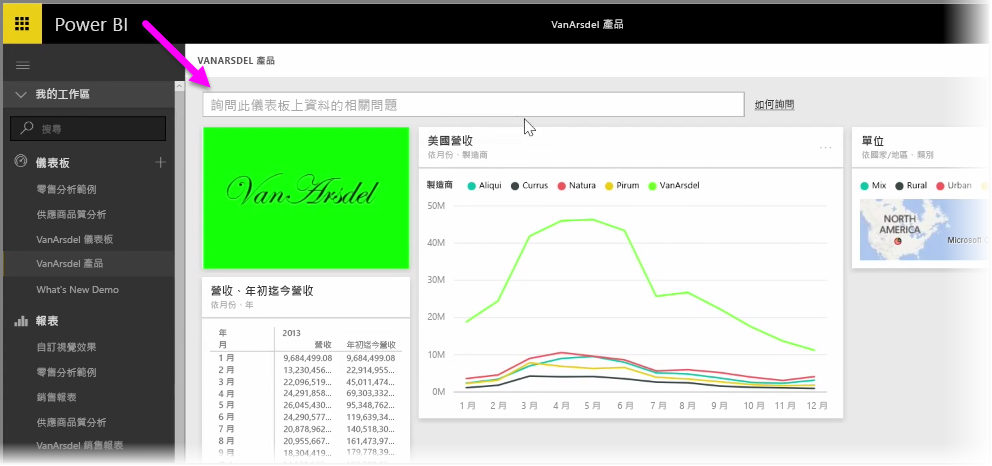
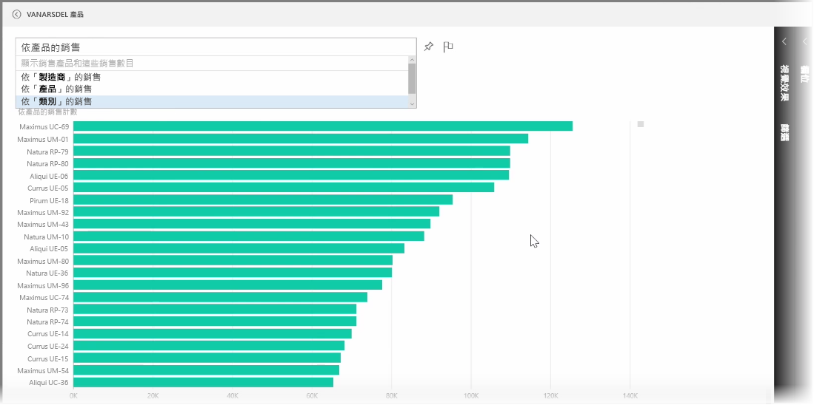
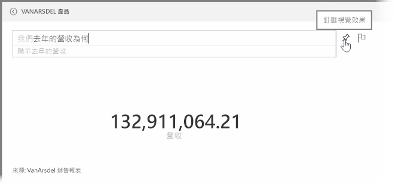
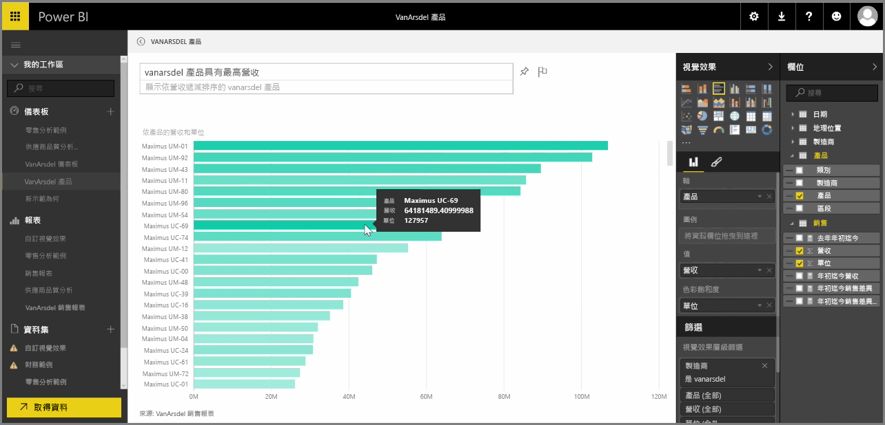

Power BI 隨附功能強大的語言辨識引擎，可讓您使用交談式片語及問句來提問。 因此，Power BI 除了有建置報表和視覺效果的功能，您還可透過詢問簡單的問題來建立圖表和圖形。

若要提出資料相關問題，請開啟 Power BI 的儀表板，畫面頂端會顯示輸入方塊，您可在其中詢問顯示資料的相關問題。 這項功能有時稱為 *問題與解答* ，但通常就直接稱為 **問與答** 。

當您按一下方塊時，Power BI 會根據您的資料顯示一些建議詞彙的提示，例如 "YTD revenue"。 按一下建議的詞彙即可查看結果，通常結果會顯示為簡單的資料表或卡片。 當您選取其中一個建議的片語時，Power BI 會自動根據您的選取項目建立視覺效果。

您也可以使用自然語言提問，例如「去年營收是多少？」 或是「2014 年 3 月時哪樣產品銷售量最高？」 Power BI 會顯示它對問題的解譯，並選擇最適當的視覺效果類型來呈現答案。 您可以選取**釘選**圖示，將其**釘選**到所選的儀表板，就像 Power BI 中的任何其他視覺效果一樣。

在過程中，您可以隨時編輯由自然語言問題或片語建立的視覺效果。 只要使用畫面右側的 [視覺效果]  與 [欄位]  窗格即可。 如同 Power BI 中的任何其他視覺效果一樣，您可以修改配置、調整篩選，並變更欄位輸入。

一旦建立滿意的視覺效果之後，只要選取問題輸入方塊旁邊的**釘選**圖示，即可將視覺效果儲存至儀表板。

